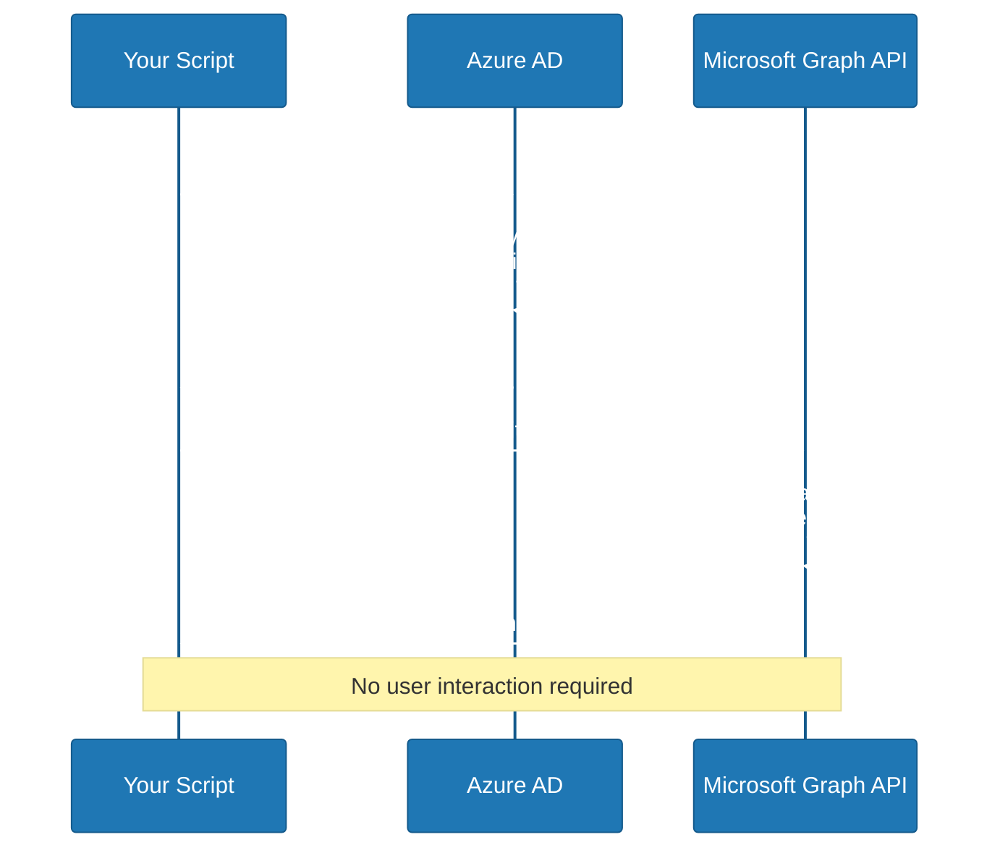
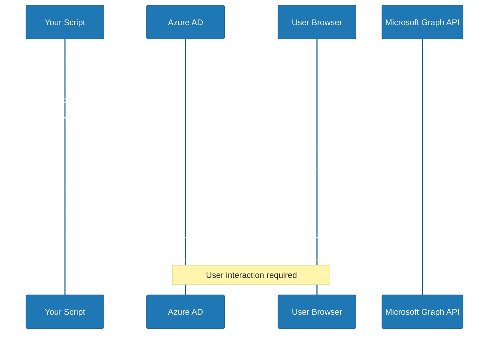
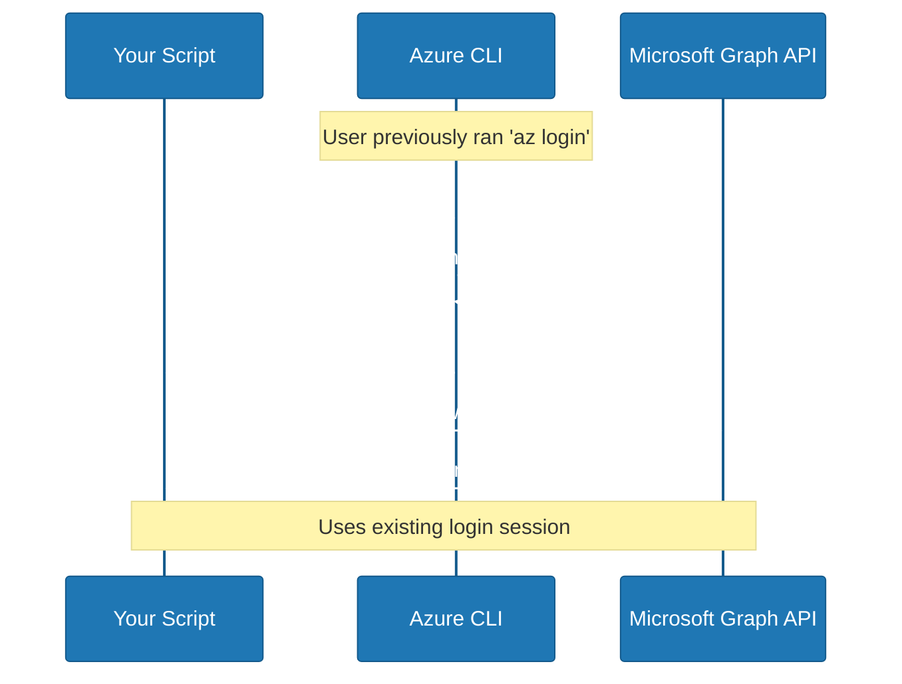

# Azure Authentication Flows

*A comprehensive guide for understanding Azure authentication and authorization*

## 📚 Table of Contents

1. [Authentication vs Authorization - The Basics](#authentication-vs-authorization---the-basics)
2. [Azure Identity Types](#azure-identity-types)
3. [Permission Types in Azure](#permission-types-in-azure)
4. [Authentication Flows Explained](#authentication-flows-explained)
5. [Real-World Example](#real-world-example)
6. [Troubleshooting Guide](#troubleshooting-guide)
7. [Quick Reference](#quick-reference)

## 🔐 Authentication vs Authorization - The Basics

### Simple Analogy: Getting into a Building

- **Authentication** = Proving who you are (showing your ID card)
- **Authorization** = What you're allowed to do once inside (which floors you can access)

### In Azure Terms

- **Authentication**: "Are you really who you claim to be?"
- **Authorization**: "What are you allowed to do with Azure resources?"

## 👤 Azure Identity Types

### 1. User Account

- **What it is**: A regular person's account (like `user@company.com`)
- **Real-world analogy**: Your employee badge
- **How it works**: You log in with username/password, maybe with MFA

**Example:**

```
Username: user@company.com
Password: YourPassword123!
MFA: Code from phone app
```

### 2. Service Principal

- **What it is**: An identity for applications/scripts (like `sp-myapp-prod`)
- **Real-world analogy**: A security robot that can do specific tasks automatically
- **How it works**: Uses a client ID (username) and client secret (password) or certificate

**Example:**

```
Client ID: <your-client-id-guid>
Client Secret: <your-client-secret>
```

## 🔑 Permission Types in Azure

### Application Permissions

- **What it is**: The app/script can do things **on its own**, without a user
- **Real-world analogy**: A security robot that can access any floor 24/7 without human supervision
- **When to use**: Automated scripts, background processes, CI/CD pipelines
- **Key point**: Works even when no user is logged in

**Example scenarios:**
- Nightly backup scripts
- Automated monitoring tools
- CI/CD deployment pipelines

### Delegated Permissions

- **What it is**: The app/script can only do things **on behalf of a logged-in user**
- **Real-world analogy**: An assistant that can only access floors you personally have access to, and only when you're there
- **When to use**: Interactive applications where a user is present
- **Key point**: Limited by what the user can actually do

**Example scenarios:**
- Web applications where users log in
- Mobile apps accessing user's data
- PowerBI reports showing user-specific data

## 🔄 Authentication Flows Explained

### Flow 1: Client Credentials Flow (Application Permissions)



### Step by step:

1. **Script says**: "Hi Azure AD, I'm service principal X with secret Y, give me a token"
2. **Azure AD checks**: "Is this really service principal X? Does it have application permissions?"
3. **Azure AD responds**: "Yes, here's your access token"
4. **Script uses token**: Makes API calls to Microsoft Graph
5. **Microsoft Graph checks**: "This token says the service principal can do X, Y, Z operations"

**Code example:**

```python
# Send credentials to Azure AD
token_data = {
    'grant_type': 'client_credentials',
    'client_id': CLIENT_ID,      # Your service principal client ID
    'client_secret': CLIENT_SECRET,  # Your service principal secret
    'scope': 'https://graph.microsoft.com/.default'
}
# Azure AD gives back an access token
```

#### ✅ Pros:

- Simple, no user interaction needed
- Works 24/7 for automation
- Perfect for background processes

#### ❌ Cons:

- Requires admin to grant powerful application permissions
- Service principal can do everything it's allowed to, always
- Higher security risk if compromised

### Flow 2: Device Code Flow (Delegated Permissions)



### Step by step:

1. **Script says**: "Hi Azure AD, I need a device code for service principal X"
2. **Azure AD responds**: "Here's code ABC123, user needs to go to microsoft.com/devicelogin"
3. **Script shows user**: "Go to this website and enter code ABC123"
4. **User opens browser**: Goes to website, enters code, logs in with their account
5. **User authorizes**: "Yes, I allow this script to act on my behalf"
6. **Azure AD gives script**: An access token that represents the user
7. **Script uses token**: Makes API calls on behalf of the user
8. **Microsoft Graph checks**: "This token represents user@company.com, what can they do?"

**Code example:**

```python
# Step 1: Get device code
device_code_data = {
    'client_id': CLIENT_ID,
    'scope': 'https://graph.microsoft.com/EntitlementManagement.ReadWrite.All'
}
# Azure AD returns: {"user_code": "ABC123", "verification_uri": "microsoft.com/devicelogin"}

# Step 2: User goes to website, enters code, logs in
# Step 3: Script polls Azure AD until user completes authentication
```

#### ✅ Pros:

- More secure (limited by user's actual permissions)
- Good for interactive scenarios
- User has control over what the script can do

#### ❌ Cons:

- Requires user interaction every time
- If user doesn't have permissions, it won't work
- Not suitable for automation

### Flow 3: Azure CLI Authentication (Delegated Permissions - Simplified)



### Step by step:

1. **You previously ran**: `az login` (this stored your credentials locally)
2. **Script asks Azure CLI**: "Give me a token for Microsoft Graph"
3. **Azure CLI checks**: "User is already logged in, here's their token"
4. **Script uses token**: Makes API calls on behalf of you

**Code example:**

```python
# Ask Azure CLI for a token
result = subprocess.run([
    'az', 'account', 'get-access-token',
    '--resource', 'https://graph.microsoft.com'
], capture_output=True, text=True)
# Uses your existing login session
```

#### ✅ Pros:

- No additional login needed if you're already logged in via `az login`
- Simple for development/testing
- Quick to implement

#### ❌ Cons:

- Still limited by your user permissions
- Requires Azure CLI to be installed and logged in
- Not suitable for production automation

## 🔍 Real-World Example

### What We're Trying to Do

Our script needs to read and update **Access Package Policies** in Azure AD Entitlement Management.

### Required Permission

- **Microsoft Graph API**: `EntitlementManagement.ReadWrite.All`

### What Happened - Troubleshooting Journey

#### Attempt 1: Application Permissions Failed ❌

```
Script → Azure AD: "I'm service principal sp-myapp-prod"
Azure AD → Script: "✅ Yes, you are who you say you are" (authentication succeeded)
Script → Microsoft Graph: "I want to read access package policies"
Microsoft Graph → Script: "❌ UnAuthorized - you don't have EntitlementManagement.ReadWrite.All APPLICATION permission"
```

**Root Cause**: Service principal doesn't have the required **application** permission granted by admin.

#### Attempt 2: Delegated Permissions (Device Code) Failed ❌

```
Script → Azure AD: "Give me a device code"
Azure AD → Script: "❌ invalid_client - need client_assertion or client_secret"
```

**Root Cause**: Service principal is configured as confidential client but device code flow implementation was incomplete.

#### Attempt 3: Delegated Permissions (Azure CLI) Failed ❌

```
Script → Azure CLI: "Give me a token for user@company.com"
Azure CLI → Script: "✅ Here's the user's token" (authentication succeeded)
Script → Microsoft Graph: "I want to read access package policies on behalf of user@company.com"
Microsoft Graph → Script: "❌ UnAuthorized - user@company.com doesn't have permission to manage entitlement packages"
```

**Root Cause**: User account doesn't have the required Azure AD role to manage entitlement packages.

## 🛠️ Troubleshooting Guide

### Common Error Messages and Solutions

#### "UnAuthorized" - After Successful Authentication

**What it means**: Authentication worked, but authorization failed.

**Solutions**:

1. **For Application Permissions**: Service principal needs the required permission + admin consent
2. **For Delegated Permissions**: User needs the required Azure AD role

#### "invalid_client" - During Authentication

**What it means**: Service principal configuration issue.

**Solutions**:

1. Check client ID and secret are correct
2. Ensure service principal is configured for the right authentication flow
3. For device code flow, might need client secret even for public clients

#### "AADSTS7000218" - Device Code Flow Configuration Error

**Full Error**: "The request body must contain the following parameter: 'client_assertion' or 'client_secret'"

**What it means**: Service principal is configured as confidential client but you're trying device code flow.

**Solutions**:

1. Remove client secret from service principal
2. Set `isFallbackPublicClient=true`
3. Remove `client_secret` from device code token request

#### "User does not have any of the required scopes" - Token Scope Issue

**What it means**: Your token doesn't include the specific Microsoft Graph scopes needed.

**Solutions**:

1. Use device code flow instead of Azure CLI for Identity Governance
2. Ensure admin consent is granted
3. Request specific scopes in device code flow

#### "Forbidden" vs "UnAuthorized"

- **UnAuthorized (401)**: Authentication failed OR insufficient permissions
- **Forbidden (403)**: Authentication succeeded, but definitely no permission

### Fix Options

#### Option 1: Grant Application Permissions (Recommended for automation)

**What needs to happen:**

1. Azure admin goes to Azure Portal → Azure Active Directory → App registrations
2. Finds service principal `sp-myapp-prod`
3. Goes to API permissions → Add permission → Microsoft Graph → Application permissions
4. Adds: `EntitlementManagement.ReadWrite.All`
5. Clicks "Grant admin consent for [tenant]"

**Result**: Script can run 24/7 without user interaction

#### Option 2: Grant User Permissions

**What needs to happen:**

1. Azure admin goes to Azure Portal → Azure Active Directory → Roles and administrators
2. Finds role like "Identity Governance Administrator"
3. Assigns this role to user `user@company.com`
4. Script uses delegated permissions (Azure CLI or device code flow)

**Result**: Script works but only when you're logged in and only with your permissions

## 📋 Quick Reference

### Authentication Flow Comparison

| **Flow** | **Permission Type** | **User Interaction** | **Best For** | **Pros** | **Cons** | **Special Requirements** |
|----------|-------------------|-------------------|-----------|------|------|----------------------|
| Client Credentials | Application | None | Automation | Simple, 24/7 | Needs admin consent | Confidential client (with secret) |
| Device Code | Delegated | Required | Interactive scripts + Identity Governance | Secure, specific scopes | Manual each time | **Public client (isFallbackPublicClient=true)** |
| Azure CLI | Delegated | Pre-authenticated | General development | Quick setup | Limited scopes, not for Identity Governance | Works with default scopes only |

### Permission Matrix

| **What You Want To Do** | **Application Permission** | **Delegated Permission** | **User Role Required** |
|----------------------|------------------------|---------------------|---------------------|
| Read Access Packages | `EntitlementManagement.Read.All` | `EntitlementManagement.Read.All` | Identity Governance Administrator |
| Modify Access Packages | `EntitlementManagement.ReadWrite.All` | `EntitlementManagement.ReadWrite.All` | Identity Governance Administrator |
| Read Users | `User.Read.All` | `User.Read.All` | User Administrator |
| Modify Users | `User.ReadWrite.All` | `User.ReadWrite.All` | User Administrator |

### Configuration Files

#### .env File Structure

```bash
# Tenant information
TENANT_ID="<your-tenant-id>"

# Service Principal
CLIENT_ID="<your-client-id>"
CLIENT_SECRET="<your-client-secret>"

# Authentication method
AUTH_METHOD="application"  # or "delegated" or "device" or "auto"
```

#### Auth Method Options

- `application`: Client credentials flow (service principal only)
- `delegated`: Azure CLI flow (uses your login)
- `device`: Device code flow (interactive)
- `auto`: Try application first, fallback to delegated

### Common Azure CLI Commands

```bash
# Login
az login

# Check current account
az account show

# Get access token for Microsoft Graph
az account get-access-token --resource https://graph.microsoft.com

# List service principals
az ad sp list --display-name "sp-myapp-prod"

# Check service principal permissions
az ad sp show --id <your-service-principal-id>
```

## 🎯 Key Takeaways

1. **Authentication ≠ Authorization**: Successfully proving who you are doesn't mean you can do what you want.
2. **Choose the Right Flow**:
    - Automation → Application permissions
    - Interactive → Delegated permissions
3. **Permissions are Hierarchical**:
    - Application permissions are granted to the service principal
    - Delegated permissions are limited by what the user can do
4. **Admin Consent Matters**: Application permissions always need admin approval.
5. **Test with Least Privilege**: Start with read permissions, then add write permissions as needed.

## 🚨 Critical Configuration Issues

### Device Code Flow - Service Principal Configuration

**Problem**: Even with correct roles and permissions, device code flow failed with error:

```
AADSTS7000218: The request body must contain the following parameter: 'client_assertion' or 'client_secret'
```

#### 🔧 Root Cause & Solution:

1. **Issue**: Service principal was configured as **confidential client** (has client secret)
2. **Device code flow requires**: **Public client** configuration
3. **Solution**:
    - Remove client secret from service principal
    - Set `isFallbackPublicClient=true` using: `az ad app update --id [app-id] --set isFallbackPublicClient=true`
    - Remove `client_secret` from device code token request

### Identity Governance Permissions - Role vs Scope Issue

**Problem**: Even with Identity Governance Administrator role, API calls failed with:

```
UnAuthorized: User is not authorized to perform the operation
```

#### 🔧 Root Causes & Solutions:

1. **PIM Activation Required**: Identity Governance Administrator role might be eligible but not active
    - **Solution**: Activate role in Azure Portal → PIM → My Roles
2. **Token Scopes Missing**: Azure CLI tokens don't include Microsoft Graph scopes by default
    - **Problem**: Azure CLI limitation with custom scopes
    - **Solution**: Use device code flow which requests specific scopes
3. **Admin Consent Required**: Delegated permissions need explicit admin consent
    - **Solution**: Run `az ad app permission admin-consent --id [app-id]`

### Updated Best Practices

#### ⚠️ For Delegated Permissions:

1. **Service Principal Must Be Public Client**:

    ```bash
    az ad app update --id [app-id] --set isFallbackPublicClient=true
    ```

2. **Use Device Code Flow**, not Azure CLI for Identity Governance operations
3. **Ensure Admin Consent** is granted for delegated permissions
4. **Activate PIM Roles** if using Privileged Identity Management
5. **User Must Have Required Role**: Identity Governance Administrator for EntitlementManagement operations

**✅ Working Device Code Flow Configuration:**

```python
# Service Principal Configuration
isFallbackPublicClient: true (NO client secret)

# Token Request (NO client_secret parameter)
token_data = {
    'grant_type': 'urn:ietf:params:oauth:grant-type:device_code',
    'client_id': CLIENT_ID,  # Your client ID, NO client_secret here
    'device_code': device_info['device_code']
}

# Required User Permissions
- Identity Governance Administrator role (ACTIVE, not just eligible)
- Admin consent granted for EntitlementManagement.ReadWrite.All
```

## 📚 Further Reading

- [Microsoft Identity Platform Documentation](https://docs.microsoft.com/en-us/azure/active-directory/develop/)
- [Microsoft Graph API Reference](https://docs.microsoft.com/en-us/graph/api/overview)
- [Azure AD Authentication Flows](https://docs.microsoft.com/en-us/azure/active-directory/develop/authentication-flows-app-scenarios)
- [Service Principal Best Practices](https://docs.microsoft.com/en-us/azure/active-directory/develop/howto-create-service-principal-portal)

---

**Created:** 2026-02-06
**Tags:** #azure #authentication #oauth2 #service-principal #microsoft-graph #cloud #security
