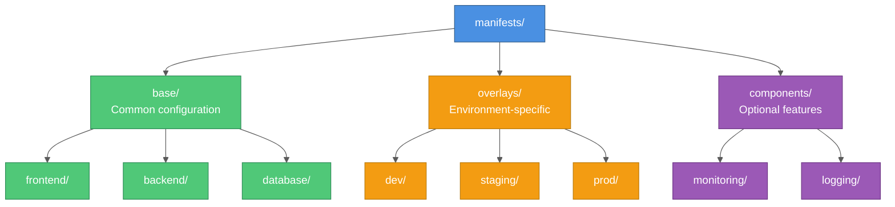

# Kustomize for Kubernetes Manifest Organization

## Overview

Kustomize is a template-free way to customize Kubernetes manifests. It helps manage configuration variations across different environments without duplicating YAML files. This guide covers best practices for organizing your Kubernetes manifests using Kustomize.

## Why Kustomize?

### Problems with Plain YAML

- **Duplication**: Copying manifests for dev/staging/prod
- **Maintenance**: Changes need updating in multiple places
- **Complexity**: Templates with many variables become hard to read
- **Error-prone**: Easy to miss environment-specific changes

### Kustomize Advantages

- **Template-free**: Plain YAML, no templating language
- **DRY Principle**: Define once, customize as needed
- **Layered approach**: Base + overlays for environments
- **Native kubectl support**: `kubectl apply -k`
- **Composable**: Reusable components

## Basic Concepts

### 1. Base

Common configuration shared across all environments:
- Core deployments
- Standard services
- ConfigMaps
- Base resources

### 2. Overlays

Environment-specific customizations:
- Development
- Staging
- Production
- Patches and variations

### 3. Components

Reusable optional pieces:
- Monitoring
- Logging
- Security policies
- Add-ons

## Project Structure

### Recommended Layout



## Implementation Guide

### Step 1: Create Base Resources

**base/frontend/deployment.yaml**:
```yaml
apiVersion: apps/v1
kind: Deployment
metadata:
  name: frontend
  labels:
    app: frontend
spec:
  replicas: 1  # Override in overlays
  selector:
    matchLabels:
      app: frontend
  template:
    metadata:
      labels:
        app: frontend
    spec:
      containers:
      - name: frontend
        image: myapp/frontend:latest  # Override in overlays
        ports:
        - containerPort: 8080
        resources:
          requests:
            cpu: 100m
            memory: 128Mi
          limits:
            cpu: 500m
            memory: 256Mi
```

**base/frontend/service.yaml**:
```yaml
apiVersion: v1
kind: Service
metadata:
  name: frontend
spec:
  type: ClusterIP
  selector:
    app: frontend
  ports:
  - port: 80
    targetPort: 8080
```

**base/frontend/kustomization.yaml**:
```yaml
apiVersion: kustomize.config.k8s.io/v1beta1
kind: Kustomization

resources:
- deployment.yaml
- service.yaml
```

### Step 2: Create Root Base Kustomization

**base/kustomization.yaml**:
```yaml
apiVersion: kustomize.config.k8s.io/v1beta1
kind: Kustomization

# Component references
resources:
- frontend
- backend
- database

# Common labels applied to all resources
commonLabels:
  app.kubernetes.io/name: myapp
  app.kubernetes.io/managed-by: kustomize

# Common annotations
commonAnnotations:
  documentation: "https://docs.myapp.com"

# Namespace for all resources
namespace: myapp
```

### Step 3: Create Environment Overlays

**overlays/dev/kustomization.yaml**:
```yaml
apiVersion: kustomize.config.k8s.io/v1beta1
kind: Kustomization

# Reference base
bases:
- ../../base

# Namespace override for dev
namespace: myapp-dev

# Add dev-specific labels
commonLabels:
  environment: development

# Image tag overrides
images:
- name: myapp/frontend
  newTag: dev-latest
- name: myapp/backend
  newTag: dev-latest

# Patches
patchesStrategicMerge:
- replica-count.yaml

# ConfigMaps specific to dev
configMapGenerator:
- name: app-config
  literals:
  - LOG_LEVEL=DEBUG
  - ENVIRONMENT=development
```

**overlays/dev/replica-count.yaml**:
```yaml
apiVersion: apps/v1
kind: Deployment
metadata:
  name: frontend
spec:
  replicas: 1  # Single replica for dev

---
apiVersion: apps/v1
kind: Deployment
metadata:
  name: backend
spec:
  replicas: 1  # Single replica for dev
```

**overlays/prod/kustomization.yaml**:
```yaml
apiVersion: kustomize.config.k8s.io/v1beta1
kind: Kustomization

# Reference base
bases:
- ../../base

# Production namespace
namespace: myapp-prod

# Add prod-specific labels
commonLabels:
  environment: production

# Image overrides with specific versions
images:
- name: myapp/frontend
  newTag: v1.2.3
- name: myapp/backend
  newTag: v1.2.3

# Patches for production
patchesStrategicMerge:
- replica-count.yaml
- resource-limits.yaml

# Production ConfigMaps
configMapGenerator:
- name: app-config
  literals:
  - LOG_LEVEL=INFO
  - ENVIRONMENT=production

# Production secrets (reference only)
secretGenerator:
- name: api-keys
  files:
  - api-key.txt
```

**overlays/prod/replica-count.yaml**:
```yaml
apiVersion: apps/v1
kind: Deployment
metadata:
  name: frontend
spec:
  replicas: 3  # High availability

---
apiVersion: apps/v1
kind: Deployment
metadata:
  name: backend
spec:
  replicas: 5  # Handle production load
```

**overlays/prod/resource-limits.yaml**:
```yaml
apiVersion: apps/v1
kind: Deployment
metadata:
  name: backend
spec:
  template:
    spec:
      containers:
      - name: backend
        resources:
          requests:
            cpu: 500m
            memory: 512Mi
          limits:
            cpu: 2000m
            memory: 2Gi
```

## Advanced Patterns

### 1. Patches

**Strategic Merge Patch** (most common):
```yaml
# overlays/prod/ingress-patch.yaml
apiVersion: networking.k8s.io/v1
kind: Ingress
metadata:
  name: myapp-ingress
  annotations:
    cert-manager.io/cluster-issuer: letsencrypt-prod
spec:
  tls:
  - hosts:
    - myapp.example.com
    secretName: myapp-tls
```

**JSON 6902 Patch** (precise targeting):
```yaml
# overlays/prod/kustomization.yaml
patchesJson6902:
- target:
    group: apps
    version: v1
    kind: Deployment
    name: backend
  patch: |-
    - op: replace
      path: /spec/replicas
      value: 10
    - op: add
      path: /spec/template/spec/containers/0/env/-
      value:
        name: CACHE_ENABLED
        value: "true"
```

### 2. ConfigMap and Secret Generators

**ConfigMap from literals**:
```yaml
configMapGenerator:
- name: app-config
  literals:
  - DATABASE_HOST=postgres.myapp.svc.cluster.local
  - DATABASE_PORT=5432
  - LOG_LEVEL=INFO
```

**ConfigMap from files**:
```yaml
configMapGenerator:
- name: app-config
  files:
  - config.json
  - settings.yaml
```

**Secret from files**:
```yaml
secretGenerator:
- name: db-credentials
  files:
  - username.txt
  - password.txt
```

**Secret from env file**:
```yaml
secretGenerator:
- name: api-keys
  envs:
  - secrets.env
```

### 3. Name Prefixes and Suffixes

Add prefixes/suffixes to all resources:
```yaml
namePrefix: v2-
nameSuffix: -canary

# Results in: v2-frontend-canary
```

### 4. Label and Annotation Transformers

```yaml
# Add labels to all resources
commonLabels:
  team: platform
  managed-by: kustomize
  version: v1.2.3

# Add annotations
commonAnnotations:
  contact: platform-team@example.com
  documentation: https://docs.example.com
```

### 5. Image Tag Management

```yaml
images:
- name: myapp/frontend
  newName: us-central1-docker.pkg.dev/myproject/myrepo/frontend
  newTag: v1.2.3
- name: myapp/backend
  newTag: sha256-abc123...
```

### 6. Replicas Transformer

```yaml
replicas:
- name: frontend
  count: 3
- name: backend
  count: 5
```

## Component-Based Organization

### Creating Components

**components/monitoring/kustomization.yaml**:
```yaml
apiVersion: kustomize.config.k8s.io/v1alpha1
kind: Component

resources:
- prometheus-deployment.yaml
- prometheus-service.yaml
- servicemonitor.yaml

configMapGenerator:
- name: prometheus-config
  files:
  - prometheus.yml
```

### Using Components

**overlays/prod/kustomization.yaml**:
```yaml
apiVersion: kustomize.config.k8s.io/v1beta1
kind: Kustomization

bases:
- ../../base

# Include optional components
components:
- ../../components/monitoring
- ../../components/logging
```

## Best Practices

### 1. Keep Base Minimal

Base should contain only what's truly common:
```yaml
# ✅ Good: Minimal base
apiVersion: apps/v1
kind: Deployment
metadata:
  name: frontend
spec:
  selector:
    matchLabels:
      app: frontend
  template:
    metadata:
      labels:
        app: frontend
    spec:
      containers:
      - name: frontend
        image: myapp/frontend:latest
```

### 2. Use Components for Optional Features

```
base/              # Core application
components/
  monitoring/      # Optional: Add monitoring
  tls/             # Optional: Enable TLS
  autoscaling/     # Optional: Enable HPA
```

### 3. Organize by Component, Not Resource Type

```
# ✅ Good: Component-based
base/
  frontend/
    deployment.yaml
    service.yaml
  backend/
    deployment.yaml
    service.yaml

# ❌ Bad: Resource type-based
base/
  deployments/
    frontend.yaml
    backend.yaml
  services/
    frontend.yaml
    backend.yaml
```

### 4. Use Descriptive Names

```yaml
# ✅ Good
overlays/
  production-us-east/
  production-eu-west/
  development/
  staging-canary/

# ❌ Bad
overlays/
  prod1/
  prod2/
  dev/
  test/
```

### 5. Version Control Everything

```gitignore
# .gitignore

# Never commit actual secrets
overlays/*/secrets/
**/*-secret.yaml

# Commit secret generators (references)
!**/*-secret-generator.yaml
```

### 6. Document Your Structure

Create a README in each overlay:
```markdown
# Production Overlay

## Purpose
Production configuration for US East region

## Changes from Base
- Replicas: 5 (frontend), 10 (backend)
- Resources: Increased limits
- Ingress: TLS enabled
- Secrets: External secret manager

## Deploy
```bash
kubectl apply -k overlays/production-us-east/
```
```

## Common Use Cases

### Multi-Region Deployment

```
overlays/
  prod-us-east-1/
    kustomization.yaml
    region-labels.yaml
  prod-eu-west-1/
    kustomization.yaml
    region-labels.yaml
  prod-ap-south-1/
    kustomization.yaml
    region-labels.yaml
```

### Feature Flags with Components

```
components/
  feature-new-ui/
    kustomization.yaml
    new-ui-deployment.yaml
  feature-beta-api/
    kustomization.yaml
    beta-api-service.yaml

# Enable in specific overlay
overlays/staging/kustomization.yaml:
  components:
  - ../../components/feature-new-ui
  - ../../components/feature-beta-api
```

### Canary Deployments

```
overlays/
  prod-stable/
    kustomization.yaml
    replicas.yaml  # 90% of traffic
  prod-canary/
    kustomization.yaml
    replicas.yaml  # 10% of traffic
    canary-labels.yaml
```

## Deployment Workflows

### Local Development

```bash
# Preview changes
kubectl kustomize overlays/dev/

# Apply to cluster
kubectl apply -k overlays/dev/

# Verify
kubectl get all -n myapp-dev
```

### CI/CD Pipeline

```yaml
# .github/workflows/deploy.yml
name: Deploy to Production
on:
  push:
    tags:
      - 'v*'

jobs:
  deploy:
    runs-on: ubuntu-latest
    steps:
    - uses: actions/checkout@v2

    - name: Update image tags
      run: |
        cd overlays/prod
        kustomize edit set image \
          myapp/frontend=myapp/frontend:${{ github.ref_name }} \
          myapp/backend=myapp/backend:${{ github.ref_name }}

    - name: Deploy
      run: |
        kubectl apply -k overlays/prod/
```

### GitOps with ArgoCD

```yaml
# argocd-application.yaml
apiVersion: argoproj.io/v1alpha1
kind: Application
metadata:
  name: myapp-prod
spec:
  project: default
  source:
    repoURL: https://github.com/myorg/myapp-manifests
    targetRevision: main
    path: overlays/prod
  destination:
    server: https://kubernetes.default.svc
    namespace: myapp-prod
  syncPolicy:
    automated:
      prune: true
      selfHeal: true
```

## Validation and Testing

### Validate Kustomization

```bash
# Check for errors
kubectl kustomize overlays/prod/

# Validate against cluster
kubectl apply -k overlays/prod/ --dry-run=client

# Server-side validation
kubectl apply -k overlays/prod/ --dry-run=server
```

### Test with Different Contexts

```bash
# Test in different namespace
kubectl kustomize overlays/staging/ | \
  kubectl apply --dry-run=client -f - -n myapp-test
```

### Diff Before Apply

```bash
# See what would change
kubectl diff -k overlays/prod/
```

## Troubleshooting

### Common Issues

**1. Resource Not Found**:
```bash
# Error: unable to find one or more resources
# Solution: Check resource paths in kustomization.yaml
kustomize build overlays/prod/  # More verbose output
```

**2. Duplicate Resources**:
```bash
# Error: duplicate resource
# Solution: Check for duplicate definitions in base and overlay
```

**3. Patch Not Applied**:
```bash
# Verify patch target matches exactly
# Check: name, namespace, apiVersion, kind
```

**4. ConfigMap/Secret Not Generated**:
```bash
# Ensure files exist
ls -la overlays/prod/

# Check generator syntax
kubectl kustomize overlays/prod/ | grep ConfigMap -A 10
```

### Debug Tips

```bash
# View final manifests
kubectl kustomize overlays/prod/ > output.yaml

# Check specific resource
kubectl kustomize overlays/prod/ | yq eval 'select(.kind == "Deployment")'

# Validate YAML syntax
kubectl kustomize overlays/prod/ | yamllint -
```

## Migration from Helm

### Helm vs Kustomize

| Aspect | Helm | Kustomize |
|--------|------|-----------|
| Templating | Go templates | Patches |
| Complexity | Higher | Lower |
| Learning curve | Steeper | Gentler |
| Flexibility | Very high | High |
| Native kubectl | No | Yes |

### Migration Strategy

1. **Export Helm template**:
```bash
helm template myapp ./chart > base/all.yaml
```

2. **Split into components**:
```bash
# Use yq or similar tool
yq eval 'select(.kind == "Deployment")' base/all.yaml > base/deployment.yaml
```

3. **Create kustomization.yaml**:
```bash
kustomize create --autodetect
```

4. **Test**:
```bash
kubectl kustomize base/ | diff - <(helm template myapp ./chart)
```

## Conclusion

Kustomize provides a powerful, template-free way to manage Kubernetes configurations. Key benefits include:

- **Simplicity**: Plain YAML, no templating language
- **Maintainability**: DRY principle with base + overlays
- **Flexibility**: Patches for any customization
- **Native integration**: Works with kubectl
- **GitOps-friendly**: Perfect for version control

Start simple with base + overlays, then adopt advanced patterns as needed.

## Additional Resources

- [Official Kustomize Documentation](https://kustomize.io/)
- [Kubernetes Documentation - Kustomize](https://kubernetes.io/docs/tasks/manage-kubernetes-objects/kustomization/)
- [Kustomize GitHub Repository](https://github.com/kubernetes-sigs/kustomize)
- [Awesome Kustomize](https://github.com/DevOpsHiveHQ/awesome-kustomize)
