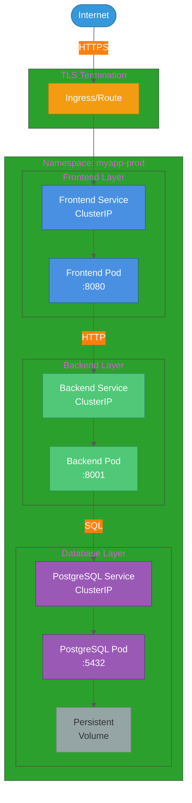

# Multi-Tier Application Architecture on Kubernetes

## Overview

This guide covers best practices for deploying multi-tier applications on Kubernetes, including frontend, backend, and database layers. Learn how to structure your application for scalability, maintainability, and high availability.

## Three-Tier Architecture Pattern

A typical three-tier application consists of:

1. **Presentation Tier** - Web frontend serving user interfaces
2. **Application Tier** - Backend API handling business logic
3. **Data Tier** - Database for persistent storage

## Architecture Diagram



## Component Design

### 1. Frontend Layer

**Purpose**: Serve static assets and web application to users

**Deployment Specification**:
```yaml
apiVersion: apps/v1
kind: Deployment
metadata:
  name: frontend
spec:
  replicas: 2
  selector:
    matchLabels:
      app: frontend
  template:
    metadata:
      labels:
        app: frontend
    spec:
      containers:
      - name: frontend
        image: myregistry.io/myapp/frontend:latest
        ports:
        - containerPort: 8080
        resources:
          requests:
            cpu: 100m
            memory: 128Mi
          limits:
            cpu: 500m
            memory: 256Mi
```

**Service Configuration**:
```yaml
apiVersion: v1
kind: Service
metadata:
  name: frontend
spec:
  type: ClusterIP
  selector:
    app: frontend
  ports:
  - port: 80
    targetPort: 8080
```

**Key Characteristics**:
- Stateless (can scale horizontally)
- Lightweight resource requirements
- Multiple replicas for high availability
- Internal communication via Service DNS

### 2. Backend Layer

**Purpose**: Handle API requests, business logic, and data processing

**Deployment Specification**:
```yaml
apiVersion: apps/v1
kind: Deployment
metadata:
  name: backend
spec:
  replicas: 3
  selector:
    matchLabels:
      app: backend
  template:
    metadata:
      labels:
        app: backend
    spec:
      containers:
      - name: backend
        image: myregistry.io/myapp/backend:latest
        ports:
        - containerPort: 8001
        env:
        - name: DATABASE_HOST
          value: "postgres"
        - name: DATABASE_PORT
          value: "5432"
        - name: DATABASE_NAME
          value: "myapp_db"
        - name: DATABASE_USER
          value: "myapp_user"
        - name: DATABASE_PASSWORD
          valueFrom:
            secretKeyRef:
              name: postgres-secret
              key: password
        resources:
          requests:
            cpu: 200m
            memory: 256Mi
          limits:
            cpu: 1000m
            memory: 512Mi
```

**Service Configuration**:
```yaml
apiVersion: v1
kind: Service
metadata:
  name: backend
spec:
  type: ClusterIP
  selector:
    app: backend
  ports:
  - port: 8001
    targetPort: 8001
```

**Key Characteristics**:
- Stateless (horizontal scaling supported)
- Database connection pooling
- Environment-based configuration
- Secrets for sensitive data

### 3. Database Layer

**Purpose**: Persistent data storage

**StatefulSet Specification**:
```yaml
apiVersion: apps/v1
kind: StatefulSet
metadata:
  name: postgres
spec:
  serviceName: postgres
  replicas: 1
  selector:
    matchLabels:
      app: postgres
  template:
    metadata:
      labels:
        app: postgres
    spec:
      containers:
      - name: postgres
        image: postgres:15-alpine
        ports:
        - containerPort: 5432
        env:
        - name: POSTGRES_DB
          value: "myapp_db"
        - name: POSTGRES_USER
          value: "myapp_user"
        - name: POSTGRES_PASSWORD
          valueFrom:
            secretKeyRef:
              name: postgres-secret
              key: password
        volumeMounts:
        - name: postgres-storage
          mountPath: /var/lib/postgresql/data
        resources:
          requests:
            cpu: 250m
            memory: 256Mi
          limits:
            cpu: 500m
            memory: 512Mi
  volumeClaimTemplates:
  - metadata:
      name: postgres-storage
    spec:
      accessModes: [ "ReadWriteOnce" ]
      resources:
        requests:
          storage: 10Gi
```

**Service Configuration**:
```yaml
apiVersion: v1
kind: Service
metadata:
  name: postgres
spec:
  type: ClusterIP
  selector:
    app: postgres
  ports:
  - port: 5432
    targetPort: 5432
```

**Key Characteristics**:
- Stateful (requires StatefulSet)
- Persistent volume for data durability
- Stable network identity
- Single replica (HA requires replication setup)

## Network Topology

### Internal Communication

| Source | Destination | Protocol | Port | Purpose |
|--------|-------------|----------|------|---------|
| Frontend | Backend | HTTP | 8001 | API requests |
| Backend | Database | PostgreSQL | 5432 | Database queries |
| External | Frontend | HTTPS | 443 | User access |

### Service Discovery

Kubernetes provides built-in DNS for service discovery:

- **Frontend → Backend**: `http://backend:8001`
- **Backend → Database**: `postgres:5432`

Services are accessible via `<service-name>.<namespace>.svc.cluster.local`

## Data Flow

### User Request Flow

1. **User → Ingress/Route**: HTTPS request to `https://myapp.example.com`
2. **Ingress → Frontend Service**: TLS termination, HTTP forwarding
3. **Frontend Service → Frontend Pod**: Load balancing to available pods
4. **Frontend Pod**: Serves static assets, JavaScript application

### API Request Flow

1. **Browser → Backend**: JavaScript makes API call
2. **Frontend Pod → Backend Service**: HTTP request to `http://backend:8001/api/...`
3. **Backend Service → Backend Pod**: Load balancing to available pods
4. **Backend Pod**: Processes business logic
5. **Backend Pod → Database Service**: SQL query to `postgres:5432`
6. **Database Pod**: Returns query results
7. **Backend Pod → Frontend**: Returns API response as JSON
8. **Frontend → Browser**: Updates UI

## Scalability Strategies

### Horizontal Scaling

**Stateless Components** (Frontend, Backend):
```bash
# Scale frontend
kubectl scale deployment frontend --replicas=5

# Scale backend based on load
kubectl scale deployment backend --replicas=10
```

**Autoscaling with HPA**:
```yaml
apiVersion: autoscaling/v2
kind: HorizontalPodAutoscaler
metadata:
  name: backend-hpa
spec:
  scaleTargetRef:
    apiVersion: apps/v1
    kind: Deployment
    name: backend
  minReplicas: 3
  maxReplicas: 20
  metrics:
  - type: Resource
    resource:
      name: cpu
      target:
        type: Utilization
        averageUtilization: 70
```

### Vertical Scaling

Adjust resource requests/limits based on actual usage:
```bash
# Update resources
kubectl set resources deployment backend \
  --limits=cpu=2000m,memory=1Gi \
  --requests=cpu=500m,memory=512Mi
```

## High Availability

### Multi-Replica Deployment

Run multiple instances of stateless components:
```yaml
spec:
  replicas: 3
  strategy:
    type: RollingUpdate
    rollingUpdate:
      maxSurge: 1
      maxUnavailable: 0
```

### Pod Anti-Affinity

Distribute pods across different nodes:
```yaml
spec:
  affinity:
    podAntiAffinity:
      preferredDuringSchedulingIgnoredDuringExecution:
      - weight: 100
        podAffinityTerm:
          labelSelector:
            matchLabels:
              app: backend
          topologyKey: kubernetes.io/hostname
```

### Health Checks

**Liveness Probe** (restart unhealthy containers):
```yaml
livenessProbe:
  httpGet:
    path: /healthz
    port: 8001
  initialDelaySeconds: 30
  periodSeconds: 10
```

**Readiness Probe** (control traffic routing):
```yaml
readinessProbe:
  httpGet:
    path: /ready
    port: 8001
  initialDelaySeconds: 5
  periodSeconds: 5
```

### Pod Disruption Budgets

Ensure minimum available pods during disruptions:
```yaml
apiVersion: policy/v1
kind: PodDisruptionBudget
metadata:
  name: backend-pdb
spec:
  minAvailable: 2
  selector:
    matchLabels:
      app: backend
```

## Security Best Practices

### 1. Network Segmentation

- **Frontend**: Publicly accessible (via Ingress)
- **Backend**: Internal only (ClusterIP)
- **Database**: Internal only (ClusterIP)

### 2. Secrets Management

Store sensitive data in Kubernetes Secrets:
```bash
kubectl create secret generic postgres-secret \
  --from-literal=password='strongpassword123'
```

Reference in deployments:
```yaml
env:
- name: DATABASE_PASSWORD
  valueFrom:
    secretKeyRef:
      name: postgres-secret
      key: password
```

### 3. TLS/HTTPS

- **External**: HTTPS with TLS termination at Ingress
- **Internal**: HTTP (within cluster network)

### 4. Network Policies

Restrict pod-to-pod communication:
```yaml
apiVersion: networking.k8s.io/v1
kind: NetworkPolicy
metadata:
  name: backend-policy
spec:
  podSelector:
    matchLabels:
      app: backend
  ingress:
  - from:
    - podSelector:
        matchLabels:
          app: frontend
    ports:
    - protocol: TCP
      port: 8001
```

## Resource Management

### Resource Quotas

Limit namespace resource consumption:
```yaml
apiVersion: v1
kind: ResourceQuota
metadata:
  name: myapp-quota
spec:
  hard:
    requests.cpu: "10"
    requests.memory: 20Gi
    limits.cpu: "20"
    limits.memory: 40Gi
    persistentvolumeclaims: "5"
```

### Limit Ranges

Set default resource limits:
```yaml
apiVersion: v1
kind: LimitRange
metadata:
  name: myapp-limits
spec:
  limits:
  - max:
      cpu: "2"
      memory: 2Gi
    min:
      cpu: 100m
      memory: 128Mi
    type: Container
```

## Monitoring and Observability

### Logging

Access application logs:
```bash
# Frontend logs
kubectl logs -f deployment/frontend

# Backend logs
kubectl logs -f deployment/backend

# Database logs
kubectl logs -f statefulset/postgres
```

### Metrics

Monitor resource usage:
```bash
# Pod metrics
kubectl top pods

# Node metrics
kubectl top nodes
```

### Prometheus Integration

Expose metrics endpoint:
```yaml
spec:
  containers:
  - name: backend
    ports:
    - name: metrics
      containerPort: 9090
```

## Deployment Strategies

### Rolling Update (Default)

Gradual replacement of pods:
```yaml
spec:
  strategy:
    type: RollingUpdate
    rollingUpdate:
      maxUnavailable: 0
      maxSurge: 1
```

### Blue-Green Deployment

Route traffic between two environments:
```bash
# Deploy new version (green)
kubectl apply -f deployment-v2.yaml

# Switch traffic
kubectl patch service frontend -p '{"spec":{"selector":{"version":"v2"}}}'

# Rollback if needed
kubectl patch service frontend -p '{"spec":{"selector":{"version":"v1"}}}'
```

### Canary Deployment

Gradually shift traffic to new version:
```yaml
# v1 deployment: 90% traffic
spec:
  replicas: 9

# v2 deployment: 10% traffic
spec:
  replicas: 1
```

## Backup and Disaster Recovery

### Database Backups

Automated backup with CronJob:
```yaml
apiVersion: batch/v1
kind: CronJob
metadata:
  name: postgres-backup
spec:
  schedule: "0 2 * * *"  # Daily at 2 AM
  jobTemplate:
    spec:
      template:
        spec:
          containers:
          - name: backup
            image: postgres:15-alpine
            command:
            - sh
            - -c
            - |
              pg_dump -h postgres -U myapp_user myapp_db > /backup/db-$(date +%Y%m%d).sql
            volumeMounts:
            - name: backup-storage
              mountPath: /backup
          restartPolicy: OnFailure
          volumes:
          - name: backup-storage
            persistentVolumeClaim:
              claimName: backup-pvc
```

### Persistent Volume Snapshots

Create volume snapshots for point-in-time recovery:
```yaml
apiVersion: snapshot.storage.k8s.io/v1
kind: VolumeSnapshot
metadata:
  name: postgres-snapshot
spec:
  volumeSnapshotClassName: standard-snapshot
  source:
    persistentVolumeClaimName: postgres-storage
```

## Common Operations

### Update Application

```bash
# Update image
kubectl set image deployment/backend \
  backend=myregistry.io/myapp/backend:v2.0

# Monitor rollout
kubectl rollout status deployment/backend
```

### Rollback

```bash
# View history
kubectl rollout history deployment/backend

# Rollback
kubectl rollout undo deployment/backend
```

### Scale Application

```bash
# Manual scaling
kubectl scale deployment frontend --replicas=5

# Autoscaling
kubectl autoscale deployment backend \
  --cpu-percent=70 --min=3 --max=10
```

### Debug Issues

```bash
# Describe resources
kubectl describe pod <pod-name>

# Check logs
kubectl logs -f <pod-name>

# Execute commands in container
kubectl exec -it <pod-name> -- /bin/sh

# Port forwarding for local testing
kubectl port-forward svc/backend 8001:8001
```

## Best Practices

1. **Use namespaces** for environment isolation (dev, staging, prod)
2. **Set resource requests/limits** for predictable scheduling
3. **Implement health checks** for automatic recovery
4. **Enable autoscaling** for dynamic load handling
5. **Use ConfigMaps** for configuration management
6. **Store secrets securely** using Kubernetes Secrets or external vaults
7. **Implement network policies** for security
8. **Monitor and log** everything
9. **Test disaster recovery** procedures regularly
10. **Document your architecture** and keep it updated

## Troubleshooting Guide

### Pods Not Starting

```bash
# Check pod status
kubectl get pods

# View events
kubectl describe pod <pod-name>

# Common issues:
# - ImagePullBackOff: Check image name and registry credentials
# - CrashLoopBackOff: Check application logs
# - Pending: Check resource availability
```

### Database Connection Issues

```bash
# Verify database is running
kubectl get pods -l app=postgres

# Test connectivity
kubectl exec -it <backend-pod> -- nc -zv postgres 5432

# Check credentials
kubectl get secret postgres-secret -o yaml
```

### Service Not Accessible

```bash
# Check service endpoints
kubectl get endpoints <service-name>

# Verify pod labels match service selector
kubectl get pods --show-labels
```

## Conclusion

This architecture provides a solid foundation for deploying multi-tier applications on Kubernetes. Key benefits include:

- **Scalability**: Independent scaling of each tier
- **Reliability**: High availability through replicas and health checks
- **Maintainability**: Clear separation of concerns
- **Security**: Network isolation and secrets management
- **Observability**: Comprehensive logging and monitoring

Adapt these patterns to your specific requirements while maintaining these core principles.

## Additional Resources

- [Kubernetes Official Documentation](https://kubernetes.io/docs/)
- [12-Factor App Methodology](https://12factor.net/)
- [Kubernetes Best Practices](https://kubernetes.io/docs/concepts/configuration/overview/)
- [Cloud Native Computing Foundation](https://www.cncf.io/)
