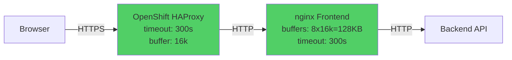

# Troubleshooting nginx Proxy Buffer Errors in OpenShift/Kubernetes

## Overview

When deploying React frontends with nginx proxies to backend APIs in OpenShift/Kubernetes, you may encounter `ERR_CONTENT_LENGTH_MISMATCH` errors when fetching large JSON responses. This guide explains the root cause and provides a complete solution.

**Compiled by:** Nagarjun Rajendran
**Last Updated:** February 2026
**Topics:** OpenShift, Kubernetes, nginx, Proxy Configuration, Troubleshooting

---

## Table of Contents

- [The Problem](#the-problem)
- [Symptoms](#symptoms)
- [Root Cause Analysis](#root-cause-analysis)
- [Solution Overview](#solution-overview)
- [Step-by-Step Fix](#step-by-step-fix)
- [Verification](#verification)
- [Prevention Tips](#prevention-tips)
- [Related Resources](#related-resources)

---

## The Problem

### Error Message

```
GET https://your-app.openshift-domain.com/api/endpoint net::ERR_CONTENT_LENGTH_MISMATCH 200 (OK)
TypeError: Failed to fetch
```

### Context

- **Environment:** OpenShift/Kubernetes
- **Frontend:** React/Vite with nginx serving static files
- **Backend:** FastAPI/Node.js API
- **Proxy Setup:** nginx in frontend container proxying `/api/*` requests to backend service
- **Response Size:** 100KB+ JSON responses

---

## Symptoms

1. **Browser Network Tab Shows:**
   - HTTP Status: `200 OK` (backend responds successfully)
   - Error: `ERR_CONTENT_LENGTH_MISMATCH`
   - Response body is truncated or empty

2. **Backend Logs Show:**
   - Request received and processed successfully
   - Full response sent to nginx proxy

3. **Pattern:**
   - Small responses (<10KB) work fine
   - Large JSON responses (>100KB) fail consistently
   - Problem only occurs in OpenShift/Kubernetes deployment, not in local development

---

## Root Cause Analysis

### Why This Happens

The error occurs at **THREE layers** in the OpenShift/Kubernetes stack:


**Layer 1: OpenShift HAProxy Router**
- Default buffer size: 4-8KB
- Default timeout: 30 seconds
- Truncates responses exceeding buffer size

**Layer 2: nginx Proxy in Frontend Pod**
- Default proxy buffers: 4-8KB
- Default read timeout: 60 seconds
- Truncates responses when buffers fill up

**Layer 3: ConfigMap Override**
- OpenShift deployments often use ConfigMaps to mount nginx configuration
- If ConfigMap is missing buffer settings, containers inherit defaults

### Technical Details

When nginx proxy buffers are too small:

1. Backend sends a large JSON response (e.g., 115KB)
2. nginx starts buffering the response
3. Buffer fills up at 8KB (default)
4. nginx truncates remaining data
5. `Content-Length` header says 115KB, but only 8KB transmitted
6. Browser detects mismatch and throws `ERR_CONTENT_LENGTH_MISMATCH`

---

## Solution Overview

Fix the issue at **BOTH** layers:

1. **Update nginx ConfigMap** with larger proxy buffers
2. **Add OpenShift Route annotations** for HAProxy buffer settings

### Architecture After Fix



---

## Step-by-Step Fix

### Prerequisites

- OpenShift CLI (`oc`) installed and logged in
- Access to your infrastructure YAML manifests
- Kubectl/oc permissions to update ConfigMaps and Routes

### File Structure

Typical OpenShift deployment structure:

```
yaml-manifests/
├── frontend/
│   ├── deployment.yaml       # References ConfigMap
│   ├── service.yaml
│   ├── nginx-config.yaml     # ConfigMap with nginx.conf
│   └── kustomization.yaml
├── backend/
│   ├── deployment.yaml
│   └── service.yaml
└── route.yaml                # OpenShift routes
```

---

### Step 1: Update nginx ConfigMap

**File:** `frontend-app/nginx-config.yaml`

Add proxy buffer settings to the `location /api/` block:

```yaml
---
apiVersion: v1
kind: ConfigMap
metadata:
  name: frontend-app-nginx-config
  namespace: your-namespace
data:
  nginx.conf: |
    worker_processes auto;
    pid /tmp/nginx.pid;
    error_log /dev/stderr info;

    events {
        worker_connections 1024;
    }

    http {
        include /etc/nginx/mime.types;
        default_type application/octet-stream;

        access_log /dev/stdout;
        sendfile on;
        keepalive_timeout 65;

        # Kubernetes DNS resolver (OpenShift default, may vary by cluster)
        # Common IPs: 172.30.0.10 (OpenShift), 10.96.0.10 (vanilla K8s)
        resolver 172.30.0.10 valid=30s ipv6=off;

        # Use writable directories for OpenShift
        client_body_temp_path /tmp/nginx-client-body;
        proxy_temp_path /tmp/nginx-proxy;
        fastcgi_temp_path /tmp/nginx-fastcgi;
        uwsgi_temp_path /tmp/nginx-uwsgi;
        scgi_temp_path /tmp/nginx-scgi;

        server {
            listen 8080;
            server_name localhost;

            root /usr/share/nginx/html;
            index index.html;

            # API endpoints - proxy to backend service
            location /api/ {
                proxy_pass http://backend-service:8001;
                proxy_set_header Host $host;
                proxy_set_header X-Real-IP $remote_addr;
                proxy_set_header X-Forwarded-For $proxy_add_x_forwarded_for;
                proxy_set_header X-Forwarded-Proto $scheme;

                # ✅ Buffer settings to handle large JSON responses
                proxy_buffering on;
                proxy_buffer_size 16k;           # Initial response buffer
                proxy_buffers 8 16k;             # 8 buffers × 16KB = 128KB total
                proxy_busy_buffers_size 32k;     # Max size for sending to client

                # ✅ Timeouts for large responses
                proxy_connect_timeout 60s;
                proxy_send_timeout 60s;
                proxy_read_timeout 300s;         # 5 minutes for AI/RAG operations
            }

            # SPA fallback
            location / {
                try_files $uri $uri/ /index.html;
            }
        }
    }
```

**Key Changes:**

| Setting | Before (Default) | After | Purpose |
|---------|------------------|-------|---------|
| `proxy_buffer_size` | 4-8KB | 16KB | Initial response header buffer |
| `proxy_buffers` | 8 × 4KB = 32KB | 8 × 16KB = 128KB | Total buffer capacity |
| `proxy_busy_buffers_size` | 8-16KB | 32KB | Max size for client transmission |
| `proxy_read_timeout` | 60s | 300s | Timeout for backend response |

---

### Step 2: Add OpenShift Route Annotations

**File:** `route.yaml`

Add HAProxy buffer annotations to the frontend route:

```yaml
apiVersion: route.openshift.io/v1
kind: Route
metadata:
  name: frontend-app
  labels:
    app: frontend-app
  annotations:
    # ✅ Increase HAProxy buffer size for large JSON responses
    haproxy.router.openshift.io/timeout: 300s
    haproxy.router.openshift.io/proxy-buffer-size: "16k"
spec:
  to:
    kind: Service
    name: frontend-app
    weight: 100
  port:
    targetPort: http
  tls:
    termination: edge
    insecureEdgeTerminationPolicy: Redirect
  wildcardPolicy: None
```

**Key Annotations:**

- `haproxy.router.openshift.io/timeout: 300s` - Prevents HAProxy from timing out during long backend operations
- `haproxy.router.openshift.io/proxy-buffer-size: "16k"` - Increases HAProxy buffer size to match nginx

---

### Step 3: Verify Deployment Configuration

Ensure your frontend deployment mounts the ConfigMap:

**File:** `frontend-app/deployment.yaml`

```yaml
apiVersion: apps/v1
kind: Deployment
metadata:
  name: frontend-app
spec:
  replicas: 1
  selector:
    matchLabels:
      app: frontend-app
  template:
    metadata:
      labels:
        app: frontend-app
    spec:
      containers:
      - name: frontend
        image: your-registry/frontend:latest
        ports:
        - containerPort: 8080
          protocol: TCP
        volumeMounts:
        # ✅ Mount ConfigMap to override nginx.conf
        - name: nginx-config
          mountPath: /etc/nginx/nginx.conf
          subPath: nginx.conf
      volumes:
      - name: nginx-config
        configMap:
          name: frontend-app-nginx-config
```

---

### Step 4: Apply Changes to OpenShift

```bash
# Navigate to your infrastructure manifests directory
cd /path/to/yaml-manifests

# 1. Update nginx ConfigMap
oc apply -f frontend-app/nginx-config.yaml

# 2. Update route with HAProxy annotations
oc apply -f route.yaml

# 3. Restart frontend pods to pick up new nginx config
oc rollout restart deployment/frontend-app

# 4. Wait for rollout to complete
oc rollout status deployment/frontend-app --timeout=180s
```

**Expected Output:**

```
configmap/frontend-app-nginx-config configured
route.route.openshift.io/frontend-app configured
deployment.apps/frontend-app restarted
Waiting for deployment "frontend-app" rollout to finish...
deployment "frontend-app" successfully rolled out
```

---

## Verification

### Step 1: Verify ConfigMap Updates

```bash
# Check ConfigMap has buffer settings
oc get configmap frontend-app-nginx-config -o yaml | grep -A 5 "proxy_buffer"
```

**Expected Output:**

```yaml
proxy_buffering on;
proxy_buffer_size 16k;
proxy_buffers 8 16k;
proxy_busy_buffers_size 32k;

# Timeouts for API calls and large responses
```

---

### Step 2: Verify Route Annotations

```bash
# Check route has HAProxy annotations
oc describe route frontend-app | grep -A 5 "Annotations"
```

**Expected Output:**

```
Annotations:	haproxy.router.openshift.io/proxy-buffer-size=16k
		haproxy.router.openshift.io/timeout=300s
```

---

### Step 3: Verify Pod Restart

```bash
# Check new pod is running
oc get pods -l app=frontend-app
```

**Expected Output:**

```
NAME                               READY   STATUS    RESTARTS   AGE
frontend-app-xxxxxxxxxx-xxxxx   1/1     Running   0          2m
```

Age should be recent (e.g., 2 minutes) indicating pod restarted.

---

### Step 4: Test API Endpoints

```bash
# Test large JSON response endpoint
curl -sS -w "\nHTTP Status: %{http_code}\nContent-Length: %{size_download}\n" \
  "https://your-app.openshift-domain.com/api/endpoint" \
  -o /tmp/test_response.json

# Verify full response was received
cat /tmp/test_response.json | jq . | head -20
```

**Expected Output:**

```
HTTP Status: 200
Content-Length: 114939

{
  "data": [...],
  "status": "success"
}
```

No `ERR_CONTENT_LENGTH_MISMATCH` errors should occur.

---

### Step 5: Browser Testing

1. Open your application in browser
2. Open DevTools → Network tab
3. Navigate to page that fetches large JSON
4. Check network request:
   - ✅ Status: `200 OK`
   - ✅ Response: Full JSON payload visible
   - ✅ No errors in console

---

## Prevention Tips

### 1. Include Buffer Settings in Initial nginx Config

Always configure proxy buffers when setting up nginx proxies:

```nginx
location /api/ {
    proxy_pass http://backend;

    # Always set buffer limits
    proxy_buffer_size 16k;
    proxy_buffers 8 16k;
    proxy_busy_buffers_size 32k;
    proxy_read_timeout 300s;
}
```

### 2. Set Route Annotations in Initial Deployment

Add HAProxy annotations to routes from the start:

```yaml
metadata:
  annotations:
    haproxy.router.openshift.io/timeout: 300s
    haproxy.router.openshift.io/proxy-buffer-size: "16k"
```

### 3. Document Maximum Response Size

Document your API's expected response sizes:

```yaml
# route.yaml
metadata:
  annotations:
    # Max API response size: ~200KB (user list endpoint)
    haproxy.router.openshift.io/proxy-buffer-size: "32k"
```

### 4. Monitor nginx Error Logs

Check nginx logs for buffer warnings:

```bash
# Check nginx error logs in pod
oc logs -l app=frontend-app | grep -i "buffer\|upstream"
```

### 5. Load Test Large Responses

Include large response testing in CI/CD:

```bash
# Test script
curl -f "https://your-app.com/api/large-response" > /dev/null || exit 1
```

---

## Common Mistakes

### ❌ Mistake 1: Only Updating Local nginx.conf

**Problem:** Updating `frontend/nginx.conf` in your repo but forgetting to update the OpenShift ConfigMap.

**Impact:** Local development works, OpenShift deployment still fails.

**Solution:** Update ConfigMap YAML and apply to cluster.

---

### ❌ Mistake 2: Forgetting to Restart Pods

**Problem:** Applying ConfigMap changes but not restarting pods.

**Impact:** Running pods still use old configuration.

**Solution:** Always run `oc rollout restart` after ConfigMap changes.

---

### ❌ Mistake 3: Missing Route Annotations

**Problem:** Fixing nginx buffers but not HAProxy route settings.

**Impact:** HAProxy still truncates responses before they reach nginx.

**Solution:** Add both nginx AND route annotations.

---

### ❌ Mistake 4: Buffer Size Too Small

**Problem:** Setting buffers to 8KB when responses are 100KB+.

**Impact:** Still get truncation errors.

**Solution:** Calculate: `proxy_buffers × proxy_buffer_size ≥ max response size`

Example:
- Max response: 200KB
- Configuration: `proxy_buffers 8 32k` = 256KB ✅

---

## Troubleshooting

### Issue: Changes Not Taking Effect

**Symptoms:** Applied ConfigMap but errors persist.

**Diagnosis:**

```bash
# 1. Check if ConfigMap was actually updated
oc get configmap frontend-app-nginx-config -o yaml | grep proxy_buffer

# 2. Check if pod has restarted
oc get pods -l app=frontend-app --sort-by=.metadata.creationTimestamp

# 3. Verify ConfigMap is mounted correctly
oc describe pod <frontend-pod-name> | grep -A 5 "Mounts"
```

**Solution:**

```bash
# Force pod restart with delete (more aggressive)
oc delete pod -l app=frontend-app

# Wait for new pod
oc wait --for=condition=Ready pod -l app=frontend-app --timeout=120s
```

---

### Issue: Still Getting Truncation with Large Buffers

**Symptoms:** Set buffers to 128KB but 200KB responses still fail.

**Diagnosis:**

```bash
# Check actual response size
curl -sI "https://your-app.com/api/endpoint" | grep -i content-length
```

**Solution:**

Increase buffers to accommodate largest response:

```nginx
# For 500KB responses
proxy_buffer_size 32k;
proxy_buffers 16 32k;           # 16 × 32KB = 512KB
proxy_busy_buffers_size 64k;
```

---

### Issue: Backend Timeout Errors

**Symptoms:** `504 Gateway Timeout` instead of buffer errors.

**Diagnosis:**

Backend takes >300s to respond.

**Solution:**

Increase timeouts OR optimize backend:

```nginx
# Increase timeouts
proxy_read_timeout 600s;        # 10 minutes

# Or optimize backend to respond faster
```

---

## Performance Considerations

### Memory Usage

Each nginx worker process allocates buffers per connection:

**Calculation:**
```
Memory per connection = proxy_buffers × proxy_buffer_size
Memory per connection = 8 × 16KB = 128KB

With 100 concurrent connections:
Total memory = 100 × 128KB = 12.8MB
```

**Recommendation:**
- Small deployments: 8 × 16KB = 128KB is fine
- High traffic: Monitor memory usage and adjust

---

### CPU Usage

**Buffering Impact:**
- `proxy_buffering on` uses more memory but LESS CPU
- nginx buffers response then sends to client in one go
- Reduces backend connection time

**Recommendation:** Keep `proxy_buffering on` for better performance.

---

## Alternative Solutions

### Option 1: Increase Only What You Need

If your responses are predictable:

```nginx
# For responses up to 64KB
proxy_buffer_size 8k;
proxy_buffers 8 8k;             # 8 × 8KB = 64KB
```

### Option 2: Disable Buffering (Not Recommended)

```nginx
# Stream response directly to client
proxy_buffering off;
```

**Pros:** No buffer size limits
**Cons:** Holds backend connection open longer, reduces performance

---

### Option 3: Paginate Large Responses

**Best Practice:** Modify API to paginate large datasets:

```javascript
// Instead of returning 100KB JSON
GET /api/users → 100KB response ❌

// Use pagination
GET /api/users?page=1&limit=50 → 25KB per page ✅
```

---

## Testing Checklist

Before considering the issue resolved:

- [ ] ConfigMap updated and applied
- [ ] Route annotations added
- [ ] Frontend pods restarted
- [ ] New pod is Running (check with `oc get pods`)
- [ ] ConfigMap changes verified (check with `oc get configmap ... -o yaml`)
- [ ] Route annotations verified (check with `oc describe route`)
- [ ] curl test successful (200 OK, full response)
- [ ] Browser test successful (no console errors)
- [ ] Large response endpoints tested (100KB+)
- [ ] Different API endpoints tested
- [ ] Changes documented in infrastructure repo

---

## Related Resources

### Official Documentation

- [nginx Proxy Module](http://nginx.org/en/docs/http/ngx_http_proxy_module.html)
- [OpenShift Route Annotations](https://docs.openshift.com/container-platform/latest/networking/routes/route-configuration.html)
- [Kubernetes ConfigMaps](https://kubernetes.io/docs/concepts/configuration/configmap/)

### Related Guides in This Repository

- [Multi-Tier Application Architecture](multi-tier-application-architecture.md) - Deploying apps on Kubernetes
- [Kustomize Manifest Organization](kustomize-manifest-organization.md) - Managing Kubernetes manifests
- [Secrets Management Strategies](secrets-management-strategies.md) - Secure configuration management

### Community Resources

- [Stack Overflow: ERR_CONTENT_LENGTH_MISMATCH](https://stackoverflow.com/questions/tagged/err-content-length-mismatch)
- [nginx Tuning Guide](https://www.nginx.com/blog/tuning-nginx/)

---

## Summary

**Problem:** `ERR_CONTENT_LENGTH_MISMATCH` errors when fetching large JSON responses through nginx proxy in OpenShift.

**Root Cause:** Default nginx proxy buffer sizes (4-8KB) are too small for large API responses (100KB+).

**Solution:**
1. Update nginx ConfigMap with larger buffers (128KB)
2. Add OpenShift Route annotations for HAProxy
3. Restart frontend pods to pick up changes

**Prevention:**
- Always configure proxy buffers in nginx
- Add route annotations from the start
- Test with large responses during development
- Monitor nginx logs for buffer warnings

**Key Takeaway:** In OpenShift/Kubernetes, nginx configuration comes from ConfigMaps, not from files baked into the container image. Always update the ConfigMap and restart pods when changing nginx settings.

---

## About This Guide

This troubleshooting guide is based on real-world OpenShift deployment experience and official nginx/OpenShift documentation.

**Attribution:**
If you found this guide helpful and share or adapt the content, please give credit:

```
Troubleshooting Guide by: Nagarjun Rajendran
Repository: A Developer's Diary
GitHub: https://github.com/nagarjunr/A_Developers_Diary
```

**Feedback:**
Found an error or have suggestions? Open an issue in the repository.

---

*Last updated: February 2026*
