# Infrastructure as Code Workflow Guide

## Overview

Infrastructure as Code (IaC) treats infrastructure configuration as software code, enabling version control, automated testing, and repeatable deployments. This guide covers practical workflows for managing cloud infrastructure using Terraform.

## Core Principles

### 1. Everything as Code

All infrastructure components should be defined in code:
- Compute resources (VMs, containers, serverless)
- Storage (buckets, databases, file systems)
- Networking (VPCs, subnets, firewalls)
- IAM permissions and service accounts
- API configurations and keys
- Monitoring and logging

### 2. Version Control

Treat infrastructure code like application code:
- Store in Git repositories
- Use branching strategies (main, develop, feature branches)
- Require code reviews via pull requests
- Track changes with meaningful commit messages
- Tag releases for rollback capability

### 3. Immutable Infrastructure

Replace rather than modify:
- Create new resources instead of updating existing ones
- Destroy and recreate for major changes
- Version all artifacts (container images, deployment packages)
- Maintain ability to rollback to previous versions

## Project Structure

### Recommended Directory Layout

```mermaid
%%{init: {'theme':'base', 'themeVariables': { 'primaryColor':'#1f77b4','primaryTextColor':'#fff','primaryBorderColor':'#145a8c','lineColor':'#5a5a5a','secondaryColor':'#ff7f0e','tertiaryColor':'#2ca02c'}}}%%
graph TD
    ROOT[infrastructure/]:::blue --> README[README.md]:::gray
    ROOT --> GIT[.gitignore]:::gray
    ROOT --> ENV[environments/]:::green
    ROOT --> MOD[modules/]:::purple
    ROOT --> SCR[scripts/]:::orange
    ROOT --> TER[terraform/]:::cyan

    ENV --> DEV[dev/]:::green
    ENV --> STAG[staging/]:::green
    ENV --> PROD[prod/]:::green

    MOD --> NET[networking/]:::purple
    MOD --> COMP[compute/]:::purple
    MOD --> STOR[storage/]:::purple

    SCR --> BOOT[bootstrap.sh]:::orange
    SCR --> DEPL[deploy.sh]:::orange
    SCR --> CLEAN[cleanup.sh]:::orange

    TER --> BACK[backend.tf]:::cyan
    TER --> MAIN[main.tf]:::cyan
    TER --> VARS[variables.tf]:::cyan

    classDef blue fill:#4A90E2,stroke:#2E5C8A,color:#fff
    classDef green fill:#50C878,stroke:#2E8B57,color:#fff
    classDef purple fill:#9B59B6,stroke:#6C3483,color:#fff
    classDef orange fill:#F39C12,stroke:#BA7A0A,color:#fff
    classDef cyan fill:#3498DB,stroke:#2471A3,color:#fff
    classDef gray fill:#95A5A6,stroke:#7F8C8D,color:#333
```



### Multi-Environment Setup

Each environment should have isolated state:

```hcl
# environments/dev/backend.tf
terraform {
  backend "gcs" {
    bucket = "my-project-terraform-state"
    prefix = "environments/dev"
  }
}

# environments/staging/backend.tf
terraform {
  backend "gcs" {
    bucket = "my-project-terraform-state"
    prefix = "environments/staging"
  }
}

# environments/prod/backend.tf
terraform {
  backend "gcs" {
    bucket = "my-project-terraform-state"
    prefix = "environments/prod"
  }
}
```

## Bootstrap Process

### Step 1: Initial Setup Script

Create `scripts/bootstrap.sh`:

```bash
#!/bin/bash
set -e

# Configuration
PROJECT_ID="${1:-my-project}"
REGION="${2:-us-central1}"
STATE_BUCKET="${PROJECT_ID}-terraform-state"

echo "Bootstrapping Terraform infrastructure for project: ${PROJECT_ID}"

# Authenticate
echo "Authenticating with GCP..."
gcloud auth login
gcloud auth application-default login
gcloud config set project ${PROJECT_ID}

# Enable required APIs
echo "Enabling required APIs..."
gcloud services enable \
  cloudresourcemanager.googleapis.com \
  serviceusage.googleapis.com \
  iam.googleapis.com \
  compute.googleapis.com \
  storage.googleapis.com

# Create state bucket
echo "Creating Terraform state bucket: ${STATE_BUCKET}"
if ! gcloud storage buckets describe gs://${STATE_BUCKET} &>/dev/null; then
  gcloud storage buckets create gs://${STATE_BUCKET} \
    --project=${PROJECT_ID} \
    --location=${REGION} \
    --uniform-bucket-level-access

  # Enable versioning
  gcloud storage buckets update gs://${STATE_BUCKET} --versioning

  # Block public access
  gcloud storage buckets update gs://${STATE_BUCKET} --public-access-prevention

  echo "✅ State bucket created successfully"
else
  echo "✅ State bucket already exists"
fi

echo ""
echo "Bootstrap complete!"
echo "Next steps:"
echo "  1. cd terraform/"
echo "  2. terraform init"
echo "  3. terraform plan"
echo "  4. terraform apply"
```

Make executable and run:

```bash
chmod +x scripts/bootstrap.sh
./scripts/bootstrap.sh my-project us-central1
```

### Step 2: Configure Environment Files

Create `.env.example`:

```bash
# GCP Configuration
export PROJECT_ID="my-project"
export REGION="us-central1"
export ZONE="us-central1-a"

# Terraform Configuration
export TF_VAR_project_id="${PROJECT_ID}"
export TF_VAR_region="${REGION}"

# macOS SSL Certificates (if needed)
# export REQUESTS_CA_BUNDLE="/path/to/certifi/cacert.pem"
# export SSL_CERT_FILE="/path/to/certifi/cacert.pem"
```

Developer setup:

```bash
cp .env.example .env
# Edit .env with your values
source .env
```

## Daily Development Workflow

### Starting Your Day

```bash
# 1. Pull latest code
git pull origin main

# 2. Source environment (if needed)
source .env

# 3. Navigate to Terraform directory
cd terraform/

# 4. Ensure state is synchronized
terraform refresh

# 5. Review current state
terraform state list
terraform output
```

### Making Changes

```bash
# 1. Create feature branch
git checkout -b feature/add-storage-bucket

# 2. Edit Terraform files
nano main.tf

# 3. Format code
terraform fmt -recursive

# 4. Validate syntax
terraform validate

# 5. Plan changes
terraform plan -out=tfplan

# 6. Review plan carefully
# Look for:
# - Resources to be created (+)
# - Resources to be modified (~)
# - Resources to be destroyed (-)

# 7. Apply if plan looks good
terraform apply tfplan

# 8. Verify in cloud console
# Check that resources were created correctly

# 9. Commit changes
cd ..
git add terraform/*.tf
git commit -m "Add storage bucket for application data"
git push origin feature/add-storage-bucket

# 10. Create pull request
# Request review from team
```

### Team Collaboration Workflow

```bash
# Teammate reviews changes
git checkout feature/add-storage-bucket
cd terraform/

# Pull remote state
terraform init
terraform state pull > current-state.json

# Review plan
terraform plan

# Approve or request changes in PR

# After approval, merge to main
git checkout main
git merge feature/add-storage-bucket
git push origin main

# Apply to production (if auto-deploy not enabled)
terraform apply
```

## Environment Promotion

### Development to Staging

```bash
# 1. Apply changes in dev
cd environments/dev/
terraform apply

# 2. Test thoroughly in dev

# 3. Copy changes to staging
cd ../staging/
# Adjust variables in terraform.tfvars

# 4. Plan staging changes
terraform plan -out=tfplan

# 5. Apply to staging
terraform apply tfplan

# 6. Test in staging
```

### Staging to Production

```bash
# 1. Verify staging works correctly

# 2. Create release tag
git tag -a v1.2.3 -m "Release v1.2.3: Add storage buckets"
git push origin v1.2.3

# 3. Apply to production
cd environments/prod/
terraform plan -out=tfplan

# 4. Review plan extra carefully for prod

# 5. Apply during maintenance window
terraform apply tfplan

# 6. Monitor production
# - Check logs
# - Verify resource health
# - Monitor metrics

# 7. Rollback if needed
git checkout v1.2.2  # Previous stable version
terraform init
terraform apply
```

## Team Onboarding

### New Team Member Setup

```bash
# 1. Clone repository
git clone https://github.com/myorg/infrastructure.git
cd infrastructure/

# 2. Install prerequisites
# - Terraform >= 1.5.0
# - gcloud CLI
# - Docker (if using containers)

# 3. Copy environment template
cp .env.example .env
nano .env  # Update with your values

# 4. Source environment
source .env

# 5. Authenticate with cloud provider
gcloud auth login
gcloud auth application-default login
gcloud config set project ${PROJECT_ID}

# 6. Initialize Terraform (connects to existing state)
cd terraform/
terraform init

# 7. Verify access to remote state
terraform state list
terraform output

# 8. You're ready to work!
```

### Onboarding Documentation

Create `ONBOARDING.md`:

```markdown
# Infrastructure Onboarding

Welcome to the infrastructure team!

## Prerequisites

- [ ] Install Terraform >= 1.5.0
- [ ] Install gcloud CLI
- [ ] Install Docker (if working with containers)
- [ ] Request GCP project access (Project Editor role)
- [ ] Request GitHub repository access

## Setup Steps

1. **Clone Repository**
   \`\`\`bash
   git clone https://github.com/myorg/infrastructure.git
   cd infrastructure/
   \`\`\`

2. **Configure Environment**
   \`\`\`bash
   cp .env.example .env
   nano .env  # Update PROJECT_ID, REGION
   source .env
   \`\`\`

3. **Authenticate**
   \`\`\`bash
   gcloud auth login
   gcloud auth application-default login
   gcloud config set project ${PROJECT_ID}
   \`\`\`

4. **Initialize Terraform**
   \`\`\`bash
   cd terraform/
   terraform init
   terraform state list  # Should show existing resources
   \`\`\`

## Resources

- Confluence: [Infrastructure Documentation](https://wiki.example.com/infra)
- Slack: #infrastructure-team
- On-call: [PagerDuty Schedule](https://pagerduty.com/schedules)

## Common Tasks

- Add new resource: Edit `main.tf`, run `terraform plan`, create PR
- Review changes: `terraform plan`, check in GCP console
- Emergency rollback: `git checkout v1.2.2`, `terraform apply`
```

## Troubleshooting Workflows

### State Conflicts

```bash
# If you see "Error acquiring state lock"

# 1. Check who has the lock
terraform force-unlock -help

# 2. If process was interrupted, unlock
terraform force-unlock <LOCK_ID>

# 3. Retry operation
terraform plan
```

### State Drift

```bash
# Manual changes were made in cloud console

# 1. Detect drift
terraform plan -refresh-only

# 2. Option A: Update code to match reality
# Edit .tf files to match current state

# 3. Option B: Revert manual changes
terraform apply
# This will change infrastructure back to match code

# 4. Prevent future drift
# - Educate team to only make changes via Terraform
# - Use IAM to restrict console access
```

### Import Existing Resources

```bash
# Resource exists but not in Terraform state

# 1. Add resource definition to .tf file
resource "google_storage_bucket" "existing" {
  name     = "existing-bucket"
  location = "US"
}

# 2. Import into state
terraform import google_storage_bucket.existing existing-bucket

# 3. Verify import
terraform state show google_storage_bucket.existing

# 4. Plan to verify no changes needed
terraform plan  # Should show "No changes"
```

## Automation Scripts

### Deployment Script

Create `scripts/deploy.sh`:

```bash
#!/bin/bash
set -e

ENVIRONMENT="${1:-dev}"
AUTO_APPROVE="${2:-false}"

echo "Deploying to ${ENVIRONMENT}..."

cd "environments/${ENVIRONMENT}"

# Initialize
terraform init -upgrade

# Validate
terraform validate

# Plan
terraform plan -out=tfplan

# Apply
if [[ "${AUTO_APPROVE}" == "true" ]]; then
  terraform apply -auto-approve tfplan
else
  terraform apply tfplan
fi

echo "✅ Deployment to ${ENVIRONMENT} complete!"
```

Usage:

```bash
# Interactive (requires approval)
./scripts/deploy.sh dev

# Automated (for CI/CD)
./scripts/deploy.sh dev true
```

### Cleanup Script

Create `scripts/cleanup.sh`:

```bash
#!/bin/bash
set -e

ENVIRONMENT="${1}"

if [[ -z "${ENVIRONMENT}" ]]; then
  echo "Usage: $0 <environment>"
  exit 1
fi

echo "⚠️  WARNING: This will destroy all resources in ${ENVIRONMENT}!"
read -p "Are you sure? (type 'yes' to confirm): " CONFIRM

if [[ "${CONFIRM}" != "yes" ]]; then
  echo "Aborted."
  exit 0
fi

cd "environments/${ENVIRONMENT}"

terraform destroy

echo "✅ Resources in ${ENVIRONMENT} destroyed."
```

## Best Practices

### 1. Use Variables

```hcl
# variables.tf
variable "project_id" {
  type        = string
  description = "GCP project ID"
}

variable "region" {
  type        = string
  default     = "us-central1"
  description = "GCP region"
}

variable "environment" {
  type        = string
  description = "Environment name (dev, staging, prod)"
  validation {
    condition     = contains(["dev", "staging", "prod"], var.environment)
    error_message = "Environment must be dev, staging, or prod."
  }
}

# terraform.tfvars
project_id  = "my-project"
region      = "us-central1"
environment = "dev"
```

### 2. Use Outputs

```hcl
# outputs.tf
output "bucket_name" {
  value       = google_storage_bucket.data.name
  description = "Name of the data storage bucket"
}

output "service_account_email" {
  value       = google_service_account.app.email
  description = "Email of application service account"
}

output "api_key" {
  value       = google_apikeys_key.genai.key_string
  sensitive   = true
  description = "API key for GenAI services"
}
```

Retrieve outputs:

```bash
# All outputs
terraform output

# Specific output
terraform output bucket_name

# Sensitive output (masked by default)
terraform output -raw api_key
```

### 3. Use Modules for Reusability

```hcl
# modules/storage/main.tf
resource "google_storage_bucket" "bucket" {
  name          = var.bucket_name
  location      = var.location
  force_destroy = var.force_destroy

  versioning {
    enabled = var.versioning_enabled
  }

  lifecycle_rule {
    condition {
      age = var.lifecycle_age_days
    }
    action {
      type = "Delete"
    }
  }
}

# modules/storage/variables.tf
variable "bucket_name" {
  type = string
}

variable "location" {
  type    = string
  default = "US"
}

variable "versioning_enabled" {
  type    = bool
  default = true
}

variable "force_destroy" {
  type    = bool
  default = false
}

variable "lifecycle_age_days" {
  type    = number
  default = 30
}

# environments/dev/main.tf
module "data_bucket" {
  source = "../../modules/storage"

  bucket_name         = "my-project-dev-data"
  location            = "US"
  versioning_enabled  = true
  lifecycle_age_days  = 7  # Shorter retention for dev
}

module "logs_bucket" {
  source = "../../modules/storage"

  bucket_name         = "my-project-dev-logs"
  location            = "US"
  versioning_enabled  = false
  lifecycle_age_days  = 3
}
```

### 4. Document Your Code

```hcl
# main.tf

# Create service account for application workloads
# This account is used by the application running in Cloud Run
# Permissions: Storage read/write, Logging write
resource "google_service_account" "app" {
  account_id   = "app-${var.environment}"
  display_name = "Application Service Account (${var.environment})"
}

# Grant storage access to service account
# Allows application to read/write objects in data bucket
resource "google_project_iam_member" "app_storage" {
  project = var.project_id
  role    = "roles/storage.objectAdmin"
  member  = "serviceAccount:${google_service_account.app.email}"
}
```

### 5. Use `.gitignore`

```
# .gitignore

# Terraform
.terraform/
.terraform.lock.hcl
*.tfstate
*.tfstate.*
*.tfplan
*.tfvars  # Don't commit variable values
!*.tfvars.example

# Credentials
*-key.json
*.json
sa-key.json
credentials.json

# Environment
.env
.env.*
!.env.example

# IDE
.vscode/
.idea/
*.swp
*.swo

# OS
.DS_Store
Thumbs.db
```

## CI/CD Integration

### GitHub Actions Workflow

```yaml
name: Terraform Deploy

on:
  push:
    branches: [main]
    paths:
      - 'terraform/**'
      - 'environments/**'
  pull_request:
    branches: [main]

env:
  TF_VERSION: 1.5.0

jobs:
  terraform-plan:
    runs-on: ubuntu-latest
    strategy:
      matrix:
        environment: [dev, staging]
    steps:
      - uses: actions/checkout@v3

      - name: Setup Terraform
        uses: hashicorp/setup-terraform@v2
        with:
          terraform_version: ${{ env.TF_VERSION }}

      - name: Authenticate to GCP
        uses: google-github-actions/auth@v1
        with:
          credentials_json: ${{ secrets.GCP_SA_KEY }}

      - name: Terraform Init
        working-directory: environments/${{ matrix.environment }}
        run: terraform init

      - name: Terraform Validate
        working-directory: environments/${{ matrix.environment }}
        run: terraform validate

      - name: Terraform Plan
        working-directory: environments/${{ matrix.environment }}
        run: terraform plan -out=tfplan

  terraform-apply:
    needs: terraform-plan
    runs-on: ubuntu-latest
    if: github.ref == 'refs/heads/main'
    strategy:
      matrix:
        environment: [dev]  # Only auto-deploy dev
    steps:
      - uses: actions/checkout@v3

      - name: Setup Terraform
        uses: hashicorp/setup-terraform@v2
        with:
          terraform_version: ${{ env.TF_VERSION }}

      - name: Authenticate to GCP
        uses: google-github-actions/auth@v1
        with:
          credentials_json: ${{ secrets.GCP_SA_KEY }}

      - name: Terraform Init
        working-directory: environments/${{ matrix.environment }}
        run: terraform init

      - name: Terraform Apply
        working-directory: environments/${{ matrix.environment }}
        run: terraform apply -auto-approve
```

## Summary

Effective IaC workflows require:

1. **Structured project layout** with clear separation of environments
2. **Bootstrap process** for initial setup and team onboarding
3. **Version control** for all infrastructure code
4. **Remote state management** for team collaboration
5. **Automated testing** via CI/CD pipelines
6. **Clear documentation** for team members
7. **Security practices** (no secrets in code, least privilege)
8. **Change management** (plan → review → apply)

Following these workflows ensures reliable, repeatable infrastructure deployments with minimal risk.

## Further Reading

- [Terraform Best Practices](https://www.terraform-best-practices.com/)
- [Google Cloud Architecture Framework](https://cloud.google.com/architecture/framework)
- [GitOps Principles](https://www.gitops.tech/)
- [Infrastructure as Code Patterns](https://www.oreilly.com/library/view/terraform-up/9781492046899/)
