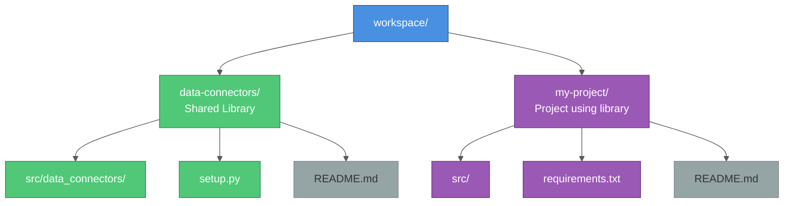

# Building and Distributing Python Libraries: A Complete Guide

A comprehensive guide to designing, building, testing, packaging, and distributing reusable Python libraries for databases, cloud storage, APIs, and more.

## Table of Contents

### Part 1: Building the Library
1. [What are Reusable Libraries?](#what-are-reusable-libraries)
2. [Design Principles](#design-principles)
3. [Abstract Base Class Pattern](#abstract-base-class-pattern)
4. [Connection Lifecycle Management](#connection-lifecycle-management)
5. [Error Handling Conventions](#error-handling-conventions)
6. [File Operations Patterns](#file-operations-patterns)
7. [Complete Connector Examples](#complete-connector-examples)
8. [Testing Strategies](#testing-strategies)

### Part 2: Packaging & Distribution
9. [Why Distribute from Git?](#why-distribute-from-git)
10. [Packaging Your Library](#packaging-your-library)
11. [Local Development: Editable Installs](#local-development-editable-installs)
12. [Production: Direct Git Installation](#production-direct-git-installation)
13. [Authentication Patterns](#authentication-patterns)
14. [Docker Integration](#docker-integration)
15. [Dependency Management](#dependency-management)
16. [Best Practices](#best-practices)
17. [Troubleshooting](#troubleshooting)

---

# Part 1: Building the Library

## What are Reusable Libraries?

**Reusable libraries** provide standardized interfaces to external systems:

- **Database connectors** - PostgreSQL, MySQL, MongoDB
- **Cloud storage connectors** - S3, Azure Blob, Google Cloud Storage
- **API connectors** - REST APIs, GraphQL, SOAP
- **File system connectors** - Local, NFS, SFTP
- **Utility libraries** - Shared helper functions, common patterns

**Why build reusable libraries?**

✅ **Consistency** - Same interface across different data sources
✅ **Reusability** - Use in multiple projects without duplication
✅ **Testability** - Mock connectors for unit testing
✅ **Maintainability** - Fix bugs once, benefit everywhere
✅ **Production-ready** - Built-in error handling, logging, connection pooling
✅ **Team productivity** - Shared code across organization

---

## Design Principles

### 1. Common Interface

All connectors should share a common interface:

```python
from abc import ABC, abstractmethod

class BaseConnector(ABC):
    """Base interface for all connectors."""

    @abstractmethod
    def list(self, path: str = None, **kwargs) -> list:
        """List available resources."""
        pass

    @abstractmethod
    def download(self, source: str, destination: str, **kwargs):
        """Download data from source to destination."""
        pass

    @abstractmethod
    def upload(self, source: str, destination: str, **kwargs):
        """Upload data from source to destination."""
        pass

    @abstractmethod
    def close(self):
        """Close connections and clean up resources."""
        pass
```

### 2. Explicit Configuration

**Don't do this:**
```python
# ❌ Bad: Hidden environment variables
class S3Client:
    def __init__(self):
        self.bucket = os.getenv("S3_BUCKET")  # Implicit!
```

**Do this:**
```python
# ✅ Good: Explicit parameters
class S3Client:
    def __init__(self, bucket_name: str, access_key: str, secret_key: str,
                 endpoint_url: str = None, region: str = "us-east-1"):
        self.bucket_name = bucket_name
        self.access_key = access_key
        self.secret_key = secret_key
        self.endpoint_url = endpoint_url
        self.region = region
```

### 3. Type Hints

Always use type hints for better IDE support and type checking:

```python
from typing import List, Optional, Dict, Any

class DatabaseClient:
    def query(self, sql: str, params: Optional[tuple] = None) -> List[Dict[str, Any]]:
        """Execute query and return results."""
        pass

    def execute(self, sql: str, params: Optional[tuple] = None) -> int:
        """Execute statement and return affected rows."""
        pass
```

### 4. Consistent Error Handling

Use custom exceptions for better error handling:

```python
class ConnectorError(Exception):
    """Base exception for connector errors."""
    pass

class ConnectionError(ConnectorError):
    """Raised when connection fails."""
    pass

class ResourceNotFoundError(ConnectorError):
    """Raised when resource doesn't exist."""
    pass
```

---

## Abstract Base Class Pattern

### Define Base Connector

```python
from abc import ABC, abstractmethod
from typing import List, Optional

class BaseConnector(ABC):
    """
    Abstract base class for all data connectors.

    Defines common interface that all connectors must implement.
    """

    @abstractmethod
    def list(self, path: Optional[str] = None, **kwargs) -> List[str]:
        """
        List available resources.

        Args:
            path: Optional path to list resources from
            **kwargs: Connector-specific options

        Returns:
            List of resource names/paths

        Raises:
            ConnectionError: If connection fails
            ResourceNotFoundError: If path doesn't exist
        """
        pass

    @abstractmethod
    def download(self, source: str, destination: str, **kwargs):
        """
        Download resource from source to local destination.

        Args:
            source: Remote resource path
            destination: Local file path
            **kwargs: Connector-specific options

        Raises:
            ResourceNotFoundError: If source doesn't exist
            PermissionError: If insufficient permissions
        """
        pass

    @abstractmethod
    def upload(self, source: str, destination: str, **kwargs):
        """
        Upload local file to remote destination.

        Args:
            source: Local file path
            destination: Remote resource path
            **kwargs: Connector-specific options

        Raises:
            FileNotFoundError: If source file doesn't exist
            PermissionError: If insufficient permissions
        """
        pass

    @abstractmethod
    def close(self):
        """
        Close connections and clean up resources.

        Should be called when connector is no longer needed.
        Idempotent - safe to call multiple times.
        """
        pass

    @abstractmethod
    def health_check(self) -> bool:
        """
        Check if connector is healthy and can communicate with remote system.

        Returns:
            True if healthy, False otherwise
        """
        pass
```

### Implement Concrete Connector

```python
import boto3
from botocore.exceptions import ClientError

class S3Connector(BaseConnector):
    """AWS S3 connector implementation."""

    def __init__(self, bucket_name: str, access_key: str, secret_key: str,
                 endpoint_url: Optional[str] = None, region: str = "us-east-1"):
        """
        Initialize S3 connector.

        Args:
            bucket_name: S3 bucket name
            access_key: AWS access key ID
            secret_key: AWS secret access key
            endpoint_url: Custom endpoint URL (for S3-compatible services)
            region: AWS region
        """
        self.bucket_name = bucket_name
        self._client = boto3.client(
            's3',
            aws_access_key_id=access_key,
            aws_secret_access_key=secret_key,
            endpoint_url=endpoint_url,
            region_name=region
        )

    def list(self, path: Optional[str] = None, **kwargs) -> List[str]:
        """List objects in bucket."""
        try:
            response = self._client.list_objects_v2(
                Bucket=self.bucket_name,
                Prefix=path or ""
            )
            return [obj['Key'] for obj in response.get('Contents', [])]
        except ClientError as e:
            raise ConnectionError(f"Failed to list objects: {e}")

    def download(self, source: str, destination: str, **kwargs):
        """Download file from S3."""
        try:
            self._client.download_file(
                self.bucket_name,
                source,
                destination
            )
        except ClientError as e:
            if e.response['Error']['Code'] == '404':
                raise ResourceNotFoundError(f"Object not found: {source}")
            raise ConnectionError(f"Failed to download: {e}")

    def upload(self, source: str, destination: str, **kwargs):
        """Upload file to S3."""
        try:
            self._client.upload_file(
                source,
                self.bucket_name,
                destination
            )
        except FileNotFoundError:
            raise FileNotFoundError(f"Local file not found: {source}")
        except ClientError as e:
            raise ConnectionError(f"Failed to upload: {e}")

    def close(self):
        """Close S3 client."""
        # boto3 client doesn't need explicit close
        pass

    def health_check(self) -> bool:
        """Check if bucket is accessible."""
        try:
            self._client.head_bucket(Bucket=self.bucket_name)
            return True
        except Exception:
            return False
```

---

## Connection Lifecycle Management

### Pattern 1: Context Manager Support

```python
class DatabaseConnector(BaseConnector):
    """Database connector with context manager support."""

    def __init__(self, host: str, port: int, database: str,
                 user: str, password: str):
        self.host = host
        self.port = port
        self.database = database
        self.user = user
        self.password = password
        self._connection = None

    def __enter__(self):
        """Enter context manager (establish connection)."""
        self._connect()
        return self

    def __exit__(self, exc_type, exc_val, exc_tb):
        """Exit context manager (close connection)."""
        self.close()
        return False  # Don't suppress exceptions

    def _connect(self):
        """Establish database connection."""
        if self._connection is None:
            import psycopg2
            self._connection = psycopg2.connect(
                host=self.host,
                port=self.port,
                database=self.database,
                user=self.user,
                password=self.password
            )

    def query(self, sql: str) -> List[Dict]:
        """Execute query."""
        if not self._connection:
            self._connect()

        with self._connection.cursor() as cursor:
            cursor.execute(sql)
            columns = [desc[0] for desc in cursor.description]
            return [dict(zip(columns, row)) for row in cursor.fetchall()]

    def close(self):
        """Close database connection."""
        if self._connection:
            self._connection.close()
            self._connection = None


# Usage
with DatabaseConnector("localhost", 5432, "mydb", "user", "pass") as db:
    results = db.query("SELECT * FROM users")
    # Connection automatically closed
```

### Pattern 2: Connection Pooling

```python
from sqlalchemy import create_engine, pool
from sqlalchemy.orm import sessionmaker, Session
from contextlib import contextmanager

class DatabaseConnector(BaseConnector):
    """Database connector with connection pooling."""

    def __init__(self, connection_string: str,
                 pool_size: int = 5, max_overflow: int = 10):
        """
        Initialize with connection pooling.

        Args:
            connection_string: Database connection string
            pool_size: Number of connections to maintain
            max_overflow: Maximum overflow connections
        """
        self.engine = create_engine(
            connection_string,
            poolclass=pool.QueuePool,
            pool_size=pool_size,
            max_overflow=max_overflow,
            pool_pre_ping=True  # Check connections before use
        )
        self.SessionLocal = sessionmaker(bind=self.engine)

    @contextmanager
    def session(self) -> Session:
        """
        Get database session from pool.

        Usage:
            with db.session() as session:
                result = session.query(User).all()
        """
        session = self.SessionLocal()
        try:
            yield session
            session.commit()
        except Exception:
            session.rollback()
            raise
        finally:
            session.close()

    def query(self, sql: str) -> List[Dict]:
        """Execute query using pooled connection."""
        with self.session() as session:
            result = session.execute(sql)
            return [dict(row) for row in result]

    def close(self):
        """Close connection pool."""
        self.engine.dispose()

    def health_check(self) -> bool:
        """Check database connectivity."""
        try:
            with self.session() as session:
                session.execute("SELECT 1")
            return True
        except Exception:
            return False
```

### Pattern 3: Lazy Connection

```python
class APIConnector(BaseConnector):
    """API connector with lazy connection."""

    def __init__(self, api_key: str, endpoint: str):
        self.api_key = api_key
        self.endpoint = endpoint
        self._session = None  # Not created until needed

    @property
    def session(self):
        """Get or create HTTP session (lazy initialization)."""
        if self._session is None:
            import requests
            self._session = requests.Session()
            self._session.headers.update({
                'Authorization': f'Bearer {self.api_key}',
                'Content-Type': 'application/json'
            })
        return self._session

    def get(self, path: str) -> dict:
        """Make GET request."""
        url = f"{self.endpoint}/{path}"
        response = self.session.get(url)
        response.raise_for_status()
        return response.json()

    def close(self):
        """Close HTTP session."""
        if self._session:
            self._session.close()
            self._session = None
```

---

## Error Handling Conventions

### Custom Exception Hierarchy

```python
class ConnectorError(Exception):
    """Base exception for all connector errors."""
    pass

class ConnectionError(ConnectorError):
    """Connection to remote system failed."""
    pass

class AuthenticationError(ConnectorError):
    """Authentication failed (invalid credentials)."""
    pass

class AuthorizationError(ConnectorError):
    """Authorization failed (insufficient permissions)."""
    pass

class ResourceNotFoundError(ConnectorError):
    """Requested resource doesn't exist."""
    pass

class ResourceAlreadyExistsError(ConnectorError):
    """Resource already exists (for create operations)."""
    pass

class TimeoutError(ConnectorError):
    """Operation timed out."""
    pass

class ValidationError(ConnectorError):
    """Input validation failed."""
    pass
```

### Error Handling in Connectors

```python
import logging
from typing import List, Optional

logger = logging.getLogger(__name__)

class S3Connector(BaseConnector):
    """S3 connector with comprehensive error handling."""

    def download(self, source: str, destination: str, **kwargs):
        """
        Download file from S3 with error handling.

        Args:
            source: S3 object key
            destination: Local file path

        Raises:
            ResourceNotFoundError: Object doesn't exist
            AuthorizationError: Insufficient permissions
            TimeoutError: Download timed out
            ConnectionError: Other connection errors
        """
        logger.info(f"Downloading {source} to {destination}")

        try:
            self._client.download_file(
                self.bucket_name,
                source,
                destination
            )
            logger.info(f"Successfully downloaded {source}")

        except ClientError as e:
            error_code = e.response.get('Error', {}).get('Code')

            if error_code == '404' or error_code == 'NoSuchKey':
                msg = f"Object not found: {source}"
                logger.error(msg)
                raise ResourceNotFoundError(msg)

            elif error_code == 'AccessDenied':
                msg = f"Access denied to {source}"
                logger.error(msg)
                raise AuthorizationError(msg)

            elif error_code == 'RequestTimeout':
                msg = f"Download timed out: {source}"
                logger.error(msg)
                raise TimeoutError(msg)

            else:
                msg = f"Failed to download {source}: {e}"
                logger.exception(msg)
                raise ConnectionError(msg)

        except Exception as e:
            msg = f"Unexpected error downloading {source}: {e}"
            logger.exception(msg)
            raise ConnectionError(msg)

    def list(self, prefix: Optional[str] = None, **kwargs) -> List[str]:
        """
        List objects in bucket with error handling.

        Args:
            prefix: Filter objects by prefix

        Returns:
            List of object keys

        Raises:
            AuthorizationError: Insufficient permissions
            ConnectionError: Connection failed
        """
        logger.info(f"Listing objects with prefix: {prefix}")

        try:
            response = self._client.list_objects_v2(
                Bucket=self.bucket_name,
                Prefix=prefix or ""
            )

            objects = [obj['Key'] for obj in response.get('Contents', [])]
            logger.info(f"Found {len(objects)} objects")
            return objects

        except ClientError as e:
            error_code = e.response.get('Error', {}).get('Code')

            if error_code == 'AccessDenied':
                msg = f"Access denied to bucket {self.bucket_name}"
                logger.error(msg)
                raise AuthorizationError(msg)

            else:
                msg = f"Failed to list objects: {e}"
                logger.exception(msg)
                raise ConnectionError(msg)
```

---

## File Operations Patterns

### CSV Export/Import Pattern

```python
import csv
from typing import List, Dict

class DatabaseConnector(BaseConnector):
    """Database connector with CSV operations."""

    def export_to_csv(self, table_name: str, output_file: str,
                      query: Optional[str] = None):
        """
        Export table or query results to CSV.

        Args:
            table_name: Table name (used if query is None)
            output_file: Output CSV file path
            query: Optional custom SQL query

        Example:
            db.export_to_csv("users", "users.csv")
            db.export_to_csv("users", "active.csv",
                           query="SELECT * FROM users WHERE active = true")
        """
        # Execute query
        if query:
            results = self.query(query)
        else:
            results = self.query(f"SELECT * FROM {table_name}")

        if not results:
            logger.warning(f"No data to export for {table_name}")
            return

        # Write to CSV
        with open(output_file, 'w', newline='', encoding='utf-8') as f:
            writer = csv.DictWriter(f, fieldnames=results[0].keys())
            writer.writeheader()
            writer.writerows(results)

        logger.info(f"Exported {len(results)} rows to {output_file}")

    def import_from_csv(self, table_name: str, input_file: str,
                       if_exists: str = "append"):
        """
        Import CSV data into table.

        Args:
            table_name: Target table name
            input_file: Input CSV file path
            if_exists: What to do if table has data:
                - "append": Add rows to existing data (default)
                - "replace": Truncate table first
                - "fail": Raise error if table is not empty

        Example:
            db.import_from_csv("users", "users.csv", if_exists="append")
        """
        # Validate if_exists parameter
        if if_exists not in ["append", "replace", "fail"]:
            raise ValidationError(
                f"Invalid if_exists: {if_exists}. "
                "Must be 'append', 'replace', or 'fail'"
            )

        # Check if table has data
        count = self.query(f"SELECT COUNT(*) as cnt FROM {table_name}")[0]['cnt']

        if count > 0:
            if if_exists == "fail":
                raise ResourceAlreadyExistsError(
                    f"Table {table_name} already contains data"
                )
            elif if_exists == "replace":
                logger.info(f"Truncating table {table_name}")
                self.execute(f"TRUNCATE TABLE {table_name}")

        # Read CSV
        with open(input_file, 'r', encoding='utf-8') as f:
            reader = csv.DictReader(f)
            rows = list(reader)

        if not rows:
            logger.warning(f"No data to import from {input_file}")
            return

        # Build INSERT statement
        columns = rows[0].keys()
        placeholders = ','.join(['%s'] * len(columns))
        insert_sql = f"INSERT INTO {table_name} ({','.join(columns)}) VALUES ({placeholders})"

        # Batch insert
        with self.session() as session:
            for row in rows:
                values = tuple(row[col] for col in columns)
                session.execute(insert_sql, values)

        logger.info(f"Imported {len(rows)} rows into {table_name}")
```

### Streaming Upload/Download Pattern

```python
class StorageConnector(BaseConnector):
    """Storage connector with streaming support."""

    def download_stream(self, source: str, chunk_size: int = 8192):
        """
        Download file as stream (generator).

        Args:
            source: Remote file path
            chunk_size: Size of each chunk in bytes

        Yields:
            Binary chunks of data

        Example:
            with open("output.dat", "wb") as f:
                for chunk in storage.download_stream("large_file.dat"):
                    f.write(chunk)
        """
        try:
            response = self._client.get_object(
                Bucket=self.bucket_name,
                Key=source
            )

            # Stream data in chunks
            for chunk in response['Body'].iter_chunks(chunk_size):
                yield chunk

            logger.info(f"Downloaded {source} (streamed)")

        except Exception as e:
            raise ConnectionError(f"Failed to download {source}: {e}")

    def upload_stream(self, data_stream, destination: str):
        """
        Upload data from stream.

        Args:
            data_stream: Iterable of binary chunks
            destination: Remote file path

        Example:
            def generate_data():
                for i in range(1000):
                    yield f"Line {i}\n".encode()

            storage.upload_stream(generate_data(), "output.txt")
        """
        try:
            # Collect stream into bytes
            data = b''.join(data_stream)

            # Upload
            self._client.put_object(
                Bucket=self.bucket_name,
                Key=destination,
                Body=data
            )

            logger.info(f"Uploaded to {destination} (streamed)")

        except Exception as e:
            raise ConnectionError(f"Failed to upload {destination}: {e}")
```

---

## Complete Connector Examples

### Example 1: PostgreSQL Connector

```python
import psycopg2
from psycopg2.extras import RealDictCursor
from contextlib import contextmanager
from typing import List, Dict, Optional

class PostgresConnector(BaseConnector):
    """PostgreSQL database connector."""

    def __init__(self, host: str, port: int, database: str,
                 user: str, password: str):
        """Initialize PostgreSQL connector."""
        self.host = host
        self.port = port
        self.database = database
        self.user = user
        self.password = password
        self._connection = None

    @contextmanager
    def _get_connection(self):
        """Context manager for database connection."""
        conn = psycopg2.connect(
            host=self.host,
            port=self.port,
            database=self.database,
            user=self.user,
            password=self.password
        )
        try:
            yield conn
            conn.commit()
        except Exception:
            conn.rollback()
            raise
        finally:
            conn.close()

    def list(self, schema: str = "public", **kwargs) -> List[str]:
        """List tables in schema."""
        query = """
            SELECT table_name
            FROM information_schema.tables
            WHERE table_schema = %s
            ORDER BY table_name
        """
        with self._get_connection() as conn:
            with conn.cursor() as cursor:
                cursor.execute(query, (schema,))
                return [row[0] for row in cursor.fetchall()]

    def query(self, sql: str, params: Optional[tuple] = None) -> List[Dict]:
        """Execute SELECT query."""
        with self._get_connection() as conn:
            with conn.cursor(cursor_factory=RealDictCursor) as cursor:
                cursor.execute(sql, params)
                return [dict(row) for row in cursor.fetchall()]

    def execute(self, sql: str, params: Optional[tuple] = None) -> int:
        """Execute INSERT/UPDATE/DELETE query."""
        with self._get_connection() as conn:
            with conn.cursor() as cursor:
                cursor.execute(sql, params)
                return cursor.rowcount

    def download(self, table_name: str, destination: str, **kwargs):
        """Export table to CSV."""
        query = kwargs.get('query', f"SELECT * FROM {table_name}")
        self.export_to_csv(table_name, destination, query)

    def upload(self, source: str, table_name: str, **kwargs):
        """Import CSV into table."""
        if_exists = kwargs.get('if_exists', 'append')
        self.import_from_csv(table_name, source, if_exists)

    def close(self):
        """Close connection."""
        # Connections are closed after each operation
        pass

    def health_check(self) -> bool:
        """Check database connectivity."""
        try:
            with self._get_connection() as conn:
                with conn.cursor() as cursor:
                    cursor.execute("SELECT 1")
            return True
        except Exception:
            return False
```

### Example 2: Cloud Storage Connector

```python
from google.cloud import storage
from google.cloud.exceptions import NotFound

class GCPStorageConnector(BaseConnector):
    """Google Cloud Storage connector."""

    def __init__(self, bucket_name: str, project_id: Optional[str] = None):
        """
        Initialize GCP Storage connector.

        Args:
            bucket_name: GCS bucket name
            project_id: Optional GCP project ID
        """
        self.bucket_name = bucket_name
        self.project_id = project_id
        self._client = storage.Client(project=project_id)
        self._bucket = self._client.bucket(bucket_name)

    def list(self, prefix: Optional[str] = None, **kwargs) -> List[str]:
        """List blobs in bucket."""
        try:
            blobs = self._bucket.list_blobs(prefix=prefix)
            return [blob.name for blob in blobs]
        except Exception as e:
            raise ConnectionError(f"Failed to list blobs: {e}")

    def download(self, source: str, destination: str, **kwargs):
        """Download blob to local file."""
        try:
            blob = self._bucket.blob(source)
            blob.download_to_filename(destination)
            logger.info(f"Downloaded {source} to {destination}")
        except NotFound:
            raise ResourceNotFoundError(f"Blob not found: {source}")
        except Exception as e:
            raise ConnectionError(f"Failed to download {source}: {e}")

    def upload(self, source: str, destination: str, **kwargs):
        """Upload local file to bucket."""
        try:
            blob = self._bucket.blob(destination)
            blob.upload_from_filename(source)
            logger.info(f"Uploaded {source} to {destination}")
        except FileNotFoundError:
            raise FileNotFoundError(f"Local file not found: {source}")
        except Exception as e:
            raise ConnectionError(f"Failed to upload {source}: {e}")

    def delete(self, path: str):
        """Delete blob."""
        try:
            blob = self._bucket.blob(path)
            blob.delete()
            logger.info(f"Deleted {path}")
        except NotFound:
            raise ResourceNotFoundError(f"Blob not found: {path}")

    def close(self):
        """Close client."""
        # GCP client doesn't need explicit close
        pass

    def health_check(self) -> bool:
        """Check bucket accessibility."""
        try:
            self._bucket.exists()
            return True
        except Exception:
            return False
```

---

## Testing Strategies

### Unit Testing with Mocks

```python
from unittest.mock import Mock, patch
import pytest

def test_s3_connector_download():
    """Test S3 connector download."""
    # Create mock S3 client
    mock_client = Mock()

    # Create connector
    connector = S3Connector("my-bucket", "key", "secret")
    connector._client = mock_client

    # Test download
    connector.download("file.txt", "/tmp/file.txt")

    # Verify client was called correctly
    mock_client.download_file.assert_called_once_with(
        "my-bucket",
        "file.txt",
        "/tmp/file.txt"
    )


def test_s3_connector_download_not_found():
    """Test S3 connector handles missing file."""
    # Create mock that raises 404
    mock_client = Mock()
    mock_client.download_file.side_effect = ClientError(
        {'Error': {'Code': '404'}},
        'download_file'
    )

    # Create connector
    connector = S3Connector("my-bucket", "key", "secret")
    connector._client = mock_client

    # Test that ResourceNotFoundError is raised
    with pytest.raises(ResourceNotFoundError):
        connector.download("missing.txt", "/tmp/missing.txt")
```

### Integration Testing

```python
import tempfile
import os

def test_database_connector_integration():
    """Integration test for database connector."""
    # Use test database
    db = PostgresConnector(
        host="localhost",
        port=5432,
        database="test_db",
        user="test_user",
        password="test_pass"
    )

    # Check health
    assert db.health_check(), "Database should be accessible"

    # Create test table
    db.execute("""
        CREATE TABLE IF NOT EXISTS test_users (
            id SERIAL PRIMARY KEY,
            name VARCHAR(100),
            email VARCHAR(100)
        )
    """)

    # Insert data
    db.execute(
        "INSERT INTO test_users (name, email) VALUES (%s, %s)",
        ("Alice", "alice@example.com")
    )

    # Query data
    results = db.query("SELECT * FROM test_users WHERE name = %s", ("Alice",))
    assert len(results) == 1
    assert results[0]['email'] == "alice@example.com"

    # Export to CSV
    with tempfile.NamedTemporaryFile(delete=False, suffix='.csv') as f:
        csv_file = f.name

    try:
        db.download("test_users", csv_file)
        assert os.path.exists(csv_file)
        with open(csv_file) as f:
            content = f.read()
            assert "Alice" in content
    finally:
        os.unlink(csv_file)

    # Cleanup
    db.execute("DROP TABLE test_users")
```

---

# Part 2: Packaging & Distribution

## Why Distribute from Git?

**Use cases for distributing libraries via Git:**

✅ **Shared internal libraries** - Install company-specific packages not published to PyPI
✅ **Development dependencies** - Use the latest development version
✅ **Private forks** - Install from your own fork of a public package
✅ **Pre-release features** - Test unreleased features from a specific branch
✅ **Monorepo patterns** - Share code between multiple projects in an organization
✅ **Rapid iteration** - Update dependencies by pointing to new commits/tags

**Example scenario:**
You've built a `data-connectors` library (like the examples above) that provides database, cloud storage, and API integrations. Multiple projects in your organization need to use it, but you don't want to publish it to PyPI.

---

## Packaging Your Library

### Directory Structure

```
data-connectors/              # Your library repository
├── src/
│   └── data_connectors/
│       ├── __init__.py
│       ├── base.py           # BaseConnector abstract class
│       ├── postgres.py       # PostgresConnector
│       ├── s3.py             # S3Connector
│       ├── gcp.py            # GCPStorageConnector
│       └── exceptions.py     # Custom exceptions
├── tests/
│   ├── test_postgres.py
│   ├── test_s3.py
│   └── test_gcp.py
├── setup.py                  # Traditional setup
├── pyproject.toml            # Modern setup
├── README.md
└── LICENSE
```

### Option 1: setup.py (Traditional)

**File: `setup.py`**

```python
from setuptools import setup, find_packages

setup(
    name="data-connectors",
    version="2.1.0",
    description="Reusable data connectors for databases, cloud storage, and APIs",
    author="Your Name",
    author_email="your.email@example.com",
    packages=find_packages(where="src"),
    package_dir={"": "src"},
    install_requires=[
        "psycopg2-binary>=2.9.0",
        "sqlalchemy>=2.0.0",
    ],
    extras_require={
        "s3": ["boto3>=1.26.0"],
        "gcp": ["google-cloud-storage>=2.10.0"],
        "all": [
            "boto3>=1.26.0",
            "google-cloud-storage>=2.10.0"
        ],
        "dev": [
            "pytest>=7.4.0",
            "pytest-cov>=4.1.0",
            "black>=23.0.0",
            "mypy>=1.5.0"
        ]
    },
    python_requires=">=3.9",
)
```

### Option 2: pyproject.toml (Modern)

**File: `pyproject.toml`**

```toml
[build-system]
requires = ["setuptools>=61.0", "wheel"]
build-backend = "setuptools.build_meta"

[project]
name = "data-connectors"
version = "2.1.0"
description = "Reusable data connectors for databases, cloud storage, and APIs"
authors = [
    {name = "Your Name", email = "your.email@example.com"}
]
requires-python = ">=3.9"
dependencies = [
    "psycopg2-binary>=2.9.0",
    "sqlalchemy>=2.0.0",
]

[project.optional-dependencies]
s3 = ["boto3>=1.26.0"]
gcp = ["google-cloud-storage>=2.10.0"]
all = [
    "boto3>=1.26.0",
    "google-cloud-storage>=2.10.0"
]
dev = [
    "pytest>=7.4.0",
    "pytest-cov>=4.1.0",
    "black>=23.0.0",
    "mypy>=1.5.0"
]

[tool.setuptools.packages.find]
where = ["src"]
```

### Package Initialization

**File: `src/data_connectors/__init__.py`**

```python
"""Data connectors for databases, cloud storage, and APIs."""

from .base import BaseConnector
from .exceptions import (
    ConnectorError,
    ConnectionError,
    AuthenticationError,
    AuthorizationError,
    ResourceNotFoundError,
    ResourceAlreadyExistsError,
    TimeoutError,
    ValidationError
)

# Import connectors (only if dependencies are available)
try:
    from .postgres import PostgresConnector
except ImportError:
    PostgresConnector = None

try:
    from .s3 import S3Connector
except ImportError:
    S3Connector = None

try:
    from .gcp import GCPStorageConnector
except ImportError:
    GCPStorageConnector = None

__version__ = "2.1.0"

__all__ = [
    "BaseConnector",
    "ConnectorError",
    "ConnectionError",
    "AuthenticationError",
    "AuthorizationError",
    "ResourceNotFoundError",
    "ResourceAlreadyExistsError",
    "TimeoutError",
    "ValidationError",
    "PostgresConnector",
    "S3Connector",
    "GCPStorageConnector",
]
```

---

## Local Development: Editable Installs

For local development, use **editable installs** (`-e` flag) so changes to the library are immediately reflected without reinstalling.

### Pattern: Sibling Directories

**Project structure:**


### Install in Editable Mode

**File: `my-project/requirements.txt`**

```bash
# Development dependencies - editable install
-e ../data-connectors[all]

# Project dependencies
fastapi>=0.109.0
uvicorn>=0.27.0
```

**Install:**

```bash
cd my-project
pip install -r requirements.txt
```

**What `-e` (editable mode) does:**
- Creates a symbolic link to the library source code
- Changes to `data-connectors/` are immediately available in `my-project/`
- No need to reinstall after every change
- Perfect for local development

### Use the Library

**File: `my-project/src/main.py`**

```python
# Import from the editable-installed library
from data_connectors import PostgresConnector, S3Connector

# Use it
db = PostgresConnector(
    host="localhost",
    port=5432,
    database="mydb",
    user="user",
    password="pass"
)
results = db.query("SELECT * FROM users")

s3 = S3Connector(
    bucket_name="my-bucket",
    access_key="key",
    secret_key="secret"
)
files = s3.list()
```

### Verifying Editable Install

```bash
# Check installed packages
pip list | grep data-connectors
# Output: data-connectors   2.1.0    /path/to/workspace/data-connectors

# The path confirms it's an editable install
```

---

## Production: Direct Git Installation

For production (Docker, CI/CD), install directly from the Git repository.

### Public Repository (GitHub, GitLab)

**Syntax:**
```bash
pip install git+https://github.com/username/data-connectors.git
```

**In requirements.txt:**
```bash
# Install from main branch
git+https://github.com/username/data-connectors.git

# Install from specific branch
git+https://github.com/username/data-connectors.git@develop

# Install from specific tag
git+https://github.com/username/data-connectors.git@v2.1.0

# Install from specific commit
git+https://github.com/username/data-connectors.git@a1b2c3d

# With extras
git+https://github.com/username/data-connectors.git@v2.1.0#egg=data-connectors[all]
```

### Private Repository (Authentication Required)

For private repositories, you need authentication.

#### Option 1: Personal Access Token (PAT)

**1. Generate a PAT:**
- GitHub: Settings → Developer settings → Personal access tokens → Generate new token
- GitLab: User Settings → Access Tokens
- Azure DevOps: User Settings → Personal access tokens

**2. Install with PAT:**

```bash
# Inline PAT (not recommended for security reasons)
pip install git+https://TOKEN@github.com/username/data-connectors.git

# Better: Use environment variable
export GIT_TOKEN=ghp_your_token_here
pip install git+https://${GIT_TOKEN}@github.com/username/data-connectors.git
```

**3. In requirements.txt (environment variable):**

```bash
# requirements.txt
# Note: Token must be set in environment before installing
git+https://${GIT_TOKEN}@github.com/username/data-connectors.git@v2.1.0#egg=data-connectors[all]
```

**4. Install with environment variable:**

```bash
export GIT_TOKEN=ghp_your_token_here
pip install -r requirements.txt
```

#### Option 2: SSH Authentication

If you have SSH keys configured:

```bash
# SSH syntax
pip install git+ssh://git@github.com/username/data-connectors.git

# In requirements.txt
git+ssh://git@github.com/username/data-connectors.git@v2.1.0#egg=data-connectors
```

---

## Authentication Patterns

### Pattern 1: Git Config with PAT (Most Secure)

Configure Git to use PAT for a specific domain, then unset after install.

```bash
#!/bin/bash
# Install script with PAT authentication

GIT_TOKEN="your_token_here"

# Configure git to use PAT
git config --global url."https://${GIT_TOKEN}@github.com/".insteadOf "https://github.com/"

# Install dependencies
pip install git+https://github.com/username/data-connectors.git@v2.1.0#egg=data-connectors[all]

# Unset git config (security)
git config --global --unset url."https://${GIT_TOKEN}@github.com/".insteadOf

# Clear token from environment
unset GIT_TOKEN
```

### Pattern 2: Netrc File (Persistent Authentication)

Create a `.netrc` file for automatic authentication:

**File: `~/.netrc`**

```
machine github.com
login username
password ghp_your_token_here

machine gitlab.com
login username
password glpat-your_token_here
```

**Set permissions (critical for security):**

```bash
chmod 600 ~/.netrc
```

**Install (no token needed in command):**

```bash
pip install git+https://github.com/username/data-connectors.git
```

### Pattern 3: Environment Variables

**`.env` file:**

```bash
GIT_USER=your_username
GIT_TOKEN=ghp_your_token_here
```

**Python script:**

```python
import os
from dotenv import load_dotenv
import subprocess

load_dotenv()

git_user = os.getenv("GIT_USER")
git_token = os.getenv("GIT_TOKEN")

# Install with authentication
subprocess.run([
    "pip", "install",
    f"git+https://{git_token}@github.com/username/data-connectors.git@v2.1.0#egg=data-connectors[all]"
])
```

---

## Docker Integration

### Pattern 1: Build-Time Installation with PAT

**Dockerfile:**

```dockerfile
FROM python:3.12-slim

WORKDIR /app

# Install git (required for pip install from git)
RUN apt-get update && apt-get install -y git && rm -rf /var/lib/apt/lists/*

# Copy requirements
COPY requirements.txt .

# Accept PAT as build argument
ARG GIT_TOKEN

# Configure git to use PAT, install, then unset
RUN if [ -n "$GIT_TOKEN" ]; then \
        git config --global url."https://${GIT_TOKEN}@github.com/".insteadOf "https://github.com/" && \
        pip install --no-cache-dir -r requirements.txt && \
        git config --global --unset url."https://${GIT_TOKEN}@github.com/".insteadOf; \
    else \
        echo "WARNING: GIT_TOKEN not provided" && \
        pip install --no-cache-dir -r requirements.txt; \
    fi

# Clear token from environment (security)
ENV GIT_TOKEN=""

# Copy application code
COPY src/ ./src/

CMD ["python", "src/main.py"]
```

**requirements.txt:**

```bash
# Will use git config authentication set in Dockerfile
git+https://github.com/username/data-connectors.git@v2.1.0#egg=data-connectors[all]

# Other dependencies
fastapi>=0.109.0
uvicorn>=0.27.0
```

**Build:**

```bash
docker build --build-arg GIT_TOKEN=ghp_your_token_here -t my-app .
```

**docker-compose.yml:**

```yaml
version: '3.8'

services:
  app:
    build:
      context: .
      args:
        GIT_TOKEN: ${GIT_TOKEN}  # Read from .env file
    ports:
      - "8000:8000"
    env_file:
      - .env
```

**Build with docker-compose:**

```bash
# .env file contains GIT_TOKEN=ghp_...
docker-compose build
```

### Pattern 2: Multi-Stage Build (Security Best Practice)

Separate build and runtime to avoid leaking credentials:

```dockerfile
# Stage 1: Build stage with git access
FROM python:3.12-slim AS builder

WORKDIR /build

RUN apt-get update && apt-get install -y git && rm -rf /var/lib/apt/lists/*

COPY requirements.txt .

ARG GIT_TOKEN

RUN git config --global url."https://${GIT_TOKEN}@github.com/".insteadOf "https://github.com/" && \
    pip install --no-cache-dir --target=/build/packages -r requirements.txt && \
    git config --global --unset url."https://${GIT_TOKEN}@github.com/".insteadOf

# Stage 2: Runtime stage (no git, no token)
FROM python:3.12-slim

WORKDIR /app

# Copy installed packages from builder
COPY --from=builder /build/packages /usr/local/lib/python3.12/site-packages

# Copy application code
COPY src/ ./src/

CMD ["python", "src/main.py"]
```

**Why this is better:**
- ✅ Final image doesn't contain git
- ✅ Final image doesn't contain credentials
- ✅ Smaller final image size
- ✅ More secure for production

---

## Dependency Management

### Separate Dev and Production Requirements

**requirements.txt (local dev):**

```bash
# Local editable install
-e ../data-connectors[all]

# Development tools
pytest>=7.4.0
pytest-cov>=4.1.0
black>=23.0.0
mypy>=1.5.0
```

**requirements-prod.txt (production):**

```bash
# Production install from Git (pinned version)
git+https://github.com/username/data-connectors.git@v2.1.0#egg=data-connectors[all]

# Production dependencies only
fastapi>=0.109.0
uvicorn>=0.27.0
gunicorn>=21.2.0
```

**Using both:**

```bash
# Local development
pip install -r requirements.txt

# Production build
pip install -r requirements-prod.txt
```

### Version Pinning

**Lock to specific versions:**

```bash
# Good: Pin to specific tag
git+https://github.com/username/data-connectors.git@v2.1.0#egg=data-connectors

# Good: Pin to specific commit
git+https://github.com/username/data-connectors.git@a1b2c3d4e5f6#egg=data-connectors

# Risky: Install from branch (version can change)
git+https://github.com/username/data-connectors.git@main#egg=data-connectors
```

### Dependency Resolution

If your library has its own dependencies, pip will resolve them:

**data-connectors/setup.py:**

```python
setup(
    name="data-connectors",
    install_requires=[
        "psycopg2-binary>=2.9.0",
        "sqlalchemy>=2.0.0",
    ]
)
```

**my-project/requirements.txt:**

```bash
# Installing data-connectors will also install psycopg2-binary and sqlalchemy
git+https://github.com/username/data-connectors.git@v2.1.0#egg=data-connectors
```

---

## Best Practices

### 1. Use Editable Installs for Development

```bash
# ✅ Good: Editable for development
-e ../data-connectors

# ❌ Bad: Non-editable for development
../data-connectors
```

### 2. Pin Versions for Production

```bash
# ✅ Good: Specific version
git+https://github.com/username/data-connectors.git@v2.1.0#egg=data-connectors

# ❌ Bad: Tracking branch (unpredictable)
git+https://github.com/username/data-connectors.git@main#egg=data-connectors
```

### 3. Never Commit Tokens to Git

```bash
# ❌ NEVER DO THIS
git+https://ghp_secrettoken123@github.com/username/data-connectors.git

# ✅ Use environment variables
git+https://${GIT_TOKEN}@github.com/username/data-connectors.git

# ✅ Or use .netrc (not committed)
git+https://github.com/username/data-connectors.git
```

### 4. Use Semantic Versioning

Follow semantic versioning for your library:

```
v2.1.0
│ │ │
│ │ └─ Patch: Bug fixes, no breaking changes
│ └─── Minor: New features, no breaking changes
└───── Major: Breaking changes
```

**Tagging releases:**

```bash
git tag -a v2.1.0 -m "Release version 2.1.0"
git push origin v2.1.0
```

### 5. Document the Setup Process

**README.md:**

```markdown
## Setup

### Prerequisites
- Python 3.9+
- Git
- Access to private repository (requires PAT)

### Local Development

1. Clone repositories side by side:
   ```bash
   git clone https://github.com/username/data-connectors.git
   git clone https://github.com/username/my-project.git
   ```

2. Install dependencies:
   ```bash
   cd my-project
   pip install -r requirements.txt
   ```

### Production Deployment

Set `GIT_TOKEN` environment variable before building:

```bash
export GIT_TOKEN=ghp_your_token_here
docker build --build-arg GIT_TOKEN=${GIT_TOKEN} -t my-app .
```
```

### 6. Use Virtual Environments

```bash
# Always use virtual environments
python -m venv venv
source venv/bin/activate  # On Windows: venv\Scripts\activate

# Install dependencies
pip install -r requirements.txt
```

### 7. Clear Credentials After Use

```bash
# In scripts and Dockerfiles
git config --global --unset url."https://${GIT_TOKEN}@github.com/".insteadOf
unset GIT_TOKEN
```

### 8. Add CI/CD Testing

Test your library with continuous integration:

**.github/workflows/test.yml:**

```yaml
name: Tests

on: [push, pull_request]

jobs:
  test:
    runs-on: ubuntu-latest
    strategy:
      matrix:
        python-version: ["3.9", "3.10", "3.11", "3.12"]

    steps:
    - uses: actions/checkout@v3

    - name: Set up Python ${{ matrix.python-version }}
      uses: actions/setup-python@v4
      with:
        python-version: ${{ matrix.python-version }}

    - name: Install dependencies
      run: |
        pip install -e .[dev]

    - name: Run tests
      run: |
        pytest tests/ --cov=data_connectors

    - name: Run type checking
      run: |
        mypy src/

    - name: Check formatting
      run: |
        black --check src/
```

---

## Troubleshooting

### Issue 1: Authentication Failed

**Error:**
```
fatal: Authentication failed for 'https://github.com/username/data-connectors.git/'
```

**Solutions:**

1. **Check PAT permissions:**
   - GitHub: Needs `repo` scope
   - GitLab: Needs `read_repository` scope

2. **Verify token:**
   ```bash
   echo $GIT_TOKEN  # Should print your token
   ```

3. **Test git access:**
   ```bash
   git clone https://${GIT_TOKEN}@github.com/username/data-connectors.git
   ```

### Issue 2: SSL Certificate Verification Failed

**Error:**
```
SSL: CERTIFICATE_VERIFY_FAILED
```

**Solutions:**

1. **Update certificates:**
   ```bash
   pip install --upgrade certifi
   ```

2. **Corporate proxy (temporary workaround):**
   ```bash
   # Not recommended for production!
   pip install --trusted-host github.com git+https://github.com/username/data-connectors.git
   ```

3. **Add corporate CA certificates:**
   ```bash
   export REQUESTS_CA_BUNDLE=/path/to/corporate-ca-bundle.crt
   ```

### Issue 3: Editable Install Not Updating

**Problem:** Changes to the library aren't reflected in the project.

**Solutions:**

1. **Verify editable install:**
   ```bash
   pip list | grep data-connectors
   # Should show path: data-connectors   2.1.0    /path/to/data-connectors
   ```

2. **Reinstall in editable mode:**
   ```bash
   pip uninstall data-connectors
   pip install -e ../data-connectors
   ```

3. **Check Python path:**
   ```python
   import data_connectors
   print(data_connectors.__file__)
   # Should point to ../data-connectors/src/data_connectors
   ```

### Issue 4: Git Not Found in Docker

**Error:**
```
/bin/sh: git: not found
```

**Solution:**

Install git in Dockerfile:

```dockerfile
RUN apt-get update && apt-get install -y git && rm -rf /var/lib/apt/lists/*
```

### Issue 5: Dependency Conflicts

**Error:**
```
ERROR: pip's dependency resolver does not currently take into account all the packages that are installed.
```

**Solutions:**

1. **Check for version conflicts:**
   ```bash
   pip check
   ```

2. **Use constraints file:**
   ```bash
   # constraints.txt
   psycopg2-binary==2.9.5
   sqlalchemy==2.0.23

   # Install with constraints
   pip install -r requirements.txt -c constraints.txt
   ```

3. **Create clean environment:**
   ```bash
   deactivate
   rm -rf venv
   python -m venv venv
   source venv/bin/activate
   pip install -r requirements.txt
   ```

---

## Real-World Example: Complete Workflow

### Project Structure

```
company-workspace/
├── data-connectors/              # Shared library
│   ├── src/
│   │   └── data_connectors/
│   │       ├── __init__.py
│   │       ├── base.py
│   │       ├── postgres.py
│   │       ├── s3.py
│   │       └── gcp.py
│   ├── tests/
│   ├── setup.py
│   └── README.md
│
├── project-a/                     # Project using connectors
│   ├── src/
│   ├── requirements.txt           # -e ../data-connectors[all]
│   ├── requirements-prod.txt      # git+https://...
│   └── Dockerfile
│
└── project-b/                     # Another project using connectors
    ├── src/
    ├── requirements.txt
    └── Dockerfile
```

### project-a/src/main.py

```python
from fastapi import FastAPI
from data_connectors import PostgresConnector, S3Connector

app = FastAPI()

# Initialize connectors
db = PostgresConnector(
    host="localhost",
    port=5432,
    database="mydb",
    user="user",
    password="pass"
)

s3 = S3Connector(
    bucket_name="my-bucket",
    access_key="key",
    secret_key="secret"
)

@app.get("/users")
def get_users():
    return db.query("SELECT * FROM users")

@app.get("/files")
def list_files():
    return s3.list()
```

### project-a/Dockerfile

```dockerfile
FROM python:3.12-slim AS builder

WORKDIR /build

# Install git
RUN apt-get update && apt-get install -y git && rm -rf /var/lib/apt/lists/*

# Copy production requirements
COPY requirements-prod.txt .

# Install with PAT
ARG GIT_TOKEN
RUN git config --global url."https://${GIT_TOKEN}@github.com/".insteadOf "https://github.com/" && \
    pip install --no-cache-dir --target=/build/packages -r requirements-prod.txt && \
    git config --global --unset url."https://${GIT_TOKEN}@github.com/".insteadOf

# Runtime stage
FROM python:3.12-slim

WORKDIR /app

COPY --from=builder /build/packages /usr/local/lib/python3.12/site-packages
COPY src/ ./src/

CMD ["uvicorn", "src.main:app", "--host", "0.0.0.0", "--port", "8000"]
```

---

## Summary

**Key Takeaways:**

### Part 1: Building
1. **Design Principles** - Common interface, explicit config, type hints, error handling
2. **Abstract Base Classes** - Consistent API across connectors
3. **Connection Management** - Context managers, connection pooling, lazy initialization
4. **Error Handling** - Custom exception hierarchy with clear messages
5. **Testing** - Unit tests with mocks, integration tests

### Part 2: Distribution
1. **Packaging** - setup.py or pyproject.toml with proper dependencies
2. **Local Development** - Use editable installs (`-e`) for immediate feedback
3. **Production** - Install directly from Git with version pinning
4. **Authentication** - Use environment variables and git config, never commit tokens
5. **Docker** - Multi-stage builds for security, install git in build stage only
6. **Best Practices** - Pin versions, use separate dev/prod requirements, document setup

**Benefits:**
- ✅ Reusable across projects
- ✅ Consistent interface for different data sources
- ✅ Easy to test with mocks
- ✅ Production-ready (error handling, logging, connection management)
- ✅ Type-safe with full IDE support
- ✅ Secure distribution via Git
- ✅ Fast iteration with editable installs

## Further Reading

- [Abstract Base Classes in Python](https://docs.python.org/3/library/abc.html)
- [Context Managers](https://docs.python.org/3/library/contextlib.html)
- [Python Type Hints](https://docs.python.org/3/library/typing.html)
- [SQLAlchemy Connection Pooling](https://docs.sqlalchemy.org/en/20/core/pooling.html)
- [Boto3 S3 Client](https://boto3.amazonaws.com/v1/documentation/api/latest/reference/services/s3.html)
- [Pip Documentation: VCS Support](https://pip.pypa.io/en/stable/topics/vcs-support/)
- [Python Packaging User Guide](https://packaging.python.org/)
- [Setuptools Documentation](https://setuptools.pypa.io/)
- [Docker Multi-Stage Builds](https://docs.docker.com/build/building/multi-stage/)

---

**Created:** 2026-02-06
**Tags:** #python #connectors #design-patterns #architecture #database #cloud-storage #api #data-engineering #pip #git #docker #dependencies #devops
