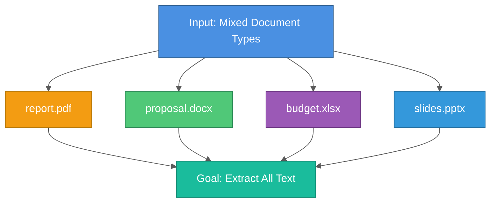

# Document Processing Pipeline: Multi-Format Text Extraction

A comprehensive guide to building robust document processing pipelines that extract text from PDF, DOCX, Excel, PowerPoint, and other formats for RAG systems and data analysis.

## Table of Contents

1. [Introduction](#introduction)
2. [Supported Formats](#supported-formats)
3. [PDF Processing](#pdf-processing)
4. [DOCX Processing](#docx-processing)
5. [Excel Processing](#excel-processing)
6. [PowerPoint Processing](#powerpoint-processing)
7. [Complete Processor](#complete-processor)
8. [Error Handling](#error-handling)
9. [Performance Optimization](#performance-optimization)
10. [Best Practices](#best-practices)

---

## Introduction

**Document processing** is the foundation of many AI applications, especially RAG (Retrieval-Augmented Generation) systems. The challenge: extracting clean, usable text from diverse file formats.

### The Challenge



### This Guide Covers

✅ PDF extraction (text + OCR for scanned documents)
✅ DOCX extraction (paragraphs, tables, headers)
✅ Excel extraction (all sheets, formatted output)
✅ PowerPoint extraction (slides + speaker notes)
✅ Error handling and validation
✅ Performance optimization

---

## Supported Formats

### Install Dependencies

```bash
# Core libraries
pip install PyPDF2 pdfplumber python-docx openpyxl python-pptx pandas

# Optional: OCR for scanned PDFs
pip install pytesseract pdf2image
# Also install Tesseract: brew install tesseract (macOS)
```

### Format Support Matrix

| Format | Extension | Library | Text | Tables | Images |
|--------|-----------|---------|------|--------|--------|
| **PDF** | `.pdf` | PyPDF2, pdfplumber | ✅ | ✅ | ⚠️ OCR |
| **Word** | `.docx` | python-docx | ✅ | ✅ | ❌ |
| **Excel** | `.xlsx`, `.xlsm` | openpyxl, pandas | ✅ | ✅ | ❌ |
| **PowerPoint** | `.pptx` | python-pptx | ✅ | ❌ | ❌ |
| **Text** | `.txt`, `.md` | built-in | ✅ | ❌ | ❌ |

---

## PDF Processing

### Method 1: PyPDF2 (Fast, Basic)

```python
# pdf_processor.py
import PyPDF2
from pathlib import Path

def extract_text_pypdf2(pdf_path: Path) -> str:
    """
    Extract text from PDF using PyPDF2.

    Pros: Fast, no dependencies
    Cons: Struggles with complex layouts, scanned PDFs
    """
    text = ""

    with open(pdf_path, 'rb') as file:
        reader = PyPDF2.PdfReader(file)

        # Extract from all pages
        for page_num, page in enumerate(reader.pages):
            page_text = page.extract_text()
            text += f"\n--- Page {page_num + 1} ---\n"
            text += page_text

    return text
```

### Method 2: pdfplumber (Better, Handles Tables)

```python
import pdfplumber

def extract_text_pdfplumber(pdf_path: Path) -> str:
    """
    Extract text from PDF using pdfplumber.

    Pros: Better layout handling, extracts tables
    Cons: Slower than PyPDF2
    """
    text = ""

    with pdfplumber.open(pdf_path) as pdf:
        for page_num, page in enumerate(pdf.pages):
            # Extract text
            page_text = page.extract_text()
            text += f"\n--- Page {page_num + 1} ---\n"
            text += page_text or ""

            # Extract tables
            tables = page.extract_tables()
            if tables:
                text += "\n\nTables:\n"
                for table in tables:
                    # Convert table to text
                    for row in table:
                        text += " | ".join([str(cell) if cell else "" for cell in row])
                        text += "\n"

    return text
```

### Method 3: OCR for Scanned PDFs

```python
from pdf2image import convert_from_path
import pytesseract

def extract_text_ocr(pdf_path: Path) -> str:
    """
    Extract text from scanned PDF using OCR.

    Use when: PDF contains images of text (scanned documents)
    Warning: Slow, requires Tesseract installation
    """
    text = ""

    # Convert PDF pages to images
    images = convert_from_path(pdf_path)

    # OCR each page
    for page_num, image in enumerate(images):
        page_text = pytesseract.image_to_string(image)
        text += f"\n--- Page {page_num + 1} ---\n"
        text += page_text

    return text
```

### Hybrid Approach (Try Text, Fall Back to OCR)

```python
def extract_text_pdf_hybrid(pdf_path: Path) -> str:
    """
    Hybrid PDF extraction: try text extraction first,
    fall back to OCR if text is sparse.
    """
    # Try text extraction
    text = extract_text_pdfplumber(pdf_path)

    # Check if we got meaningful text (> 100 chars)
    if len(text.strip()) < 100:
        print(f"Text extraction failed for {pdf_path.name}, trying OCR...")
        text = extract_text_ocr(pdf_path)

    return text
```

---

## DOCX Processing

### Extract Paragraphs

```python
import docx

def extract_text_docx(docx_path: Path) -> str:
    """
    Extract text from DOCX file.

    Extracts: Paragraphs, headings, lists
    """
    doc = docx.Document(docx_path)
    text = ""

    # Extract all paragraphs
    for para in doc.paragraphs:
        text += para.text + "\n"

    return text
```

### Extract Tables

```python
def extract_text_docx_with_tables(docx_path: Path) -> str:
    """
    Extract text and tables from DOCX.
    """
    doc = docx.Document(docx_path)
    text = ""

    # Extract paragraphs
    for para in doc.paragraphs:
        text += para.text + "\n"

    # Extract tables
    if doc.tables:
        text += "\n\n--- Tables ---\n"
        for table_num, table in enumerate(doc.tables):
            text += f"\nTable {table_num + 1}:\n"

            for row in table.rows:
                row_text = " | ".join([cell.text for cell in row.cells])
                text += row_text + "\n"

    return text
```

### Extract Headers and Footers

```python
def extract_text_docx_complete(docx_path: Path) -> str:
    """
    Extract all text including headers and footers.
    """
    doc = docx.Document(docx_path)
    text = ""

    # Headers
    for section in doc.sections:
        header = section.header
        for para in header.paragraphs:
            if para.text.strip():
                text += f"[Header] {para.text}\n"

    # Body paragraphs
    for para in doc.paragraphs:
        text += para.text + "\n"

    # Tables
    for table in doc.tables:
        for row in table.rows:
            row_text = " | ".join([cell.text for cell in row.cells])
            text += row_text + "\n"

    # Footers
    for section in doc.sections:
        footer = section.footer
        for para in footer.paragraphs:
            if para.text.strip():
                text += f"[Footer] {para.text}\n"

    return text
```

---

## Excel Processing

### Extract All Sheets

```python
import pandas as pd

def extract_text_excel(excel_path: Path) -> str:
    """
    Extract text from Excel file (all sheets).

    Uses pandas for easy conversion to text.
    """
    text = ""

    # Read all sheets
    xls = pd.ExcelFile(excel_path, engine='openpyxl')

    for sheet_name in xls.sheet_names:
        text += f"\n\n--- Sheet: {sheet_name} ---\n"

        # Read sheet as DataFrame
        df = pd.read_excel(xls, sheet_name=sheet_name)

        # Convert to string (preserves structure)
        text += df.to_string(index=False)
        text += "\n"

    return text
```

### Handle Formulas and Formatting

```python
from openpyxl import load_workbook

def extract_text_excel_advanced(excel_path: Path) -> str:
    """
    Extract text with formula values (not formulas themselves).
    """
    text = ""

    # Load workbook (data_only=True gets computed values)
    wb = load_workbook(excel_path, data_only=True)

    for sheet_name in wb.sheetnames:
        sheet = wb[sheet_name]
        text += f"\n\n--- Sheet: {sheet_name} ---\n"

        # Iterate through rows
        for row in sheet.iter_rows(values_only=True):
            # Convert row to text
            row_text = " | ".join([str(cell) if cell is not None else "" for cell in row])
            text += row_text + "\n"

    return text
```

### Optimize for Large Files

```python
def extract_text_excel_optimized(excel_path: Path, max_rows: int = 1000) -> str:
    """
    Extract text from Excel with row limit (for large files).
    """
    text = ""

    xls = pd.ExcelFile(excel_path, engine='openpyxl')

    for sheet_name in xls.sheet_names:
        text += f"\n\n--- Sheet: {sheet_name} ---\n"

        # Read only first N rows
        df = pd.read_excel(xls, sheet_name=sheet_name, nrows=max_rows)

        text += df.to_string(index=False)

        # Indicate if truncated
        if len(df) == max_rows:
            text += f"\n... (truncated to {max_rows} rows)"

    return text
```

---

## PowerPoint Processing

### Extract Slide Text

```python
from pptx import Presentation

def extract_text_pptx(pptx_path: Path) -> str:
    """
    Extract text from PowerPoint slides.
    """
    prs = Presentation(pptx_path)
    text = ""

    for slide_num, slide in enumerate(prs.slides):
        text += f"\n\n--- Slide {slide_num + 1} ---\n"

        # Extract text from all shapes
        for shape in slide.shapes:
            if hasattr(shape, "text"):
                text += shape.text + "\n"

    return text
```

### Include Speaker Notes

```python
def extract_text_pptx_with_notes(pptx_path: Path) -> str:
    """
    Extract slide text AND speaker notes.
    """
    prs = Presentation(pptx_path)
    text = ""

    for slide_num, slide in enumerate(prs.slides):
        text += f"\n\n--- Slide {slide_num + 1} ---\n"

        # Slide content
        for shape in slide.shapes:
            if hasattr(shape, "text"):
                text += shape.text + "\n"

        # Speaker notes
        if slide.has_notes_slide:
            notes_slide = slide.notes_slide
            if notes_slide.notes_text_frame:
                text += "\nSpeaker Notes:\n"
                text += notes_slide.notes_text_frame.text + "\n"

    return text
```

---

## Complete Processor

### Unified Interface

```python
# document_processor.py
from pathlib import Path
from typing import Optional, Dict, Any

class DocumentProcessor:
    """Unified document processor for multiple formats."""

    SUPPORTED_FORMATS = {'.txt', '.pdf', '.docx', '.xlsx', '.xlsm', '.pptx'}

    @classmethod
    def is_supported_format(cls, file_path: Path) -> bool:
        """Check if file format is supported."""
        return file_path.suffix.lower() in cls.SUPPORTED_FORMATS

    @classmethod
    def process_document(cls, file_path: Path) -> Optional[Dict[str, Any]]:
        """
        Extract text from document.

        Returns:
            Dict with keys:
            - content (str): Extracted text
            - error (str or None): Error message if failed
            - format (str): File format
            - size_bytes (int): File size
        """
        if not file_path.exists():
            return {"content": "", "error": f"File not found: {file_path}"}

        if not cls.is_supported_format(file_path):
            return {"content": "", "error": f"Unsupported format: {file_path.suffix}"}

        suffix = file_path.suffix.lower()

        try:
            # Route to appropriate extractor
            if suffix == '.txt':
                content = cls._extract_txt(file_path)
            elif suffix == '.pdf':
                content = cls._extract_pdf(file_path)
            elif suffix == '.docx':
                content = cls._extract_docx(file_path)
            elif suffix in {'.xlsx', '.xlsm'}:
                content = cls._extract_excel(file_path)
            elif suffix == '.pptx':
                content = cls._extract_pptx(file_path)
            else:
                return {"content": "", "error": f"No handler for {suffix}"}

            return {
                "content": content,
                "error": None,
                "format": suffix,
                "size_bytes": file_path.stat().st_size
            }

        except Exception as e:
            return {
                "content": "",
                "error": f"{type(e).__name__}: {str(e)}",
                "format": suffix,
                "size_bytes": file_path.stat().st_size
            }

    @staticmethod
    def _extract_txt(file_path: Path) -> str:
        """Extract text from TXT file."""
        with open(file_path, 'r', encoding='utf-8', errors='ignore') as f:
            return f.read()

    @staticmethod
    def _extract_pdf(file_path: Path) -> str:
        """Extract text from PDF (using pdfplumber)."""
        import pdfplumber

        text = ""
        with pdfplumber.open(file_path) as pdf:
            for page in pdf.pages:
                page_text = page.extract_text()
                text += page_text or ""
                text += "\n"
        return text

    @staticmethod
    def _extract_docx(file_path: Path) -> str:
        """Extract text from DOCX."""
        import docx

        doc = docx.Document(file_path)
        text = "\n".join([para.text for para in doc.paragraphs])
        return text

    @staticmethod
    def _extract_excel(file_path: Path) -> str:
        """Extract text from Excel."""
        import pandas as pd

        text = ""
        xls = pd.ExcelFile(file_path, engine='openpyxl')

        for sheet_name in xls.sheet_names:
            text += f"\n--- Sheet: {sheet_name} ---\n"
            df = pd.read_excel(xls, sheet_name=sheet_name)
            text += df.to_string(index=False)
            text += "\n"

        return text

    @staticmethod
    def _extract_pptx(file_path: Path) -> str:
        """Extract text from PowerPoint."""
        from pptx import Presentation

        prs = Presentation(file_path)
        text = ""

        for slide_num, slide in enumerate(prs.slides):
            text += f"\n--- Slide {slide_num + 1} ---\n"
            for shape in slide.shapes:
                if hasattr(shape, "text"):
                    text += shape.text + "\n"

        return text
```

### Usage Example

```python
from pathlib import Path

# Process single document
result = DocumentProcessor.process_document(Path("report.pdf"))

if result["error"]:
    print(f"Error: {result['error']}")
else:
    print(f"Extracted {len(result['content'])} characters")
    print(f"Format: {result['format']}")
    print(result["content"][:500])  # First 500 chars

# Process directory
def process_directory(directory: Path):
    """Process all supported documents in a directory."""
    results = []

    for file_path in directory.rglob("*"):
        if file_path.is_file() and DocumentProcessor.is_supported_format(file_path):
            result = DocumentProcessor.process_document(file_path)
            results.append({
                "file": file_path.name,
                "success": result["error"] is None,
                "size": result["size_bytes"],
                "content_length": len(result.get("content", ""))
            })

    return results

# Example
results = process_directory(Path("./documents"))
print(f"Processed {len(results)} documents")
print(f"Successful: {sum(1 for r in results if r['success'])}")
```

---

## Error Handling

### Robust Error Handling

```python
import logging

logger = logging.getLogger(__name__)

def process_document_safe(file_path: Path) -> Dict[str, Any]:
    """
    Process document with comprehensive error handling.
    """
    try:
        # Check file exists
        if not file_path.exists():
            return {"content": "", "error": "File not found"}

        # Check file size (skip huge files)
        max_size_mb = 50
        size_bytes = file_path.stat().st_size
        if size_bytes > max_size_mb * 1024 * 1024:
            return {"content": "", "error": f"File too large (>{max_size_mb}MB)"}

        # Check format
        if not DocumentProcessor.is_supported_format(file_path):
            return {"content": "", "error": f"Unsupported format: {file_path.suffix}"}

        # Process
        result = DocumentProcessor.process_document(file_path)

        # Validate result
        if not result.get("content") or len(result["content"]) < 10:
            logger.warning(f"Little/no content extracted from {file_path.name}")

        return result

    except PermissionError:
        return {"content": "", "error": "Permission denied"}
    except UnicodeDecodeError:
        return {"content": "", "error": "Encoding error"}
    except Exception as e:
        logger.exception(f"Unexpected error processing {file_path.name}")
        return {"content": "", "error": f"Unexpected error: {type(e).__name__}"}
```

---

## Performance Optimization

### 1. Parallel Processing

```python
from concurrent.futures import ThreadPoolExecutor, as_completed

def process_documents_parallel(file_paths: list[Path], max_workers: int = 4) -> list:
    """Process multiple documents in parallel."""
    results = []

    with ThreadPoolExecutor(max_workers=max_workers) as executor:
        # Submit all tasks
        future_to_file = {
            executor.submit(DocumentProcessor.process_document, fp): fp
            for fp in file_paths
        }

        # Collect results as they complete
        for future in as_completed(future_to_file):
            file_path = future_to_file[future]
            try:
                result = future.result()
                results.append({"file": file_path.name, **result})
            except Exception as e:
                results.append({"file": file_path.name, "error": str(e)})

    return results
```

### 2. Caching Results

```python
import hashlib
import pickle
from pathlib import Path

def get_file_hash(file_path: Path) -> str:
    """Calculate file hash for caching."""
    with open(file_path, 'rb') as f:
        return hashlib.md5(f.read()).hexdigest()

def process_with_cache(file_path: Path, cache_dir: Path) -> Dict:
    """Process document with caching."""
    cache_dir.mkdir(exist_ok=True)

    # Check cache
    file_hash = get_file_hash(file_path)
    cache_file = cache_dir / f"{file_hash}.pkl"

    if cache_file.exists():
        # Load from cache
        with open(cache_file, 'rb') as f:
            return pickle.load(f)

    # Process and cache
    result = DocumentProcessor.process_document(file_path)

    with open(cache_file, 'wb') as f:
        pickle.dump(result, f)

    return result
```

### 3. Streaming for Large Files

```python
def extract_text_streaming(file_path: Path, chunk_size: int = 1000):
    """
    Stream text extraction for large files.

    Yields text in chunks instead of loading entire document.
    """
    if file_path.suffix == '.txt':
        with open(file_path, 'r', encoding='utf-8') as f:
            while True:
                chunk = f.read(chunk_size)
                if not chunk:
                    break
                yield chunk

    elif file_path.suffix == '.pdf':
        import pdfplumber
        with pdfplumber.open(file_path) as pdf:
            for page in pdf.pages:
                yield page.extract_text() or ""
```

---

## Best Practices

### 1. Validate Before Processing

```python
def validate_document(file_path: Path) -> tuple[bool, str]:
    """Validate document before processing."""
    if not file_path.exists():
        return False, "File not found"

    if not file_path.is_file():
        return False, "Not a file"

    if file_path.stat().st_size == 0:
        return False, "File is empty"

    if not DocumentProcessor.is_supported_format(file_path):
        return False, f"Unsupported format: {file_path.suffix}"

    return True, "Valid"
```

### 2. Log Processing Metrics

```python
import time

def process_with_metrics(file_path: Path) -> Dict:
    """Process document and log metrics."""
    start_time = time.time()

    result = DocumentProcessor.process_document(file_path)

    elapsed = time.time() - start_time

    logger.info(
        f"Processed {file_path.name}: "
        f"{len(result.get('content', ''))} chars in {elapsed:.2f}s"
    )

    return result
```

### 3. Handle Special Characters

```python
def clean_extracted_text(text: str) -> str:
    """Clean extracted text."""
    # Remove null bytes
    text = text.replace('\x00', '')

    # Normalize whitespace
    text = ' '.join(text.split())

    # Remove control characters
    text = ''.join(char for char in text if char.isprintable() or char in '\n\t')

    return text
```

---

## Summary

**Key Takeaways:**

1. **Multiple Libraries** - PyPDF2 (fast), pdfplumber (tables), pytesseract (OCR)
2. **Unified Interface** - Single API for all formats
3. **Error Handling** - Robust try-except, validation, logging
4. **Performance** - Parallel processing, caching, streaming
5. **Best Practices** - Validate, log metrics, clean text

**Implementation Checklist:**

- [ ] Install dependencies (PyPDF2, python-docx, openpyxl, pdfplumber)
- [ ] Create DocumentProcessor class
- [ ] Add format-specific extractors
- [ ] Implement error handling
- [ ] Add validation
- [ ] Test with sample documents
- [ ] Add caching (optional)
- [ ] Optimize for large files (optional)

## Further Reading

- [PyPDF2 Documentation](https://pypdf2.readthedocs.io/)
- [pdfplumber Documentation](https://github.com/jsvine/pdfplumber)
- [python-docx Documentation](https://python-docx.readthedocs.io/)
- [openpyxl Documentation](https://openpyxl.readthedocs.io/)

---

**Created:** 2026-02-06
**Tags:** #document-processing #pdf #docx #excel #text-extraction #rag #python
