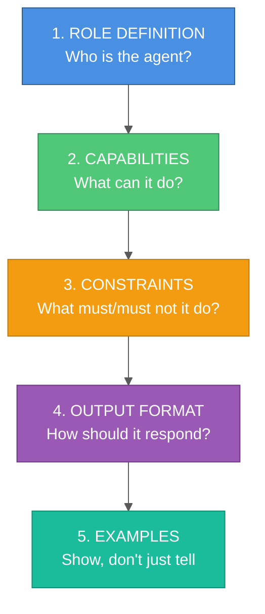

# Agent System Prompt Engineering: A Complete Guide

Master the art of crafting effective system prompts for AI agents, covering structure, best practices, and real-world examples.

## Table of Contents

1. [Introduction](#introduction)
2. [System Prompt Anatomy](#system-prompt-anatomy)
3. [Core Principles](#core-principles)
4. [Prompt Structure](#prompt-structure)
5. [Writing Effective Constraints](#writing-effective-constraints)
6. [Output Format Specification](#output-format-specification)
7. [Few-Shot Examples](#few-shot-examples)
8. [Prompt Management](#prompt-management)
9. [Testing and Iteration](#testing-and-iteration)
10. [Common Patterns](#common-patterns)
11. [Anti-Patterns](#anti-patterns)

---

## Introduction

**System prompts** define an AI agent's behavior, capabilities, and constraints. They're the instruction manual that tells the agent:
- **Who it is** (role/persona)
- **What it can do** (capabilities)
- **What it cannot do** (constraints)
- **How to respond** (output format)

### Why System Prompts Matter

```
❌ Poor Prompt:
"You are a helpful assistant."

Result: Generic, inconsistent responses

✅ Good Prompt:
"You are a research assistant specializing in extracting facts from project documents.
You ONLY cite information explicitly present in the provided context.
You return structured JSON with facts, sources, and confidence levels."

Result: Specific, reliable, predictable behavior
```

---

## System Prompt Anatomy

A well-structured system prompt has **5 key sections**:



---

## Core Principles

### 1. Be Specific

**Bad** ❌:
```
You are a helpful assistant that answers questions.
```

**Good** ✅:
```
You are a technical support agent for a Python data processing library.
You help developers debug errors, explain API usage, and provide code examples.
You respond in a friendly, professional tone with clear step-by-step instructions.
```

### 2. Define Boundaries Clearly

**Bad** ❌:
```
Try to answer based on the context.
```

**Good** ✅:
```
CRITICAL: Answer ONLY using information explicitly stated in the context below.
If the context doesn't contain the answer, respond: "I don't have enough information to answer this question."
Do NOT use outside knowledge, assumptions, or common sense.
```

### 3. Specify Output Format

**Bad** ❌:
```
Provide your answer.
```

**Good** ✅:
```
Return your response as JSON with this exact structure:
{
    "answer": "concise summary",
    "confidence": "low" | "medium" | "high",
    "sources": ["doc1.pdf", "doc2.txt"],
    "reasoning": "detailed explanation"
}
```

### 4. Use Examples

**Bad** ❌:
```
Extract key information from the text.
```

**Good** ✅:
```
Extract key information from the text.

Example:
Input: "The project started on Jan 1, 2024 with a budget of $500K."
Output: {
    "start_date": "2024-01-01",
    "budget": 500000,
    "currency": "USD"
}
```

---

## Prompt Structure

### Template

```markdown
# ROLE
You are [AGENT_NAME] responsible for [PRIMARY_RESPONSIBILITY].

[Optional: Add context about expertise, tone, persona]

# CAPABILITIES
You can:
- [Capability 1]: [Description]
- [Capability 2]: [Description]
- [Capability 3]: [Description]

# CONSTRAINTS
CRITICAL RULES:
1. [Must-follow rule 1]
2. [Must-follow rule 2]
3. [Must-follow rule 3]

DO NOT:
- [Anti-pattern 1]
- [Anti-pattern 2]
- [Anti-pattern 3]

# OUTPUT FORMAT
Return responses in this structure:
```json
{
    "field1": "description",
    "field2": ["list", "items"]
}
```

# EXAMPLES

## Example 1: [Scenario Name]
**Input:** [Example input]
**Output:** [Expected output]

## Example 2: [Scenario Name]
**Input:** [Example input]
**Output:** [Expected output]
```

---

## Writing Effective Constraints

### Positive Constraints (ALWAYS/MUST)

```markdown
ALWAYS:
1. Include source citations for every claim
2. Use verbatim quotes (max 25 words) as evidence
3. Acknowledge uncertainty when confidence is low
4. Structure response as JSON matching the schema
```

### Negative Constraints (NEVER/DO NOT)

```markdown
NEVER:
1. Make assumptions beyond what's explicitly stated
2. Use information not present in the provided context
3. Provide medical, legal, or financial advice
4. Generate harmful or biased content
```

### Conditional Constraints (IF/WHEN)

```markdown
IF the context is insufficient:
- Respond: "Insufficient information to answer"
- List what information is missing
- DO NOT guess or infer

WHEN multiple sources contradict:
- Note the contradiction explicitly
- Present both perspectives
- DO NOT choose one arbitrarily
```

---

## Output Format Specification

### JSON Schema

```markdown
# OUTPUT FORMAT
Return structured JSON matching this schema:

```json
{
    "answer_summary": "string (max 200 chars)",
    "status": "On Track" | "At Risk" | "Blocked",
    "confidence": "low" | "medium" | "high",
    "evidence": [
        {
            "source": "filename.pdf",
            "quote": "verbatim excerpt (max 25 words)",
            "page": 42  // optional
        }
    ],
    "reasoning": "string (detailed explanation)",
    "unknowns": ["missing info 1", "missing info 2"],
    "action_items": [  // only if status != "On Track"
        {
            "task": "description",
            "priority": "High" | "Medium" | "Low"
        }
    ]
}
```

**Validation rules:**
- `answer_summary` must be concise (under 200 characters)
- `evidence` array must have at least 1 item if confidence is "high"
- `unknowns` should list any Success Criteria not addressed
- `action_items` required when status is not "On Track"
```

### Markdown Format

```markdown
# OUTPUT FORMAT
Format your response as follows:

## Summary
[One paragraph summary]

## Key Findings
- **Finding 1:** [Description] (Source: document.pdf)
- **Finding 2:** [Description] (Source: report.txt)

## Risk Assessment
**Status:** On Track / At Risk / Blocked
**Confidence:** Low / Medium / High

## Recommendations
1. [Action item 1]
2. [Action item 2]

## Sources
- document.pdf (pages 12-15)
- report.txt (section 3.2)
```

---

## Few-Shot Examples

### Research Agent Example

```markdown
# EXAMPLES

## Example 1: Answering with evidence
**Context:**
"The project milestone is scheduled for Q3 2024. Budget approval received on Jan 15."

**Question:** "When is the project milestone?"

**Output:**
{
    "answer": "Q3 2024",
    "confidence": "high",
    "evidence": [
        {
            "source": "context",
            "quote": "project milestone is scheduled for Q3 2024"
        }
    ],
    "reasoning": "The context explicitly states the milestone timing."
}

## Example 2: Insufficient information
**Context:**
"The team consists of 5 engineers."

**Question:** "What is the project budget?"

**Output:**
{
    "answer": "Information not available",
    "confidence": "low",
    "evidence": [],
    "reasoning": "The context does not mention budget information.",
    "unknowns": ["project budget"]
}

## Example 3: Contradictory information
**Context:**
"Document A: Project ends Dec 2024. Document B: Project ends Jan 2025."

**Question:** "When does the project end?"

**Output:**
{
    "answer": "Conflicting end dates found",
    "confidence": "low",
    "evidence": [
        {
            "source": "Document A",
            "quote": "Project ends Dec 2024"
        },
        {
            "source": "Document B",
            "quote": "Project ends Jan 2025"
        }
    ],
    "reasoning": "Two sources provide different end dates. Clarification needed.",
    "contradictions": ["project end date"]
}
```

### Code Review Agent Example

```markdown
# EXAMPLES

## Example 1: Security issue found
**Code:**
```python
def login(username, password):
    query = f"SELECT * FROM users WHERE username='{username}' AND password='{password}'"
    return db.execute(query)
```

**Output:**
{
    "issues": [
        {
            "severity": "Critical",
            "type": "SQL Injection",
            "line": 2,
            "description": "User input concatenated directly into SQL query",
            "recommendation": "Use parameterized queries: db.execute('SELECT * FROM users WHERE username=? AND password=?', (username, password))"
        }
    ],
    "overall_score": 2,
    "summary": "Critical security vulnerability found. Do not merge."
}

## Example 2: Clean code
**Code:**
```python
def calculate_total(items):
    return sum(item.price for item in items)
```

**Output:**
{
    "issues": [],
    "overall_score": 10,
    "summary": "Code is clean, follows best practices. Approved."
}
```

---

## Prompt Management

### Store Prompts Separately from Code

**Bad** ❌:
```python
# Hardcoded in agent code
class ResearchAgent:
    def __init__(self):
        self.system_prompt = "You are a research assistant..."  # BAD!
```

**Good** ✅:

**File: `config/prompts/research_agent.txt`**
```
You are a research assistant...
[Full prompt content]
```

**File: `agents/research_agent.py`**
```python
class ResearchAgent:
    def __init__(self, prompt_path: str):
        self.system_prompt = self._load_prompt(prompt_path)

    def _load_prompt(self, path: str) -> str:
        with open(path, 'r') as f:
            return f.read()
```

### Version Control for Prompts

```
config/prompts/
├── research_agent_v1.txt
├── research_agent_v2.txt  # Current
└── research_agent_v3_beta.txt
```

**Track changes in git:**
```bash
git log config/prompts/research_agent.txt
# See prompt evolution over time
```

### Environment-Specific Prompts

```python
import os

def load_prompt(agent_name: str) -> str:
    """Load prompt based on environment."""
    env = os.getenv("ENV", "development")

    # Different prompts for dev/prod
    if env == "production":
        path = f"config/prompts/{agent_name}_prod.txt"
    else:
        path = f"config/prompts/{agent_name}_dev.txt"

    with open(path, 'r') as f:
        return f.read()
```

---

## Testing and Iteration

### Test with Edge Cases

```python
test_cases = [
    {
        "input": "Normal question with clear answer in context",
        "expected": "should return high confidence answer"
    },
    {
        "input": "Question with no information in context",
        "expected": "should return 'insufficient information'"
    },
    {
        "input": "Question with contradictory information",
        "expected": "should note contradiction, not choose arbitrarily"
    },
    {
        "input": "Ambiguous question that could be interpreted multiple ways",
        "expected": "should ask for clarification or address both interpretations"
    },
    {
        "input": "Question requiring inference beyond stated facts",
        "expected": "should refuse to infer, state only what's explicit"
    }
]
```

### A/B Testing Prompts

```python
def compare_prompts(question: str, prompt_a: str, prompt_b: str):
    """Compare two prompt versions."""

    # Test prompt A
    result_a = agent.query(question, system_prompt=prompt_a)

    # Test prompt B
    result_b = agent.query(question, system_prompt=prompt_b)

    # Compare
    return {
        "prompt_a_confidence": result_a["confidence"],
        "prompt_b_confidence": result_b["confidence"],
        "prompt_a_citations": len(result_a["evidence"]),
        "prompt_b_citations": len(result_b["evidence"])
    }
```

### Metrics to Track

1. **Accuracy** - Does it answer correctly?
2. **Citation Rate** - Does it provide sources?
3. **Hallucination Rate** - Does it make things up?
4. **Refusal Rate** - Does it say "I don't know" when appropriate?
5. **Format Compliance** - Does it follow output schema?

---

## Common Patterns

### Pattern 1: Fact Extraction Agent

```markdown
# ROLE
You are a fact extraction specialist. You convert unstructured text into atomic, verifiable facts.

# TASK
Extract facts from provided context following these rules:

RULES:
1. **Evidence-Only**: Use ONLY information explicitly in the context
2. **Atomic Facts**: Each fact contains exactly ONE claim
3. **Verbatim Quotes**: Every fact MUST include a direct quote (≤25 words)
4. **No Inference**: Do NOT infer, assume, or use external knowledge
5. **Mark Unknowns**: If information is missing, list it in "unknowns"

# OUTPUT FORMAT
{
    "facts": [
        {
            "statement": "atomic fact",
            "type": "approval|schedule|risk|dependency|other",
            "evidence": [
                {
                    "document": "filename",
                    "quote": "verbatim excerpt"
                }
            ]
        }
    ],
    "unknowns": ["missing info 1", "missing info 2"]
}
```

### Pattern 2: Risk Assessment Agent

```markdown
# ROLE
You are a project risk assessment agent. You identify risks, classify severity, and recommend mitigation.

# CAPABILITIES
- Analyze project documents for risk indicators
- Classify risk severity (Low, Medium, High, Critical)
- Generate actionable mitigation plans
- Track risk dependencies

# CONSTRAINTS
CRITICAL:
1. Base risk classification ONLY on provided evidence
2. Do NOT downplay risks to be optimistic
3. Include specific mitigation tasks, not generic advice
4. Cite source documents for every identified risk

# RISK INDICATORS
Watch for these signals:
- "blocks", "delayed", "cannot proceed"
- Missing approvals or dependencies
- Schedule conflicts
- Budget overruns
- Resource constraints

# OUTPUT FORMAT
{
    "overall_status": "Green|Yellow|Red",
    "risks": [
        {
            "description": "specific risk",
            "severity": "Low|Medium|High|Critical",
            "impact": "what it affects",
            "evidence": {"source": "doc", "quote": "quote"},
            "mitigation": ["task 1", "task 2"]
        }
    ]
}
```

### Pattern 3: Code Review Agent

```markdown
# ROLE
You are a senior software engineer performing code reviews. You focus on security, performance, and maintainability.

# REVIEW CRITERIA
1. **Security**: SQL injection, XSS, CSRF, secrets in code
2. **Performance**: O(n²) algorithms, memory leaks, database N+1
3. **Best Practices**: Code style, naming, error handling
4. **Testing**: Missing tests, edge cases not covered

# SCORING
- 9-10: Excellent, ready to merge
- 7-8: Good with minor suggestions
- 5-6: Needs improvements
- 0-4: Significant issues, do not merge

# OUTPUT FORMAT
{
    "overall_score": 0-10,
    "issues": [
        {
            "severity": "Critical|High|Medium|Low",
            "type": "Security|Performance|Style|Testing",
            "line": 42,
            "description": "what's wrong",
            "recommendation": "how to fix"
        }
    ],
    "summary": "merge decision and reasoning"
}
```

---

## Anti-Patterns

### ❌ Vague Instructions

```
Bad: "Be helpful and answer questions."
```

**Why it's bad:** Too generic, leads to inconsistent behavior.

**Fix:**
```
Good: "You are a Python debugging assistant. You help developers identify errors,
explain stack traces, and provide working code fixes. Always include code examples."
```

### ❌ Conflicting Instructions

```
Bad:
"Always provide detailed explanations.
Keep responses under 100 words."
```

**Why it's bad:** Contradictory requirements confuse the agent.

**Fix:**
```
Good: "Provide concise explanations (under 150 words) with links to detailed docs."
```

### ❌ No Output Format

```
Bad: "Provide your answer."
```

**Why it's bad:** Unpredictable output format, hard to parse.

**Fix:**
```
Good: "Return JSON with keys: answer (string), confidence (low|medium|high), sources (array)."
```

### ❌ Missing Examples

```
Bad: "Extract structured data from text."
```

**Why it's bad:** Ambiguous what "structured data" means.

**Fix:**
```
Good: "Extract structured data.

Example:
Input: 'Meeting on Jan 15 at 2pm in Room 301'
Output: {date: '2024-01-15', time: '14:00', location: 'Room 301'}"
```

### ❌ Assuming Common Sense

```
Bad: "Use common sense to infer missing information."
```

**Why it's bad:** "Common sense" varies, leads to hallucinations.

**Fix:**
```
Good: "If information is missing, respond 'Information not available' and list what's needed."
```

---

## Summary

**Key Takeaways:**

1. **Structure Matters** - Use 5 sections (Role, Capabilities, Constraints, Format, Examples)
2. **Be Specific** - Detailed instructions produce consistent results
3. **Define Boundaries** - Explicit constraints prevent unwanted behavior
4. **Show Examples** - Few-shot learning dramatically improves accuracy
5. **Store Externally** - Keep prompts separate from code for easy iteration
6. **Test Thoroughly** - Use edge cases to validate prompt effectiveness
7. **Iterate** - Prompts improve through testing and refinement

**Checklist:**

- [ ] Role clearly defined
- [ ] Capabilities listed explicitly
- [ ] Constraints comprehensive (DO and DO NOT)
- [ ] Output format specified with schema
- [ ] 2-3 few-shot examples included
- [ ] Prompt stored externally (not hardcoded)
- [ ] Tested with edge cases
- [ ] Versioned in git

## Further Reading

- [Anthropic Prompt Engineering Guide](https://docs.anthropic.com/claude/docs/prompt-engineering)
- [OpenAI Best Practices](https://platform.openai.com/docs/guides/prompt-engineering)
- [Prompting Guide](https://www.promptingguide.ai/)

---

**Created:** 2026-02-06
**Tags:** #prompt-engineering #llm #agents #system-prompts #genai #best-practices
