# Human-in-the-Loop (HITL) Workflow Architecture

A comprehensive guide to designing and implementing Human-in-the-Loop systems for AI applications, ensuring AI decisions are reviewed and validated by humans before action.

## Table of Contents

1. [Introduction](#introduction)
2. [Why Human-in-the-Loop?](#why-human-in-the-loop)
3. [Core Patterns](#core-patterns)
4. [Architecture Design](#architecture-design)
5. [Workflow States](#workflow-states)
6. [UI/UX Considerations](#uiux-considerations)
7. [Implementation Examples](#implementation-examples)
8. [Approval Mechanisms](#approval-mechanisms)
9. [Audit Trail](#audit-trail)
10. [Best Practices](#best-practices)

---

## Introduction

**Human-in-the-Loop (HITL)** is a design pattern where AI systems present their decisions to humans for review and approval before taking action.

### The Flow

```mermaid
%%{init: {'theme':'base', 'themeVariables': { 'primaryColor':'#1f77b4','primaryTextColor':'#fff','primaryBorderColor':'#145a8c','lineColor':'#5a5a5a','secondaryColor':'#ff7f0e','tertiaryColor':'#2ca02c'}}}%%
flowchart TD
    Step1["1. AI PROCESSES DATA<br/>- Analyzes documents<br/>- Generates recommendations<br/>- Classifies items"]:::blue
    Step2["2. AI PRESENTS RESULTS FOR REVIEW<br/>- Shows decision with confidence score<br/>- Provides evidence/reasoning<br/>- Highlights uncertainties"]:::purple
    Step3["3. HUMAN REVIEWS<br/>- Examines AI decision<br/>- Checks evidence<br/>- Validates reasoning"]:::orange
    Step4["4. HUMAN DECIDES<br/>Option A: Approve → Action taken<br/>Option B: Reject → AI decision overridden<br/>Option C: Modify → Human provides correction"]:::green

    Step1 --> Step2
    Step2 --> Step3
    Step3 --> Step4

    classDef blue fill:#4A90E2,stroke:#2E5C8A,color:#fff
    classDef purple fill:#9B59B6,stroke:#6C3483,color:#fff
    classDef orange fill:#F39C12,stroke:#BA7A0A,color:#fff
    classDef green fill:#50C878,stroke:#2E8B57,color:#fff
```



---

## Why Human-in-the-Loop?

### The Case for HITL

**Without HITL:**
```
AI Decision → Automatic Action ❌
- High risk of errors
- No accountability
- Trust issues
- Regulatory concerns
```

**With HITL:**
```
AI Decision → Human Review → Approved Action ✅
- Reduced error impact
- Human accountability
- Builds trust
- Meets compliance requirements
```

### When to Use HITL

✅ **Use HITL when:**
- **High stakes** - Medical diagnosis, financial decisions, legal assessments
- **Trust is critical** - New AI system, low confidence predictions
- **Regulatory requirements** - Healthcare, finance, legal domains
- **Learning phase** - Collecting human feedback to improve AI
- **Edge cases** - Unusual situations requiring human judgment

❌ **Skip HITL when:**
- Low-stakes decisions (e.g., email spam filtering)
- Real-time requirements (millisecond latency)
- High confidence + well-tested AI (e.g., OCR on clean documents)
- Human review adds no value

---

## Core Patterns

### Pattern 1: Review & Approve

AI makes a decision, human approves or rejects.

```mermaid
%%{init: {'theme':'base', 'themeVariables': { 'primaryColor':'#1f77b4','primaryTextColor':'#fff','primaryBorderColor':'#145a8c','lineColor':'#5a5a5a','secondaryColor':'#ff7f0e','tertiaryColor':'#2ca02c'}}}%%
flowchart TD
    AIDecision["AI Decision<br/>Status: Red"]:::red
    HumanReview["Human Review<br/>☑ Approve align<br/>☐ Reject override"]:::orange
    FinalStatus["Final Status<br/>Red ✅"]:::green

    AIDecision --> HumanReview
    HumanReview --> FinalStatus

    classDef red fill:#E74C3C,stroke:#A93226,color:#fff
    classDef orange fill:#F39C12,stroke:#BA7A0A,color:#fff
    classDef green fill:#50C878,stroke:#2E8B57,color:#fff
```



**Use case:** Risk assessment, content moderation, quality control

### Pattern 2: Flag for Review

Only uncertain/high-risk items require human review.

```
┌──────────────────┐
│ AI Confidence    │
│ High: Auto-pass  │ → No review needed
│ Low:  Flag       │ → Human reviews
└──────────────────┘
```

**Use case:** Document classification, fraud detection

### Pattern 3: Collaborative Decision

Human and AI work together, combining strengths.

```
┌──────────────┐      ┌──────────────┐
│ AI Suggests  │  +   │ Human Adds   │  =  Final Decision
│ 3 options    │      │ Domain       │
│              │      │ Knowledge    │
└──────────────┘      └──────────────┘
```

**Use case:** Medical diagnosis, legal research, creative work

### Pattern 4: Human Override

AI provides default, human can override.

```
┌──────────────┐
│ AI Default   │
│ Category: A  │
└──────┬───────┘
       │
       ▼
┌──────────────────────┐
│ Human Override?      │
│ ☐ Keep (Category A)  │
│ ☑ Change (Category B)│
└──────────────────────┘
```

**Use case:** Data labeling, content tagging, priority assignment

---

## Architecture Design

### System Components


### Database Schema

```sql
-- AI Decisions
CREATE TABLE ai_decisions (
    id SERIAL PRIMARY KEY,
    item_id VARCHAR(255),
    ai_status VARCHAR(50),  -- e.g., "On Track", "At Risk", "Blocked"
    confidence VARCHAR(10), -- "low", "medium", "high"
    reasoning TEXT,
    evidence JSONB,         -- Array of evidence objects
    created_at TIMESTAMP DEFAULT NOW()
);

-- Human Reviews
CREATE TABLE human_reviews (
    id SERIAL PRIMARY KEY,
    decision_id INTEGER REFERENCES ai_decisions(id),
    reviewer_id VARCHAR(255),
    action VARCHAR(20),     -- "approved", "rejected", "modified"
    human_status VARCHAR(50), -- Status after human review
    comments TEXT,
    reviewed_at TIMESTAMP DEFAULT NOW()
);

-- Approval History (audit trail)
CREATE TABLE approval_history (
    id SERIAL PRIMARY KEY,
    decision_id INTEGER REFERENCES ai_decisions(id),
    ai_status VARCHAR(50),
    human_status VARCHAR(50),
    match BOOLEAN,          -- Does AI status match human status?
    reviewer_id VARCHAR(255),
    reviewed_at TIMESTAMP
);
```

---

## Workflow States

### State Machine


### State Definitions

**CREATED** - AI has generated a decision
- **Next actions:** Display to human, mark as PENDING
- **Who can act:** System (automatic)

**PENDING** - Awaiting human review
- **Next actions:** Approve, Reject, Modify
- **Who can act:** Authorized reviewer

**APPROVED** - Human agrees with AI decision
- **Next actions:** Execute action (if any)
- **Who can act:** System (automatic)

**REJECTED** - Human disagrees with AI
- **Next actions:** Use human decision instead
- **Who can act:** System (automatic)

**MODIFIED** - Human provides alternative
- **Next actions:** Use modified decision
- **Who can act:** System (automatic)

**RESOLVED** - Final state, action taken
- **Next actions:** None (terminal state)
- **Who can act:** N/A

---

## UI/UX Considerations

### Review Dashboard

**Key elements:**
1. **Item list** - Show pending reviews with priority
2. **AI decision** - Display clearly with confidence
3. **Evidence** - Show supporting documents/data
4. **Action buttons** - Approve/Reject/Modify
5. **Status indicators** - Visual cues for urgency

**Example layout:**

```
┌───────────────────────────────────────────────────┐
│  Review Dashboard                     [Filter ▼]  │
├───────────────────────────────────────────────────┤
│                                                   │
│  ⚠️  3 items need review                          │
│                                                   │
│  ┌─────────────────────────────────────────────┐ │
│  │  Item #1234                          [!]    │ │
│  │  AI Decision: "At Risk"                     │ │
│  │  Confidence: Medium                         │ │
│  │                                             │ │
│  │  Evidence: project_plan.pdf (page 12)      │ │
│  │  "Milestone delayed by 2 weeks"            │ │
│  │                                             │ │
│  │  [View Details] [Approve] [Reject]         │ │
│  └─────────────────────────────────────────────┘ │
│                                                   │
│  ┌─────────────────────────────────────────────┐ │
│  │  Item #1235                                 │ │
│  │  AI Decision: "On Track"                    │ │
│  │  Confidence: High                           │ │
│  │  ...                                        │ │
│  └─────────────────────────────────────────────┘ │
└───────────────────────────────────────────────────┘
```

### Detail View

Show comprehensive information for a single item:

```
┌───────────────────────────────────────────────────┐
│  ← Back to Dashboard                              │
├───────────────────────────────────────────────────┤
│  Item #1234: "What are the project risks?"        │
│                                                   │
│  ┌─────────────────────────────────────────────┐ │
│  │  AI DECISION                                │ │
│  │  Status: "At Risk" 🟡                       │ │
│  │  Confidence: Medium (65%)                   │ │
│  │                                             │ │
│  │  Reasoning:                                 │ │
│  │  "Milestone delay detected. Budget         │ │
│  │   concerns mentioned in documentation."     │ │
│  └─────────────────────────────────────────────┘ │
│                                                   │
│  ┌─────────────────────────────────────────────┐ │
│  │  EVIDENCE                                   │ │
│  │  📄 project_plan.pdf (page 12)             │ │
│  │  "Milestone delayed by 2 weeks due to..."  │ │
│  │                                             │ │
│  │  📄 budget_report.xlsx (Sheet 2)           │ │
│  │  "Cost overrun of 15% in Q2"               │ │
│  └─────────────────────────────────────────────┘ │
│                                                   │
│  ┌─────────────────────────────────────────────┐ │
│  │  YOUR DECISION                              │ │
│  │  ○ Approve (align with AI)                 │ │
│  │  ○ Reject (override)                       │ │
│  │                                             │ │
│  │  If rejecting, select status:              │ │
│  │  ○ On Track  ○ At Risk  ○ Blocked         │ │
│  │                                             │ │
│  │  Comments (optional):                      │ │
│  │  ┌─────────────────────────────────────┐  │ │
│  │  │                                     │  │ │
│  │  └─────────────────────────────────────┘  │ │
│  │                                             │ │
│  │           [Submit Decision]                │ │
│  └─────────────────────────────────────────────┘ │
└───────────────────────────────────────────────────┘
```

### Visual Indicators

**Status colors:**
- 🟢 Green - On Track
- 🟡 Yellow - At Risk
- 🔴 Red - Blocked

**Confidence indicators:**
- 🔴 Low (< 50%)
- 🟡 Medium (50-80%)
- 🟢 High (> 80%)

**Mismatch indicator:**
- ⚠️ Yellow warning icon when AI and human disagree

---

## Implementation Examples

### Backend API Endpoints

```python
# api/review.py
from fastapi import APIRouter, HTTPException
from typing import List
from pydantic import BaseModel

router = APIRouter()

class ApproveRequest(BaseModel):
    reviewer_id: str
    comments: str = ""

class RejectRequest(BaseModel):
    reviewer_id: str
    human_status: str  # Override status
    comments: str

@router.get("/api/pending-reviews")
def get_pending_reviews():
    """Get all items awaiting human review."""
    with get_db() as db:
        items = db.query(AIDecision).filter(
            AIDecision.review_status == "pending"
        ).all()

        return [
            {
                "id": item.id,
                "item_id": item.item_id,
                "ai_status": item.ai_status,
                "confidence": item.confidence,
                "reasoning": item.reasoning,
                "evidence": item.evidence,
                "created_at": item.created_at.isoformat()
            }
            for item in items
        ]

@router.post("/api/approve/{decision_id}")
def approve_decision(decision_id: int, request: ApproveRequest):
    """Approve AI decision (human agrees)."""
    with get_db() as db:
        decision = db.query(AIDecision).filter(
            AIDecision.id == decision_id
        ).first()

        if not decision:
            raise HTTPException(status_code=404, detail="Decision not found")

        # Create review record
        review = HumanReview(
            decision_id=decision_id,
            reviewer_id=request.reviewer_id,
            action="approved",
            human_status=decision.ai_status,  # Same as AI
            comments=request.comments,
        )
        db.add(review)

        # Update decision status
        decision.review_status = "approved"
        decision.reviewed_at = datetime.now()
        decision.reviewed_by = request.reviewer_id

        # Create audit record
        audit = ApprovalHistory(
            decision_id=decision_id,
            ai_status=decision.ai_status,
            human_status=decision.ai_status,
            match=True,  # AI and human agree
            reviewer_id=request.reviewer_id
        )
        db.add(audit)

        db.commit()

        return {"message": "Decision approved", "decision_id": decision_id}

@router.post("/api/reject/{decision_id}")
def reject_decision(decision_id: int, request: RejectRequest):
    """Reject AI decision (human overrides)."""
    with get_db() as db:
        decision = db.query(AIDecision).filter(
            AIDecision.id == decision_id
        ).first()

        if not decision:
            raise HTTPException(status_code=404, detail="Decision not found")

        # Create review record
        review = HumanReview(
            decision_id=decision_id,
            reviewer_id=request.reviewer_id,
            action="rejected",
            human_status=request.human_status,  # Different from AI
            comments=request.comments,
        )
        db.add(review)

        # Update decision with human override
        decision.review_status = "rejected"
        decision.final_status = request.human_status  # Use human decision
        decision.reviewed_at = datetime.now()
        decision.reviewed_by = request.reviewer_id

        # Create audit record
        audit = ApprovalHistory(
            decision_id=decision_id,
            ai_status=decision.ai_status,
            human_status=request.human_status,
            match=False,  # AI and human disagree
            reviewer_id=request.reviewer_id
        )
        db.add(audit)

        db.commit()

        return {
            "message": "Decision overridden",
            "ai_status": decision.ai_status,
            "human_status": request.human_status
        }

@router.get("/api/review-history")
def get_review_history(limit: int = 50):
    """Get history of human reviews."""
    with get_db() as db:
        history = db.query(ApprovalHistory)\
            .order_by(ApprovalHistory.reviewed_at.desc())\
            .limit(limit)\
            .all()

        return [
            {
                "decision_id": h.decision_id,
                "ai_status": h.ai_status,
                "human_status": h.human_status,
                "match": h.match,
                "reviewer": h.reviewer_id,
                "reviewed_at": h.reviewed_at.isoformat()
            }
            for h in history
        ]

@router.get("/api/mismatch-rate")
def get_mismatch_rate():
    """Get AI vs Human agreement metrics."""
    with get_db() as db:
        total = db.query(ApprovalHistory).count()
        mismatches = db.query(ApprovalHistory).filter(
            ApprovalHistory.match == False
        ).count()

        if total == 0:
            return {"total": 0, "mismatches": 0, "rate": 0.0}

        return {
            "total": total,
            "matches": total - mismatches,
            "mismatches": mismatches,
            "agreement_rate": (total - mismatches) / total,
            "mismatch_rate": mismatches / total
        }
```

### Frontend React Components

```javascript
// components/ReviewDashboard.jsx
import { useState, useEffect } from 'react';

export function ReviewDashboard() {
  const [pendingItems, setPendingItems] = useState([]);
  const [loading, setLoading] = useState(true);

  useEffect(() => {
    fetchPendingReviews();
  }, []);

  const fetchPendingReviews = async () => {
    const response = await fetch('/api/pending-reviews');
    const data = await response.json();
    setPendingItems(data);
    setLoading(false);
  };

  if (loading) return <div>Loading...</div>;

  return (
    <div className="review-dashboard">
      <h1>Review Dashboard</h1>
      <p>{pendingItems.length} items need review</p>

      {pendingItems.map(item => (
        <ReviewCard
          key={item.id}
          item={item}
          onReviewed={fetchPendingReviews}
        />
      ))}
    </div>
  );
}

// components/ReviewCard.jsx
export function ReviewCard({ item, onReviewed }) {
  const [showDetails, setShowDetails] = useState(false);

  const handleApprove = async () => {
    await fetch(`/api/approve/${item.id}`, {
      method: 'POST',
      headers: { 'Content-Type': 'application/json' },
      body: JSON.stringify({
        reviewer_id: 'current_user',
        comments: ''
      })
    });
    onReviewed(); // Refresh list
  };

  const handleReject = async (humanStatus, comments) => {
    await fetch(`/api/reject/${item.id}`, {
      method: 'POST',
      headers: { 'Content-Type': 'application/json' },
      body: JSON.stringify({
        reviewer_id: 'current_user',
        human_status: humanStatus,
        comments: comments
      })
    });
    onReviewed();
  };

  return (
    <div className="review-card">
      <div className="header">
        <h3>Item #{item.item_id}</h3>
        <StatusBadge status={item.ai_status} />
      </div>

      <div className="ai-decision">
        <p><strong>AI Decision:</strong> {item.ai_status}</p>
        <p><strong>Confidence:</strong> {item.confidence}</p>
        <p><strong>Reasoning:</strong> {item.reasoning}</p>
      </div>

      <div className="evidence">
        <h4>Evidence:</h4>
        {item.evidence.map((e, i) => (
          <div key={i} className="evidence-item">
            📄 {e.document}: "{e.quote}"
          </div>
        ))}
      </div>

      <div className="actions">
        <button onClick={handleApprove} className="btn-approve">
          ✓ Approve
        </button>
        <button onClick={() => setShowDetails(true)} className="btn-details">
          View Details
        </button>
      </div>

      {showDetails && (
        <ReviewDetailModal
          item={item}
          onApprove={handleApprove}
          onReject={handleReject}
          onClose={() => setShowDetails(false)}
        />
      )}
    </div>
  );
}
```

---

## Approval Mechanisms

### 1. Single Reviewer

Simplest pattern: one person reviews and approves.

```python
@router.post("/api/approve/{id}")
def approve(id: int, reviewer: str):
    decision.status = "approved"
    decision.reviewer = reviewer
    decision.approved_at = datetime.now()
```

**Pros:** Fast, simple
**Cons:** Single point of failure, no redundancy

### 2. Multi-Level Approval

Requires multiple approvals (e.g., reviewer + manager).

```python
class ApprovalLevel(Enum):
    REVIEWER = 1
    MANAGER = 2
    EXECUTIVE = 3

@router.post("/api/approve/{id}")
def approve(id: int, reviewer: str, level: ApprovalLevel):
    decision.approvals.append({
        "level": level,
        "reviewer": reviewer,
        "timestamp": datetime.now()
    })

    # Check if all required levels approved
    if has_all_approvals(decision):
        decision.status = "fully_approved"
```

**Pros:** Higher confidence, accountability
**Cons:** Slower, more complex

### 3. Threshold-Based

Automatic approval if confidence is high.

```python
def process_decision(decision):
    if decision.confidence == "high":
        # Auto-approve high confidence
        decision.status = "auto_approved"
    else:
        # Require human review
        decision.status = "pending"
```

**Pros:** Reduces review burden
**Cons:** Still need mechanism for low confidence items

### 4. Random Sampling

Review random sample for quality assurance.

```python
import random

def process_decision(decision):
    # Auto-approve but flag 10% for spot check
    decision.status = "auto_approved"

    if random.random() < 0.1:
        decision.flagged_for_audit = True
```

**Pros:** Balance speed and quality
**Cons:** Misses some errors

---

## Audit Trail

### Logging All Decisions

```python
@router.post("/api/approve/{id}")
def approve(id: int, request: ApproveRequest):
    # ... approval logic ...

    # Log audit trail
    audit_log = AuditLog(
        action="approve",
        decision_id=id,
        actor=request.reviewer_id,
        timestamp=datetime.now(),
        details={
            "ai_status": decision.ai_status,
            "human_action": "approved",
            "comments": request.comments,
            "ip_address": request.client.host
        }
    )
    db.add(audit_log)
```

### Metrics Dashboard

Track AI vs Human performance:

```python
def get_metrics():
    """Calculate HITL metrics."""
    with get_db() as db:
        total = db.query(ApprovalHistory).count()
        approved = db.query(ApprovalHistory).filter(
            ApprovalHistory.action == "approved"
        ).count()
        rejected = total - approved

        # Agreement rate
        matches = db.query(ApprovalHistory).filter(
            ApprovalHistory.match == True
        ).count()

        return {
            "total_reviews": total,
            "approved": approved,
            "rejected": rejected,
            "agreement_rate": matches / total if total > 0 else 0,
            "approval_rate": approved / total if total > 0 else 0
        }
```

---

## Best Practices

### 1. Make Review Easy

✅ **DO:**
- Show AI decision prominently
- Provide clear evidence
- One-click approval for clear cases
- Keyboard shortcuts for power users

❌ **DON'T:**
- Bury important information
- Require excessive clicking
- Make evidence hard to access

### 2. Provide Context

✅ **DO:**
- Show AI confidence score
- Display supporting evidence
- Explain reasoning
- Show related decisions

❌ **DON'T:**
- Show decision without context
- Hide uncertainty
- Omit sources

### 3. Handle Disagreement

✅ **DO:**
- Track mismatches
- Investigate patterns
- Use feedback to improve AI
- Respect human override

❌ **DON'T:**
- Ignore disagreements
- Force humans to align with AI
- Discard human input

### 4. Optimize for Throughput

✅ **DO:**
- Batch similar items
- Prioritize by urgency
- Allow bulk actions (when safe)
- Reduce review fatigue

❌ **DON'T:**
- Force review of obvious cases
- Create bottlenecks
- Overwhelm reviewers

### 5. Build Trust

✅ **DO:**
- Be transparent about AI limitations
- Show when AI is uncertain
- Celebrate agreements
- Learn from disagreements

❌ **DON'T:**
- Oversell AI capabilities
- Hide errors
- Blame humans for corrections

---

## Summary

**Key Takeaways:**

1. **HITL is essential** for high-stakes AI decisions
2. **Four core patterns** - Review & Approve, Flag for Review, Collaborative, Override
3. **Clear UI/UX** - Dashboard, detail view, evidence, actions
4. **Audit trail** - Track all decisions, measure agreement
5. **Optimize workflow** - Make review easy, provide context
6. **Learn from feedback** - Use human corrections to improve AI

**Implementation Checklist:**

- [ ] Database schema (ai_decisions, human_reviews, audit_trail)
- [ ] API endpoints (pending reviews, approve, reject)
- [ ] Review dashboard UI
- [ ] Detail view with evidence
- [ ] Approval/rejection workflow
- [ ] Metrics tracking
- [ ] Audit logging
- [ ] User permissions/roles

## Further Reading

- [Human-AI Interaction Patterns](https://pair.withgoogle.com/guidebook/)
- [Designing for Trust in AI](https://www.nngroup.com/articles/ai-trust/)
- [Microsoft HITL Guidelines](https://www.microsoft.com/en-us/research/project/guidelines-for-human-ai-interaction/)

---

**Created:** 2026-02-06
**Tags:** #human-in-loop #hitl #ai-workflow #ux #trust #compliance #genai
