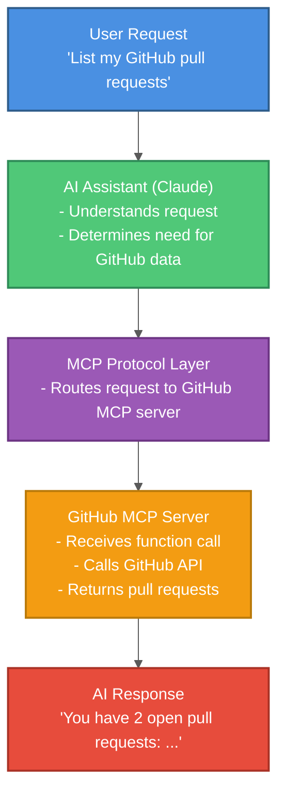
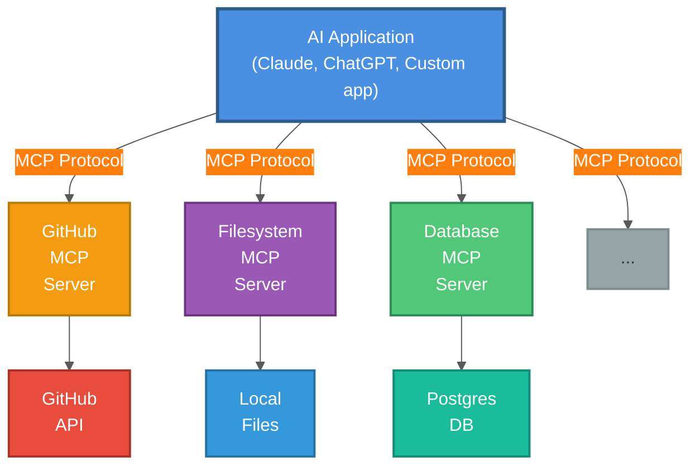

# Model Context Protocol (MCP): Extending AI with External Tools

A comprehensive guide to understanding and using the Model Context Protocol (MCP) to connect AI assistants with external data sources and tools.

## Table of Contents

1. [Introduction](#introduction)
2. [What is MCP?](#what-is-mcp)
3. [MCP Architecture](#mcp-architecture)
4. [Available MCP Servers](#available-mcp-servers)
5. [Using MCP Tools](#using-mcp-tools)
6. [Configuration](#configuration)
7. [Building Custom MCP Servers](#building-custom-mcp-servers)
8. [Best Practices](#best-practices)
9. [Troubleshooting](#troubleshooting)

---

## Introduction

**Model Context Protocol (MCP)** is a standardized way for AI assistants to interact with external tools and data sources. Think of it as a "plugin system" for AI.

### The Problem MCP Solves

**Without MCP:**
```
User: "Show me my GitHub pull requests"
AI: "I don't have access to GitHub" ❌
```

**With MCP:**
```
User: "Show me my GitHub pull requests"
AI → calls github_list_prs() → Returns: [PR#123, PR#456]
AI: "You have 2 open pull requests:
     - PR#123: Add authentication
     - PR#456: Fix database bug" ✅
```

---

## What is MCP?

### Key Concepts

**MCP Server** - External process that provides tools/resources
- Example: GitHub server provides GitHub API tools
- Example: Filesystem server provides file read/write tools

**Tools** - Functions the AI can call
- `github_list_prs()` - List pull requests
- `filesystem_read_file(path)` - Read file content

**Resources** - Data sources the AI can access
- Code repositories
- File systems
- Databases
- Web APIs

### Flow Diagram



---

## MCP Architecture

### Components



---

## Available MCP Servers

### Official MCP Servers

#### 1. Filesystem Server

**Purpose:** Read/write files on your computer

**Tools:**
- `read_file(path)` - Read file contents
- `write_file(path, content)` - Write to file
- `list_directory(path)` - List directory contents
- `search_files(pattern)` - Search with glob patterns

**Example:**
```
User: "Read the contents of README.md"
AI → read_file("README.md") → Returns content
AI: "Here's your README: ..."
```

#### 2. GitHub Server

**Purpose:** Interact with GitHub repositories

**Tools:**
- `create_repository(name)` - Create new repo
- `create_pull_request(title, body)` - Create PR
- `list_pull_requests(repo)` - List PRs
- `get_file_contents(repo, path)` - Get file from repo
- `push_files(repo, files)` - Push multiple files

**Example:**
```
User: "Create a pull request titled 'Fix bug'"
AI → create_pull_request(title="Fix bug", body="...") → Returns PR URL
AI: "Created: https://github.com/user/repo/pull/123"
```

#### 3. Web Search Server (Brave)

**Purpose:** Search the web for information

**Tools:**
- `web_search(query)` - Search web
- `local_search(query)` - Search local businesses

**Example:**
```
User: "What's the latest news on AI?"
AI → web_search("latest AI news 2026") → Returns results
AI: "Here are recent AI developments: ..."
```

#### 4. Database Server (SQLite/PostgreSQL)

**Purpose:** Query databases

**Tools:**
- `query(sql)` - Execute SELECT query
- `execute(sql)` - Execute UPDATE/INSERT/DELETE

**Example:**
```
User: "Show me all users"
AI → query("SELECT * FROM users LIMIT 10") → Returns rows
AI: "Here are 10 users: ..."
```

#### 5. Context7 Server

**Purpose:** Search framework documentation with AI

**Tools:**
- `resolve_library_id(name)` - Find library
- `query_docs(library_id, query)` - Search docs

**Example:**
```
User: "How do I use React hooks?"
AI → resolve_library_id("react") → Returns "/facebook/react"
AI → query_docs("/facebook/react", "hooks usage") → Returns docs
AI: "Here's how to use React hooks: ..."
```

---

## Using MCP Tools

### Configuration File

**File: `.mcp.json`** (in project root or home directory)

```json
{
  "mcpServers": {
    "filesystem": {
      "command": "npx",
      "args": [
        "-y",
        "@modelcontextprotocol/server-filesystem",
        "/Users/username/projects",
        "/Users/username/documents"
      ],
      "description": "Access to projects and documents folders"
    },
    "github": {
      "command": "npx",
      "args": [
        "-y",
        "@modelcontextprotocol/server-github"
      ],
      "env": {
        "GITHUB_PERSONAL_ACCESS_TOKEN": "${GITHUB_TOKEN}"
      },
      "description": "GitHub repository access"
    },
    "brave-search": {
      "command": "npx",
      "args": [
        "-y",
        "@modelcontextprotocol/server-brave-search"
      ],
      "env": {
        "BRAVE_API_KEY": "${BRAVE_API_KEY}"
      },
      "description": "Web search capabilities"
    }
  }
}
```

### Environment Variables

**File: `.env`**

```bash
# GitHub
GITHUB_TOKEN=ghp_your_personal_access_token

# Brave Search
BRAVE_API_KEY=BSAyour_api_key_here

# Context7
CONTEXT7_API_KEY=your_context7_key
```

### Calling MCP Tools

In your AI application:

```python
# Example with Claude SDK
import anthropic

client = anthropic.Anthropic(api_key="your_key")

# MCP tools are automatically available if configured
response = client.messages.create(
    model="claude-3-5-sonnet-20241022",
    messages=[
        {"role": "user", "content": "List files in my projects folder"}
    ],
    tools=[
        {
            "name": "list_directory",
            "description": "List directory contents",
            "input_schema": {
                "type": "object",
                "properties": {
                    "path": {"type": "string"}
                },
                "required": ["path"]
            }
        }
    ]
)

# AI will call list_directory tool automatically
```

---

## Configuration

### Enabling MCP Servers

**Step 1: Install MCP Server Package**

```bash
# Install filesystem server
npx @modelcontextprotocol/server-filesystem

# Install GitHub server
npx @modelcontextprotocol/server-github
```

**Step 2: Add to `.mcp.json`**

```json
{
  "mcpServers": {
    "my-server": {
      "command": "npx",
      "args": ["-y", "@org/mcp-server-package"],
      "env": {
        "API_KEY": "${MY_API_KEY}"
      },
      "disabled": false
    }
  }
}
```

**Step 3: Set Environment Variables**

```bash
# .env
MY_API_KEY=your_key_here
```

**Step 4: Restart AI Application**

Changes to `.mcp.json` require restarting the AI application.

### Disabling Servers

```json
{
  "mcpServers": {
    "github": {
      "disabled": true  // Temporarily disable
    }
  }
}
```

---

## Building Custom MCP Servers

### Create a Simple MCP Server

**File: `my-mcp-server.js`**

```javascript
#!/usr/bin/env node

import { Server } from "@modelcontextprotocol/sdk/server/index.js";
import { StdioServerTransport } from "@modelcontextprotocol/sdk/server/stdio.js";

// Create server
const server = new Server(
  {
    name: "my-custom-server",
    version: "1.0.0",
  },
  {
    capabilities: {
      tools: {},
    },
  }
);

// Define a tool
server.setRequestHandler("tools/list", async () => {
  return {
    tools: [
      {
        name: "greet",
        description: "Greet a person by name",
        inputSchema: {
          type: "object",
          properties: {
            name: {
              type: "string",
              description: "Person's name",
            },
          },
          required: ["name"],
        },
      },
    ],
  };
});

// Handle tool calls
server.setRequestHandler("tools/call", async (request) => {
  const { name, arguments: args } = request.params;

  if (name === "greet") {
    return {
      content: [
        {
          type: "text",
          text: `Hello, ${args.name}! Welcome to MCP.`,
        },
      ],
    };
  }

  throw new Error(`Unknown tool: ${name}`);
});

// Start server
const transport = new StdioServerTransport();
await server.connect(transport);
```

### Add to `.mcp.json`

```json
{
  "mcpServers": {
    "my-custom-server": {
      "command": "node",
      "args": ["/path/to/my-mcp-server.js"],
      "description": "My custom MCP server"
    }
  }
}
```

### Python MCP Server Example

```python
#!/usr/bin/env python3
import json
import sys

def handle_request(request):
    """Handle MCP requests."""
    method = request.get("method")

    if method == "tools/list":
        return {
            "tools": [
                {
                    "name": "calculate",
                    "description": "Perform calculation",
                    "inputSchema": {
                        "type": "object",
                        "properties": {
                            "expression": {"type": "string"}
                        },
                        "required": ["expression"]
                    }
                }
            ]
        }

    elif method == "tools/call":
        tool_name = request["params"]["name"]
        args = request["params"]["arguments"]

        if tool_name == "calculate":
            result = eval(args["expression"])  # Be careful with eval!
            return {
                "content": [
                    {"type": "text", "text": f"Result: {result}"}
                ]
            }

    return {"error": "Unknown method"}

# Main loop
while True:
    line = sys.stdin.readline()
    if not line:
        break

    request = json.loads(line)
    response = handle_request(request)
    print(json.dumps(response))
    sys.stdout.flush()
```

---

## Best Practices

### 1. Limit Access Scope

```json
// ✅ Good: Specific directories
"filesystem": {
  "args": ["-y", "@mcp/server-filesystem", "./projects", "./docs"]
}

// ❌ Bad: Root access
"filesystem": {
  "args": ["-y", "@mcp/server-filesystem", "/"]
}
```

### 2. Use Environment Variables for Secrets

```json
// ✅ Good: Reference environment variable
"github": {
  "env": {
    "GITHUB_TOKEN": "${GITHUB_TOKEN}"
  }
}

// ❌ Bad: Hardcode token
"github": {
  "env": {
    "GITHUB_TOKEN": "ghp_actual_token_here"  // Never do this!
  }
}
```

### 3. Add Descriptions

```json
"github": {
  "description": "GitHub API access for repos in myorg/ namespace",
  "command": "npx",
  "args": ["-y", "@mcp/server-github"]
}
```

### 4. Test Tools Independently

```bash
# Test MCP server directly
echo '{"method": "tools/list"}' | node my-mcp-server.js
```

### 5. Handle Errors Gracefully

```javascript
server.setRequestHandler("tools/call", async (request) => {
  try {
    // Tool logic
    return { content: [...] };
  } catch (error) {
    return {
      content: [
        {
          type: "text",
          text: `Error: ${error.message}`
        }
      ],
      isError: true
    };
  }
});
```

---

## Troubleshooting

### Issue 1: MCP Server Not Found

**Error:**
```
MCP server 'github' failed to start
```

**Solutions:**

1. **Check package is installed:**
   ```bash
   npx @modelcontextprotocol/server-github
   ```

2. **Verify .mcp.json path:**
   ```bash
   cat .mcp.json
   ```

3. **Check command is correct:**
   ```json
   "command": "npx",  // Make sure npx is in PATH
   ```

### Issue 2: Authentication Failed

**Error:**
```
401 Unauthorized
```

**Solutions:**

1. **Check environment variable is set:**
   ```bash
   echo $GITHUB_TOKEN
   ```

2. **Verify token has correct scopes:**
   - GitHub: Needs `repo` scope
   - Check in GitHub Settings → Developer settings → Personal access tokens

3. **Reload environment:**
   ```bash
   source .env
   ```

### Issue 3: Tool Not Available

**Problem:** AI says "I don't have access to that tool"

**Solutions:**

1. **Check server is enabled:**
   ```json
   "github": {
     "disabled": false  // Must be false or omitted
   }
   ```

2. **Restart AI application** (MCP config changes require restart)

3. **Check tool name:**
   ```bash
   # List available tools
   echo '{"method": "tools/list"}' | npx @mcp/server-github
   ```

### Issue 4: Slow Performance

**Problem:** MCP tool calls are slow

**Solutions:**

1. **Cache results** (if tool allows)
2. **Batch requests** (call multiple tools in parallel)
3. **Increase timeout:**
   ```json
   "github": {
     "timeout": 60000  // 60 seconds
   }
   ```

---

## Summary

**Key Takeaways:**

1. **MCP extends AI** with external tools and data
2. **Easy to configure** with `.mcp.json`
3. **Many servers available** (GitHub, filesystem, database, web search)
4. **Build custom servers** in JavaScript or Python
5. **Security matters** - limit scope, use env vars for secrets

**Getting Started Checklist:**

- [ ] Create `.mcp.json` configuration file
- [ ] Set up environment variables (`.env`)
- [ ] Install MCP server packages (`npx install`)
- [ ] Enable desired servers
- [ ] Test with simple queries
- [ ] Build custom server (optional)

## Further Reading

- [MCP Documentation](https://modelcontextprotocol.io/)
- [MCP Server Registry](https://github.com/modelcontextprotocol/servers)
- [Claude MCP Guide](https://docs.anthropic.com/claude/docs/mcp)
- [Building MCP Servers](https://modelcontextprotocol.io/docs/building-servers)

---

**Created:** 2026-02-06
**Tags:** #mcp #model-context-protocol #ai #tools #integration #claude #anthropic
