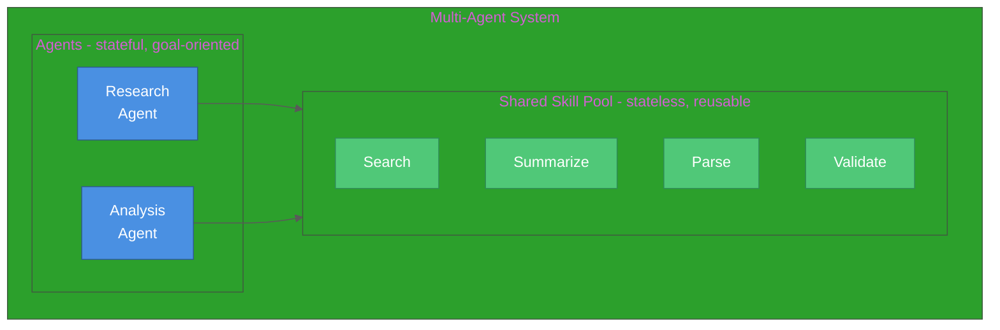
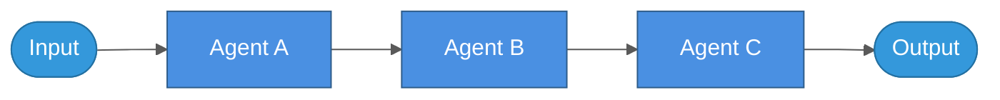
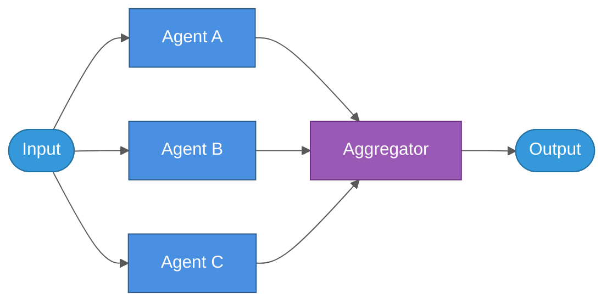
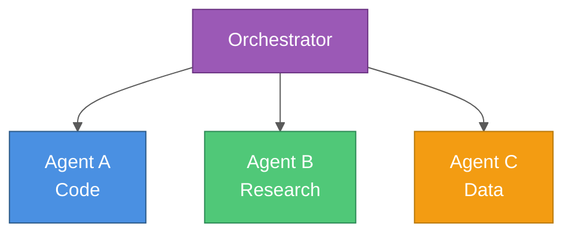
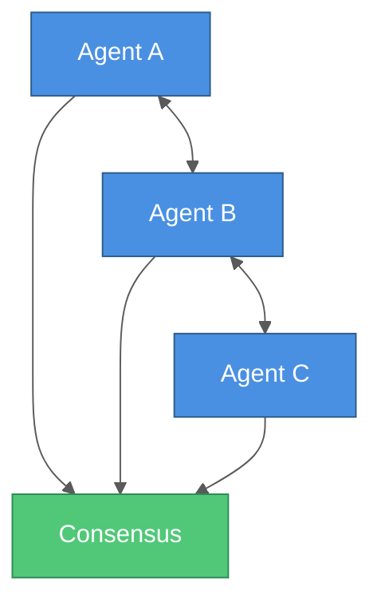
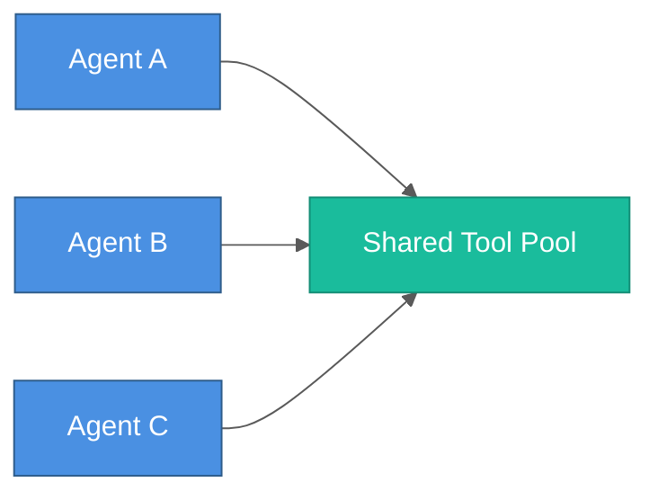
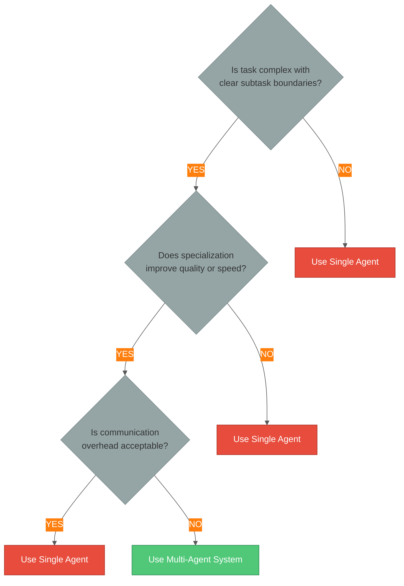

# Multi-Agent Orchestration Patterns

A comprehensive guide to designing, implementing, and coordinating multiple AI agents for complex problem-solving.

## Table of Contents

1. [Introduction](#introduction)
2. [Agent vs Skill](#agent-vs-skill)
3. [Agent Design Principles](#agent-design-principles)
4. [Orchestration Patterns](#orchestration-patterns)
5. [Communication Strategies](#communication-strategies)
6. [Implementation Examples](#implementation-examples)
7. [Testing Multi-Agent Systems](#testing-multi-agent-systems)
8. [Performance Optimization](#performance-optimization)
9. [Anti-Patterns to Avoid](#anti-patterns-to-avoid)
10. [When to Use Multi-Agent](#when-to-use-multi-agent)

---

## Introduction

**Multi-agent systems** coordinate multiple specialized AI agents to solve problems that are too complex for a single agent. Each agent has a specific role, and together they collaborate to achieve a common goal.

### Why Multi-Agent?

**Benefits:**
- ✅ **Specialization** - Agents focus on specific tasks (research, analysis, writing)
- ✅ **Parallel execution** - Multiple agents work simultaneously
- ✅ **Modularity** - Easy to add, remove, or upgrade agents
- ✅ **Fault tolerance** - System continues if one agent fails
- ✅ **Scalability** - Distribute workload across agents

**When NOT to use:**
- ❌ Simple, straightforward tasks (single agent is faster)
- ❌ High communication overhead
- ❌ No clear task decomposition

---

## Agent vs Skill

Before building multi-agent systems, understand the distinction between **agents** and **skills**.

### Use an Agent When:

- **Orchestration needed**: Coordinating multiple steps or decisions
- **Conversational context**: Maintaining dialogue state across turns
- **Goal-oriented**: Has a high-level objective (e.g., "research this topic")
- **Adaptive behavior**: Adjusts strategy based on results

**Examples:**
- ResearchAgent - Gathers information from multiple sources
- PlannerAgent - Creates step-by-step execution plans
- CodeReviewAgent - Reviews code for quality and security

### Use a Skill When:

- **Deterministic operation**: Input → Process → Output
- **Reusable utility**: Multiple agents need the same capability
- **Testable function**: Can be unit tested with clear pass/fail
- **Composable**: Can be chained with other skills

**Examples:**
- SearchSkill - Retrieves documents using BM25 or vector search
- SummarizationSkill - Summarizes text to a target length
- ValidationSkill - Validates data against schema

### Visual Comparison



---

## Agent Design Principles

### 1. Single Responsibility

Each agent should have **ONE clear purpose**.

**Bad** ❌:
```python
class UniversalAgent(BaseAgent):
    """Does everything: research, planning, coding, testing, deployment."""
    async def execute(self, task: str):
        if "research" in task:
            return self._research(task)
        elif "code" in task:
            return self._write_code(task)
        elif "test" in task:
            return self._run_tests(task)
        # ... 20 more conditions
```

**Good** ✅:
```python
class ResearchAgent(BaseAgent):
    """Gathers information from documents and web sources."""
    async def execute(self, task: str):
        # Focus on research only
        documents = await self.search_skill.search(task)
        summary = await self.summarize_skill.summarize(documents)
        return {"findings": summary, "sources": documents}

class PlannerAgent(BaseAgent):
    """Creates step-by-step execution plans."""
    async def execute(self, research_findings: dict):
        # Focus on planning only
        plan = await self.llm.generate(
            f"Create a plan based on: {research_findings}"
        )
        return {"steps": plan}
```

### 2. Observable Behavior

Log all key decisions and context retrievals for debugging and monitoring.

```python
import logging

logger = logging.getLogger(__name__)

class ObservableAgent(BaseAgent):
    async def execute(self, task: str, context: dict) -> dict:
        logger.info(f"Agent {self.name} starting task: {task}")

        # Log retrieved context
        retrieved_docs = await self.search_skill.search(task)
        logger.info(f"Retrieved {len(retrieved_docs)} documents")

        # Log decision points
        confidence = self._calculate_confidence(retrieved_docs)
        if confidence < 0.7:
            logger.warning(f"Low confidence: {confidence}")

        # Generate result
        result = await self.llm.generate(
            system=self.system_prompt,
            user=f"Task: {task}\nContext: {retrieved_docs}"
        )

        logger.info(f"Task completed with confidence: {confidence}")
        return {"result": result, "confidence": confidence}
```

### 3. Graceful Degradation

Handle failures without crashing the entire system.

```python
class ResilientAgent(BaseAgent):
    async def execute(self, task: str, context: dict) -> dict:
        try:
            # Try primary method
            result = await self._primary_method(task, context)
            return result

        except LLMTimeoutError:
            logger.error("LLM timeout, using fallback")
            # Use simpler fallback method
            result = await self._fallback_method(task, context)
            result["fallback_used"] = True
            return result

        except LLMRateLimitError:
            logger.error("Rate limit exceeded, retrying with backoff")
            await asyncio.sleep(5)
            return await self.execute(task, context)

        except Exception as e:
            logger.exception("Unexpected error in agent execution")
            return {
                "status": "failed",
                "error": str(e),
                "partial_result": context.get("partial_result")
            }
```

### 4. Composability

Agents can delegate to other agents.

```python
class ComposableOrchestrator(BaseAgent):
    def __init__(self):
        self.researcher = ResearchAgent()
        self.planner = PlannerAgent()
        self.executor = ExecutorAgent()

    async def execute(self, task: str, context: dict) -> dict:
        # Stage 1: Research
        research = await self.researcher.execute(task, context)
        logger.info(f"Research completed: {len(research['findings'])} findings")

        # Stage 2: Plan
        plan = await self.planner.execute(task, {"research": research})
        logger.info(f"Plan created: {len(plan['steps'])} steps")

        # Stage 3: Execute
        results = await self.executor.execute(task, {"plan": plan, "research": research})
        logger.info("Execution completed")

        return {
            "research": research,
            "plan": plan,
            "execution": results
        }
```

---

## Orchestration Patterns

### Pattern 1: Sequential Pipeline

**When to use:**
- Linear workflows with clear stages
- Each stage builds on previous results
- Order matters

**Structure:**


**Example: Research → Analysis → Report**

```python
class SequentialPipeline:
    """Agents execute in sequence, each building on previous results."""

    def __init__(self):
        self.researcher = ResearchAgent()
        self.analyzer = AnalysisAgent()
        self.writer = ReportWriterAgent()

    async def execute(self, topic: str) -> dict:
        context = {"topic": topic}

        # Stage 1: Research
        research_result = await self.researcher.execute(topic, context)
        context["research"] = research_result
        logger.info(f"Research: Found {len(research_result['sources'])} sources")

        # Stage 2: Analysis
        analysis_result = await self.analyzer.execute(topic, context)
        context["analysis"] = analysis_result
        logger.info(f"Analysis: Generated {len(analysis_result['insights'])} insights")

        # Stage 3: Report Writing
        report = await self.writer.execute(topic, context)
        logger.info("Report generation completed")

        return {
            "report": report,
            "metadata": {
                "sources": len(research_result['sources']),
                "insights": len(analysis_result['insights'])
            }
        }
```

**Use cases:**
- Data Extraction → Processing → Visualization
- Requirements Gathering → Design → Implementation
- Question → Research → Answer

### Pattern 2: Parallel Execution

**When to use:**
- Independent subtasks
- Speed is critical
- Tasks can run concurrently

**Structure:**



**Example: Multi-Source Research**

```python
import asyncio

class ParallelOrchestrator:
    """Agents execute concurrently for speed."""

    def __init__(self):
        self.web_agent = WebSearchAgent()
        self.document_agent = DocumentSearchAgent()
        self.database_agent = DatabaseAgent()

    async def execute(self, query: str) -> dict:
        logger.info(f"Parallel execution starting for: {query}")

        # Run all agents in parallel
        results = await asyncio.gather(
            self.web_agent.execute(query, {}),
            self.document_agent.execute(query, {}),
            self.database_agent.execute(query, {}),
            return_exceptions=True  # Don't fail if one agent fails
        )

        # Check for failures
        successful_results = []
        for i, result in enumerate(results):
            if isinstance(result, Exception):
                logger.error(f"Agent {i} failed: {result}")
            else:
                successful_results.append(result)

        # Aggregate results
        aggregated = self._aggregate(successful_results)

        logger.info(f"Parallel execution completed: {len(successful_results)}/{len(results)} agents succeeded")

        return aggregated

    def _aggregate(self, results: list) -> dict:
        """Combine results from multiple agents."""
        all_findings = []
        all_sources = []

        for result in results:
            all_findings.extend(result.get("findings", []))
            all_sources.extend(result.get("sources", []))

        return {
            "findings": all_findings,
            "sources": all_sources,
            "total_agents": len(results)
        }
```

**Use cases:**
- Searching multiple data sources simultaneously
- Parallel sentiment analysis (positive, negative, neutral perspectives)
- Multi-model evaluation (GPT-4, Claude, Gemini)

### Pattern 3: Hierarchical (Supervisor)

**When to use:**
- Complex task decomposition needed
- Dynamic routing based on task type
- Specialization improves quality

**Structure:**



**Example: Task Router**

```python
class HierarchicalOrchestrator:
    """Supervisor agent routes tasks to specialized agents."""

    def __init__(self):
        self.supervisor = SupervisorAgent()

        self.specialists = {
            "code": CodeAgent(),
            "research": ResearchAgent(),
            "data": DataAnalysisAgent(),
            "writing": WritingAgent()
        }

    async def execute(self, task: str) -> dict:
        logger.info(f"Hierarchical orchestration starting for: {task}")

        # Supervisor classifies the task
        classification = await self.supervisor.classify_task(task)
        task_type = classification["type"]
        logger.info(f"Task classified as: {task_type}")

        # Route to appropriate specialist
        agent = self.specialists.get(task_type)
        if not agent:
            logger.error(f"No specialist for task type: {task_type}")
            raise ValueError(f"Unknown task type: {task_type}")

        # Execute with specialist
        result = await agent.execute(task, {})
        result["routed_to"] = task_type

        logger.info(f"Task completed by {task_type} specialist")
        return result

class SupervisorAgent(BaseAgent):
    """Classifies tasks and routes to specialists."""

    async def classify_task(self, task: str) -> dict:
        """Determine which specialist should handle this task."""
        prompt = f"""
Classify the following task into one of these categories:
- code: Writing, reviewing, or debugging code
- research: Information gathering or fact-finding
- data: Data analysis, visualization, or statistics
- writing: Document creation or content writing

Task: {task}

Return only the category name.
"""
        response = await self.llm.generate(system="You are a task classifier", user=prompt)
        task_type = response.strip().lower()

        return {"type": task_type, "confidence": 0.9}
```

**Use cases:**
- Customer support routing (billing, technical, sales)
- Multi-domain problem solving
- Dynamic workflow orchestration

### Pattern 4: Collaborative (Debate)

**When to use:**
- Multiple valid perspectives
- Quality through discussion
- Consensus building

**Structure:**



**Example: Multi-Perspective Analysis**

```python
class CollaborativeDebate:
    """Agents debate and reach consensus."""

    def __init__(self):
        self.agents = [
            DebateAgent(persona="optimistic"),
            DebateAgent(persona="pessimistic"),
            DebateAgent(persona="neutral"),
        ]
        self.synthesizer = SynthesizerAgent()

    async def debate(self, topic: str, rounds: int = 3) -> dict:
        """Run multi-round debate between agents."""
        logger.info(f"Starting debate on: {topic} ({rounds} rounds)")

        positions = []

        for round_num in range(rounds):
            logger.info(f"Debate round {round_num + 1}/{rounds}")
            round_positions = []

            for agent in self.agents:
                # Provide context from previous positions
                context = "\n".join(positions[-6:])  # Last 6 positions

                position = await agent.generate_position(
                    topic=topic,
                    previous_context=context
                )

                round_positions.append({
                    "agent": agent.persona,
                    "round": round_num + 1,
                    "position": position
                })

            positions.extend(round_positions)

        # Synthesize consensus
        consensus = await self.synthesizer.synthesize(positions)

        logger.info("Debate completed, consensus reached")

        return {
            "consensus": consensus,
            "debate_history": positions,
            "total_rounds": rounds
        }

class DebateAgent(BaseAgent):
    """Agent with specific perspective/persona."""

    def __init__(self, persona: str):
        self.persona = persona
        self.system_prompt = self._get_system_prompt(persona)

    def _get_system_prompt(self, persona: str) -> str:
        prompts = {
            "optimistic": "You focus on opportunities and positive outcomes.",
            "pessimistic": "You identify risks and potential problems.",
            "neutral": "You provide balanced, objective analysis."
        }
        return prompts.get(persona, "You provide thoughtful analysis.")

    async def generate_position(self, topic: str, previous_context: str) -> str:
        """Generate position on topic given previous debate context."""
        prompt = f"""
Topic: {topic}

Previous discussion:
{previous_context}

Provide your perspective ({self.persona}) on this topic.
"""
        response = await self.llm.generate(system=self.system_prompt, user=prompt)
        return response
```

**Use cases:**
- Strategic decision making
- Risk assessment from multiple angles
- Creative brainstorming

### Pattern 5: Tool-Sharing Network

**When to use:**
- Multiple agents need same tools
- Resource efficiency important
- Centralized tool management

**Structure:**



**Example: Shared Resource Pool**

```python
class ToolSharingNetwork:
    """Multiple agents share common tools/resources."""

    def __init__(self):
        # Shared tool pool
        self.tools = {
            "search": SearchTool(),
            "calculator": CalculatorTool(),
            "database": DatabaseTool(),
            "web_fetch": WebFetchTool()
        }

        # Agents with access to shared tools
        self.agents = [
            ResearchAgent(tools=self.tools),
            AnalysisAgent(tools=self.tools),
            WritingAgent(tools=self.tools)
        ]

    async def execute(self, task: str, pattern: str = "sequential") -> dict:
        """Execute task with specified coordination pattern."""
        if pattern == "sequential":
            return await self._sequential_execution(task)
        elif pattern == "parallel":
            return await self._parallel_execution(task)

    async def _sequential_execution(self, task: str) -> dict:
        """Run agents in sequence, all using shared tools."""
        result = {"task": task}

        for agent in self.agents:
            agent_result = await agent.execute(task, result)
            result[agent.name] = agent_result

        return result
```

---

## Communication Strategies

### 1. Direct Communication

Agents call each other directly (tight coupling).

```python
# Agent A calls Agent B directly
result_b = await agent_b.execute(agent_a_output)
```

**Pros:** Simple, direct
**Cons:** Tight coupling, hard to modify

### 2. Message Passing

Agents communicate via message queue (loose coupling).

```python
import asyncio

class MessageBus:
    """Central message broker for agent communication."""

    def __init__(self):
        self.queues = {}

    async def publish(self, topic: str, message: dict):
        """Publish message to topic."""
        if topic not in self.queues:
            self.queues[topic] = asyncio.Queue()
        await self.queues[topic].put(message)

    async def subscribe(self, topic: str) -> dict:
        """Subscribe to topic and wait for message."""
        if topic not in self.queues:
            self.queues[topic] = asyncio.Queue()
        return await self.queues[topic].get()

# Usage
bus = MessageBus()

# Agent A publishes
await bus.publish("analysis_needed", {"data": agent_a_result})

# Agent B subscribes
message = await bus.subscribe("analysis_needed")
result_b = await agent_b.execute(message["data"])
```

**Pros:** Loose coupling, scalable, async
**Cons:** More complex, potential message loss

### 3. Shared Memory

Agents communicate via shared state.

```python
class SharedMemory:
    """Shared context for agent communication."""

    def __init__(self):
        self._memory = {}

    def set(self, key: str, value: any):
        """Store value in shared memory."""
        self._memory[key] = value

    def get(self, key: str, default=None):
        """Retrieve value from shared memory."""
        return self._memory.get(key, default)

    def update(self, updates: dict):
        """Batch update multiple keys."""
        self._memory.update(updates)

# Usage
shared_memory = SharedMemory()

# Agent A writes
shared_memory.set("research_results", agent_a_result)

# Agent B reads
research = shared_memory.get("research_results")
result_b = await agent_b.execute(research)
```

**Pros:** Simple, fast
**Cons:** Potential race conditions, state management complexity

---

## Implementation Examples

### Complete Multi-Agent System

```python
from typing import Dict, Any, List
from abc import ABC, abstractmethod
import asyncio
import logging

logging.basicConfig(level=logging.INFO)
logger = logging.getLogger(__name__)

# Base Agent
class BaseAgent(ABC):
    """Base class for all agents."""

    def __init__(self, name: str, llm_client):
        self.name = name
        self.llm = llm_client

    @abstractmethod
    async def execute(self, task: str, context: Dict[str, Any]) -> Dict[str, Any]:
        """Execute agent's primary function."""
        pass

# Specialized Agents
class ResearchAgent(BaseAgent):
    """Gathers information from multiple sources."""

    async def execute(self, task: str, context: Dict[str, Any]) -> Dict[str, Any]:
        logger.info(f"[{self.name}] Researching: {task}")

        # Simulate research
        await asyncio.sleep(1)

        findings = [
            "Finding 1: Important fact about the topic",
            "Finding 2: Related concept",
            "Finding 3: Key statistics"
        ]

        return {
            "status": "success",
            "findings": findings,
            "sources": ["source1.pdf", "source2.txt"],
            "confidence": 0.85
        }

class AnalysisAgent(BaseAgent):
    """Analyzes research findings."""

    async def execute(self, task: str, context: Dict[str, Any]) -> Dict[str, Any]:
        logger.info(f"[{self.name}] Analyzing research")

        research = context.get("research", {})
        findings = research.get("findings", [])

        # Simulate analysis
        await asyncio.sleep(1)

        return {
            "status": "success",
            "insights": [
                f"Insight 1: Analysis of {len(findings)} findings",
                "Insight 2: Key patterns identified",
                "Insight 3: Recommendations"
            ],
            "confidence": 0.9
        }

class WriterAgent(BaseAgent):
    """Writes reports based on analysis."""

    async def execute(self, task: str, context: Dict[str, Any]) -> Dict[str, Any]:
        logger.info(f"[{self.name}] Writing report")

        analysis = context.get("analysis", {})
        research = context.get("research", {})

        # Simulate writing
        await asyncio.sleep(1)

        report = f"""
# Report: {task}

## Executive Summary
Based on {len(research.get('findings', []))} research findings and
{len(analysis.get('insights', []))} analytical insights, we present the following report.

## Key Findings
{chr(10).join(f"- {f}" for f in research.get('findings', []))}

## Analysis
{chr(10).join(f"- {i}" for i in analysis.get('insights', []))}

## Conclusion
Report generated by multi-agent system.
"""

        return {
            "status": "success",
            "report": report,
            "word_count": len(report.split())
        }

# Orchestrator
class MultiAgentOrchestrator:
    """Coordinates multiple agents."""

    def __init__(self, llm_client):
        self.researcher = ResearchAgent("Researcher", llm_client)
        self.analyzer = AnalysisAgent("Analyzer", llm_client)
        self.writer = WriterAgent("Writer", llm_client)

    async def execute_sequential(self, task: str) -> Dict[str, Any]:
        """Execute agents sequentially (pipeline)."""
        logger.info("=== Sequential Pipeline Execution ===")
        context = {}

        # Stage 1: Research
        research = await self.researcher.execute(task, context)
        context["research"] = research

        # Stage 2: Analysis
        analysis = await self.analyzer.execute(task, context)
        context["analysis"] = analysis

        # Stage 3: Writing
        report = await self.writer.execute(task, context)

        return report

    async def execute_parallel(self, task: str) -> Dict[str, Any]:
        """Execute multiple agents in parallel."""
        logger.info("=== Parallel Execution ===")

        # Run multiple research approaches in parallel
        results = await asyncio.gather(
            self.researcher.execute(f"{task} - approach 1", {}),
            self.researcher.execute(f"{task} - approach 2", {}),
            return_exceptions=True
        )

        # Aggregate parallel results
        all_findings = []
        for result in results:
            if not isinstance(result, Exception):
                all_findings.extend(result.get("findings", []))

        return {
            "status": "success",
            "findings": all_findings,
            "approaches": len(results)
        }

# Usage Example
async def main():
    """Demonstrate multi-agent orchestration."""

    # Mock LLM client
    class MockLLM:
        async def generate(self, prompt: str) -> str:
            return "Mock LLM response"

    llm = MockLLM()
    orchestrator = MultiAgentOrchestrator(llm)

    # Sequential execution
    result = await orchestrator.execute_sequential("AI trends in 2026")
    print("\n" + result["report"])

    # Parallel execution
    parallel_result = await orchestrator.execute_parallel("Market research")
    print(f"\nParallel findings: {len(parallel_result['findings'])}")

if __name__ == "__main__":
    asyncio.run(main())
```

---

## Testing Multi-Agent Systems

### Unit Tests: Individual Agents

```python
import pytest

@pytest.mark.asyncio
async def test_research_agent_returns_findings():
    """Test research agent retrieves findings."""
    llm = MockLLM()
    agent = ResearchAgent("Researcher", llm)

    result = await agent.execute("test query", {})

    assert result["status"] == "success"
    assert len(result["findings"]) > 0
    assert result["confidence"] > 0.5

@pytest.mark.asyncio
async def test_analysis_agent_requires_research_context():
    """Test analysis agent handles missing context gracefully."""
    llm = MockLLM()
    agent = AnalysisAgent("Analyzer", llm)

    # Test with empty context
    result = await agent.execute("test", {})

    assert result["status"] == "success"
    # Should handle missing research gracefully
```

### Integration Tests: Multi-Agent Workflows

```python
@pytest.mark.asyncio
async def test_sequential_pipeline_completes():
    """Test full sequential pipeline execution."""
    llm = MockLLM()
    orchestrator = MultiAgentOrchestrator(llm)

    result = await orchestrator.execute_sequential("test task")

    # Verify pipeline completed
    assert result["status"] == "success"
    assert "report" in result
    assert result["word_count"] > 0

@pytest.mark.asyncio
async def test_parallel_execution_handles_failures():
    """Test parallel execution with agent failures."""
    llm = MockLLM()
    orchestrator = MultiAgentOrchestrator(llm)

    result = await orchestrator.execute_parallel("test task")

    # Should complete even if some agents fail
    assert result["status"] == "success"
```

### Mocking LLM Responses

```python
class MockLLM:
    """Mock LLM client for testing."""

    def __init__(self, responses: dict = None):
        self.responses = responses or {}
        self.call_count = 0

    async def generate(self, prompt: str, **kwargs) -> str:
        """Return mock response based on prompt."""
        self.call_count += 1

        # Return specific response based on keywords
        if "research" in prompt.lower():
            return '{"findings": ["fact1", "fact2"]}'
        elif "analyze" in prompt.lower():
            return '{"insights": ["insight1", "insight2"]}'
        elif "write" in prompt.lower():
            return "# Report\n\nMock report content"

        return "default response"

    def reset(self):
        """Reset call counter."""
        self.call_count = 0
```

---

## Performance Optimization

### 1. Caching Expensive Operations

```python
from functools import lru_cache

class CachedAgent(BaseAgent):
    """Agent with caching for expensive operations."""

    @lru_cache(maxsize=128)
    def _preprocess_query(self, query: str) -> str:
        """Cache preprocessing results."""
        # Expensive preprocessing
        return query.lower().strip()

    async def execute(self, task: str, context: dict) -> dict:
        # Use cached preprocessing
        processed = self._preprocess_query(task)
        # Continue execution...
```

### 2. Batch Processing

```python
class BatchAgent(BaseAgent):
    """Agent that processes multiple tasks in batches."""

    async def execute_batch(self, tasks: List[str]) -> List[dict]:
        """Process multiple tasks in a single LLM call."""
        batch_prompt = "\n\n".join([
            f"Task {i+1}: {task}"
            for i, task in enumerate(tasks)
        ])

        # Single LLM call for all tasks
        response = await self.llm.generate(batch_prompt)

        # Parse batch results
        return self._parse_batch_response(response, len(tasks))
```

### 3. Connection Pooling

```python
import asyncio

class PooledAgent(BaseAgent):
    """Agent with connection pooling."""

    def __init__(self, name: str, llm_client, pool_size: int = 5):
        super().__init__(name, llm_client)
        self.semaphore = asyncio.Semaphore(pool_size)

    async def execute(self, task: str, context: dict) -> dict:
        """Execute with connection pooling."""
        async with self.semaphore:
            # Only pool_size agents can run concurrently
            return await self._execute_impl(task, context)
```

### 4. Timeout Management

```python
class TimeoutAgent(BaseAgent):
    """Agent with timeout handling."""

    def __init__(self, name: str, llm_client, timeout: int = 30):
        super().__init__(name, llm_client)
        self.timeout = timeout

    async def execute(self, task: str, context: dict) -> dict:
        """Execute with timeout."""
        try:
            result = await asyncio.wait_for(
                self._execute_impl(task, context),
                timeout=self.timeout
            )
            return result
        except asyncio.TimeoutError:
            logger.error(f"Agent {self.name} timed out after {self.timeout}s")
            return {
                "status": "timeout",
                "error": f"Execution exceeded {self.timeout}s"
            }
```

---

## Anti-Patterns to Avoid

### ❌ God Agent

**Problem:** One agent tries to do everything.

```python
# DON'T: Single agent with too many responsibilities
class SuperAgent(BaseAgent):
    async def execute(self, task: str, context: dict):
        if "research" in task:
            return self._research(task)
        elif "analyze" in task:
            return self._analyze(task)
        elif "write" in task:
            return self._write(task)
        elif "code" in task:
            return self._code(task)
        # ... 20 more conditions
```

**Solution:** Create specialized agents for each task type.

### ❌ Tight Coupling

**Problem:** Agents directly access each other's internals.

```python
# DON'T: Direct access to internal state
class BadAgent(BaseAgent):
    async def execute(self, task: str, context: dict):
        other_agent = ResearchAgent(...)
        # Accessing internal state directly
        docs = other_agent._cached_documents  # BAD!
        return self._process(docs)
```

**Solution:** Use well-defined interfaces and message passing.

### ❌ No Error Handling

**Problem:** Exceptions crash the entire system.

```python
# DON'T: Unhandled exceptions
class FragileAgent(BaseAgent):
    async def execute(self, task: str, context: dict):
        result = await self.llm.generate(prompt)  # What if this fails?
        return result
```

**Solution:** Implement graceful degradation and fallbacks.

### ❌ Over-Communication

**Problem:** Too much inter-agent communication overhead.

```python
# DON'T: Excessive back-and-forth
async def inefficient_workflow(task):
    # Agent A calls B, B calls C, C calls A...
    result_a = await agent_a.execute(task, {})
    result_b = await agent_b.execute(result_a, {})
    result_c = await agent_c.execute(result_b, {})
    result_a2 = await agent_a.execute(result_c, {})  # Too much back-and-forth
```

**Solution:** Design clear, linear workflows when possible.

---

## When to Use Multi-Agent

### Use Multi-Agent When:

✅ Task naturally decomposes into distinct subtasks
✅ Specialization improves quality (research vs writing vs coding)
✅ Parallel execution provides meaningful speedup
✅ Clear interfaces between components
✅ System needs to be modular and maintainable
✅ Different agents need different models/configurations

### Use Single Agent When:

❌ Task is straightforward and doesn't require specialization
❌ No clear subtask boundaries
❌ Communication overhead exceeds benefits
❌ Simple is better (Occam's Razor)
❌ Real-time response critical (multi-agent adds latency)

### Decision Framework



---

## Real-World Examples

### Example 1: Document Q&A System

**Task:** Answer questions about a large document collection.

**Architecture:**
```
User Query
    ↓
Retrieval Agent (searches documents)
    ↓
Reranking Agent (ranks by relevance)
    ↓
QA Agent (generates answer)
    ↓
Verification Agent (fact-checks)
    ↓
Final Answer
```

### Example 2: Code Review System

**Task:** Review code for quality, security, and performance.

**Architecture:**
```
                  Code Submission
                        ↓
                  Router Agent
               /        |         \
    Quality Agent  Security Agent  Performance Agent
               \        |         /
                  Aggregator
                        ↓
                  Review Report
```

### Example 3: Content Creation Pipeline

**Task:** Generate blog posts from topics.

**Architecture:**
```
Topic → Research Agent (gathers info)
            ↓
        Outline Agent (creates structure)
            ↓
        Writing Agent (writes content)
            ↓
        Editing Agent (refines)
            ↓
        SEO Agent (optimizes)
            ↓
        Final Blog Post
```

---

## Summary

**Key Takeaways:**

1. **Specialization** - Each agent has a specific, well-defined role
2. **Coordination** - Choose pattern based on task structure (sequential, parallel, hierarchical)
3. **Communication** - Use appropriate strategy (direct, message passing, shared memory)
4. **Resilience** - Handle failures gracefully with fallbacks
5. **Observability** - Log decisions and metrics for debugging
6. **Testing** - Test agents individually and workflows end-to-end
7. **Simplicity** - Use single agent unless multi-agent provides clear value

## Further Reading

- **Frameworks:**
  - [LangGraph](https://github.com/langchain-ai/langgraph) - Graph-based multi-agent workflows
  - [AutoGen](https://github.com/microsoft/autogen) - Microsoft's multi-agent framework
  - [CrewAI](https://github.com/joaomdmoura/crewAI) - Role-based agent teams

- **Papers:**
  - ["Communicative Agents for Software Development"](https://arxiv.org/abs/2307.07924)
  - ["Multi-Agent Systems: A Survey"](https://arxiv.org/abs/2401.03428)

- **Books:**
  - "Multi-Agent Systems" by Gerhard Weiss
  - "An Introduction to MultiAgent Systems" by Michael Wooldridge

---

**Created:** 2026-02-06
**Tags:** #ai #multi-agent #orchestration #llm #agents #architecture #genai
