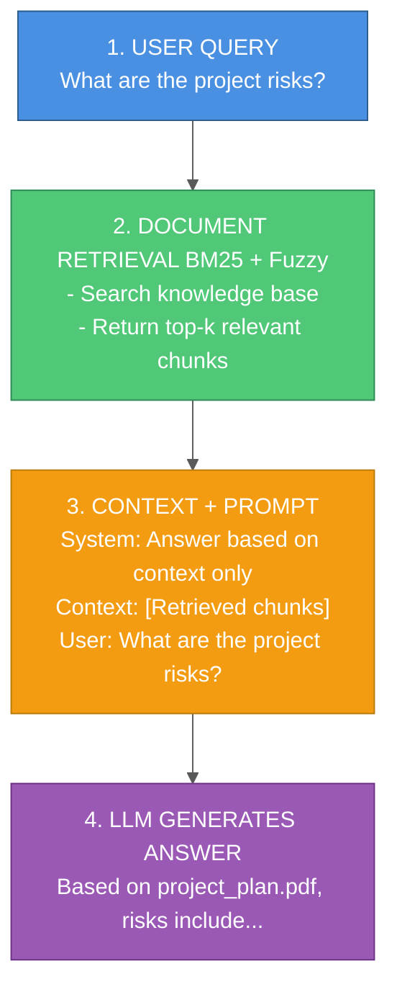
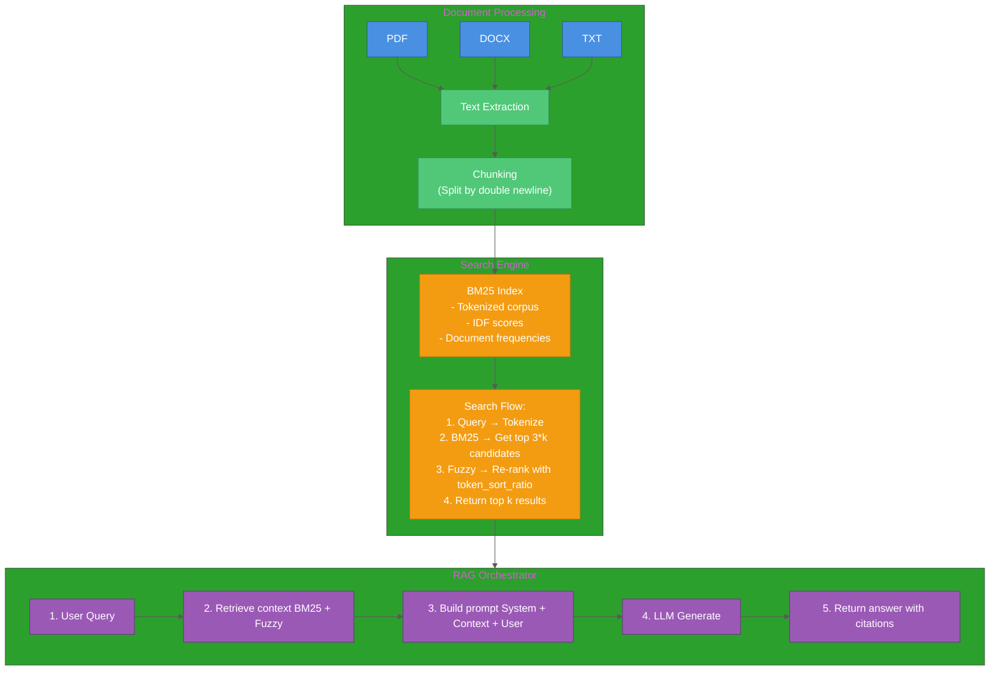

# RAG Implementation with BM25 + Fuzzy Matching

A practical guide to building production-ready Retrieval-Augmented Generation (RAG) systems using BM25 for keyword search and fuzzy matching for robustness.

## Table of Contents

1. [Introduction to RAG](#introduction-to-rag)
2. [Why BM25 + Fuzzy Matching?](#why-bm25--fuzzy-matching)
3. [Architecture Overview](#architecture-overview)
4. [Document Processing](#document-processing)
5. [BM25 Search Implementation](#bm25-search-implementation)
6. [Fuzzy Matching Integration](#fuzzy-matching-integration)
7. [LLM Integration](#llm-integration)
8. [Two-Step RAG Pattern](#two-step-rag-pattern)
9. [Complete Implementation](#complete-implementation)
10. [Performance Optimization](#performance-optimization)
11. [When to Use This Approach](#when-to-use-this-approach)

---

## Introduction to RAG

**Retrieval-Augmented Generation (RAG)** combines information retrieval with large language models (LLMs) to generate accurate, grounded responses.

### The Problem RAG Solves

**Without RAG:**
```
User: "What's our Q4 revenue?"
LLM: "I don't have real-time data..." ❌ (Hallucination or outdated knowledge)
```

**With RAG:**
```
User: "What's our Q4 revenue?"
System:
  1. Retrieves: "Q4 2024 revenue: $42.5M (finance_report.pdf)"
  2. LLM + Context: "According to finance_report.pdf, Q4 2024 revenue was $42.5M" ✅
```

### RAG Flow



---

## Why BM25 + Fuzzy Matching?

### Comparison of Retrieval Methods

| Method | Speed | Setup | Accuracy | Typo Handling |
|--------|-------|-------|----------|---------------|
| **BM25** | ⚡ Fast | 🟢 Simple | 🟡 Good for keywords | ❌ Poor |
| **Fuzzy** | 🐌 Slow | 🟢 Simple | 🟡 Good for typos | ✅ Excellent |
| **Embeddings** | 🐌 Slow | 🔴 Complex | 🟢 Best semantic | ❌ Poor |
| **BM25 + Fuzzy** | ⚡ Fast | 🟢 Simple | 🟢 Best hybrid | ✅ Excellent |

### Why This Hybrid Approach?

**BM25 strengths:**
- ✅ Fast keyword matching (O(n) with preprocessing)
- ✅ Works without GPU/embeddings
- ✅ Handles exact terminology well (e.g., technical docs, legal text)
- ✅ Interpretable scoring (TF-IDF based)

**Fuzzy matching strengths:**
- ✅ Handles typos ("docmuent" → "document")
- ✅ Handles variations ("project mgmt" → "project management")
- ✅ Re-ranks BM25 results for better quality
- ✅ Low overhead (only applied to top-k candidates)

**When BM25 + Fuzzy is ideal:**
- Small to medium corpora (<10,000 documents)
- Technical documentation with specific terminology
- Queries with typos or abbreviations
- Low-latency requirements (< 100ms retrieval)
- No GPU available

**When to use embeddings instead:**
- Large corpora (>50,000 documents)
- Semantic search ("cheap restaurants" → "affordable dining")
- Multi-lingual search
- GPU available

---

## Architecture Overview



---

## Document Processing

### Step 1: Extract Text from Multiple Formats

```python
# document_processor.py
from pathlib import Path
from typing import Optional, Dict, Any
import PyPDF2
import docx
import pandas as pd

class DocumentProcessor:
    """Extract text from various document formats."""

    SUPPORTED_FORMATS = {'.txt', '.pdf', '.docx', '.xlsx', '.xlsm'}

    @classmethod
    def is_supported_format(cls, file_path: Path) -> bool:
        """Check if file format is supported."""
        return file_path.suffix.lower() in cls.SUPPORTED_FORMATS

    @classmethod
    def process_document(cls, file_path: Path) -> Optional[Dict[str, Any]]:
        """
        Extract text from document.

        Returns:
            Dict with keys: content (str), error (str or None)
        """
        suffix = file_path.suffix.lower()

        try:
            if suffix == '.txt':
                with open(file_path, 'r', encoding='utf-8') as f:
                    content = f.read()

            elif suffix == '.pdf':
                content = cls._extract_from_pdf(file_path)

            elif suffix == '.docx':
                content = cls._extract_from_docx(file_path)

            elif suffix in {'.xlsx', '.xlsm'}:
                content = cls._extract_from_excel(file_path)

            else:
                return {"content": "", "error": f"Unsupported format: {suffix}"}

            return {"content": content, "error": None}

        except Exception as e:
            return {"content": "", "error": str(e)}

    @staticmethod
    def _extract_from_pdf(file_path: Path) -> str:
        """Extract text from PDF."""
        with open(file_path, 'rb') as f:
            reader = PyPDF2.PdfReader(f)
            text = ""
            for page in reader.pages:
                text += page.extract_text() + "\n"
        return text

    @staticmethod
    def _extract_from_docx(file_path: Path) -> str:
        """Extract text from DOCX."""
        doc = docx.Document(file_path)
        text = "\n".join([para.text for para in doc.paragraphs])
        return text

    @staticmethod
    def _extract_from_excel(file_path: Path) -> str:
        """Extract text from Excel (all sheets)."""
        xls = pd.ExcelFile(file_path, engine='openpyxl')
        all_text = []

        for sheet_name in xls.sheet_names:
            df = pd.read_excel(xls, sheet_name=sheet_name)
            # Convert dataframe to text
            sheet_text = df.to_string(index=False)
            all_text.append(f"Sheet: {sheet_name}\n{sheet_text}")

        return "\n\n".join(all_text)
```

### Step 2: Chunk Documents

```python
def chunk_document(content: str, chunk_separator: str = "\n\n") -> list[str]:
    """
    Split document into chunks.

    Strategy: Split by paragraph (double newline).
    Alternative strategies:
    - Fixed size (e.g., 500 chars with overlap)
    - Semantic chunking (sentence boundaries)
    """
    raw_chunks = content.split(chunk_separator)

    chunks = []
    for chunk in raw_chunks:
        clean_chunk = chunk.strip()
        if clean_chunk:  # Skip empty chunks
            chunks.append(clean_chunk)

    return chunks
```

---

## BM25 Search Implementation

### Step 1: Install Dependencies

```bash
pip install rank-bm25 rapidfuzz
```

### Step 2: Build BM25 Index

```python
# search_engine.py
import re
from typing import List, Dict, Any
from rank_bm25 import BM25Okapi
from pathlib import Path

class SearchEngine:
    """BM25-based search engine for document retrieval."""

    def __init__(self, data_dir: str):
        self.data_dir = Path(data_dir)
        self.documents: List[Dict[str, Any]] = []
        self.bm25 = None
        self.tokenized_corpus = []

        self._load_documents()
        self._build_index()

    def _tokenize(self, text: str) -> List[str]:
        """Simple tokenization: lowercase + word extraction."""
        return re.findall(r'\w+', text.lower())

    def _load_documents(self):
        """Load and chunk all documents."""
        for file_path in self.data_dir.rglob("*.txt"):
            with open(file_path, 'r', encoding='utf-8') as f:
                content = f.read()

            # Chunk by paragraph
            chunks = content.split("\n\n")

            for i, chunk in enumerate(chunks):
                clean_chunk = chunk.strip()
                if clean_chunk:
                    self.documents.append({
                        "content": clean_chunk,
                        "source": file_path.name,
                        "chunk_id": i
                    })

        print(f"Loaded {len(self.documents)} chunks from {self.data_dir}")

    def _build_index(self):
        """Build BM25 index."""
        self.tokenized_corpus = [
            self._tokenize(doc["content"])
            for doc in self.documents
        ]
        self.bm25 = BM25Okapi(self.tokenized_corpus)
        print(f"Built BM25 index with {len(self.documents)} chunks")

    def search_bm25_only(self, query: str, top_k: int = 3) -> List[Dict[str, Any]]:
        """Search using BM25 only."""
        if not self.documents or not self.bm25:
            return []

        tokenized_query = self._tokenize(query)
        bm25_scores = self.bm25.get_scores(tokenized_query)

        # Get top-k indices
        top_indices = sorted(
            range(len(bm25_scores)),
            key=lambda i: bm25_scores[i],
            reverse=True
        )[:top_k]

        results = []
        for idx in top_indices:
            results.append({
                **self.documents[idx],
                "score": bm25_scores[idx]
            })

        return results
```

---

## Fuzzy Matching Integration

### Hybrid Search: BM25 + Fuzzy

```python
from rapidfuzz import fuzz

class SearchEngine:
    # ... (previous code)

    def search(self, query: str, top_k: int = 3) -> List[Dict[str, Any]]:
        """
        Hybrid search: BM25 for candidates, Fuzzy for re-ranking.

        Strategy:
        1. Get top 3*k candidates from BM25 (cast wider net)
        2. Re-rank candidates using fuzzy matching
        3. Return top k results
        """
        if not self.documents or not self.bm25:
            return []

        tokenized_query = self._tokenize(query)

        # Step 1: BM25 retrieval (get more candidates)
        bm25_scores = self.bm25.get_scores(tokenized_query)
        top_n_indices = sorted(
            range(len(bm25_scores)),
            key=lambda i: bm25_scores[i],
            reverse=True
        )[:top_k * 3]  # Get 3x candidates

        # Step 2: Re-rank with fuzzy matching
        candidates = []
        for idx in top_n_indices:
            doc = self.documents[idx]
            bm25_score = bm25_scores[idx]

            # Fuzzy score (0-100)
            # token_sort_ratio handles out-of-order words
            fuzzy_score = fuzz.token_sort_ratio(query, doc["content"])

            # Combined score: BM25 (primary) + Fuzzy (secondary)
            # Weight: BM25 contributes more to ranking
            combined_score = bm25_score + (fuzzy_score / 20.0)

            candidates.append({
                **doc,
                "score": combined_score,
                "bm25_score": bm25_score,
                "fuzzy_score": fuzzy_score
            })

        # Step 3: Sort by combined score and return top-k
        candidates.sort(key=lambda x: x["score"], reverse=True)
        return candidates[:top_k]
```

### Fuzzy Matching Options

```python
from rapidfuzz import fuzz

# Different fuzzy matching strategies:

# 1. Simple ratio (exact order matters)
score = fuzz.ratio("project manager", "project management")  # 80

# 2. Token sort ratio (order doesn't matter)
score = fuzz.token_sort_ratio("project manager", "manager project")  # 100

# 3. Token set ratio (handles duplicates + order)
score = fuzz.token_set_ratio(
    "project risk management plan",
    "risk plan management project"
)  # 100

# 4. Partial ratio (substring matching)
score = fuzz.partial_ratio("project", "Our project is on track")  # 100
```

**Recommendation:** Use `token_sort_ratio` for RAG (handles word order variations).

---

## LLM Integration

### Prompt Structure

```python
def build_rag_prompt(query: str, context_chunks: List[Dict]) -> str:
    """Build RAG prompt with retrieved context."""

    # Format context
    context_text = ""
    for i, chunk in enumerate(context_chunks):
        context_text += f"Document: {chunk['source']}\n"
        context_text += f"Content: {chunk['content']}\n\n"

    # Build prompt
    prompt = f"""
You are a helpful assistant that answers questions based on provided context.

IMPORTANT:
- Answer ONLY using information from the context below
- If the context doesn't contain enough information, say "I don't have enough information"
- Cite your sources by mentioning document names

Context:
{context_text}

Question: {query}

Answer:"""

    return prompt
```

### LLM Call (Generic)

```python
import openai  # or anthropic, google.generativeai, etc.

def call_llm(prompt: str, model: str = "gpt-4") -> str:
    """Call LLM with prompt."""
    response = openai.ChatCompletion.create(
        model=model,
        messages=[
            {"role": "system", "content": "You are a helpful assistant."},
            {"role": "user", "content": prompt}
        ],
        temperature=0.3,  # Lower temperature for factual answers
        max_tokens=1000
    )

    return response.choices[0].message.content
```

### Complete RAG Function

```python
def answer_with_rag(
    query: str,
    search_engine: SearchEngine,
    top_k: int = 3
) -> Dict[str, Any]:
    """
    Answer question using RAG.

    Returns:
        Dict with keys: answer, sources, context_chunks
    """
    # Step 1: Retrieve relevant chunks
    chunks = search_engine.search(query, top_k=top_k)

    if not chunks:
        return {
            "answer": "No relevant documents found.",
            "sources": [],
            "context_chunks": []
        }

    # Step 2: Build prompt
    prompt = build_rag_prompt(query, chunks)

    # Step 3: Generate answer
    answer = call_llm(prompt)

    # Step 4: Extract sources
    sources = list(set([chunk["source"] for chunk in chunks]))

    return {
        "answer": answer,
        "sources": sources,
        "context_chunks": chunks
    }
```

---

## Two-Step RAG Pattern

For higher quality, use a two-step approach:

### Step 1: Fact Extraction

```python
def extract_facts(query: str, context_chunks: List[Dict]) -> Dict[str, Any]:
    """
    Step 1: Extract atomic facts from context.

    This step focuses on identifying factual statements
    without interpretation.
    """
    context_text = "\n\n".join([
        f"Source: {c['source']}\n{c['content']}"
        for c in context_chunks
    ])

    prompt = f"""
Extract atomic facts from the context below.

Rules:
1. Each fact must be a single, verifiable statement
2. Include source document name for each fact
3. Use verbatim quotes (max 25 words) as evidence
4. Mark unknowns if information is missing

Context:
{context_text}

Question: {query}

Return JSON:
{{
    "facts": [
        {{
            "statement": "fact text",
            "source": "document.pdf",
            "quote": "verbatim quote"
        }}
    ],
    "unknowns": ["missing info 1", "missing info 2"]
}}
"""

    response = call_llm_structured(prompt, output_schema=FactExtractionSchema)
    return response
```

### Step 2: Answer Synthesis

```python
def synthesize_answer(query: str, facts: Dict[str, Any]) -> Dict[str, Any]:
    """
    Step 2: Synthesize answer from extracted facts.

    This step interprets facts and generates the final answer.
    """
    facts_text = "\n".join([
        f"- {f['statement']} (Source: {f['source']})"
        for f in facts["facts"]
    ])

    unknowns_text = "\n".join([
        f"- {u}" for u in facts.get("unknowns", [])
    ])

    prompt = f"""
Answer the question based on these extracted facts.

Facts:
{facts_text}

Unknowns:
{unknowns_text}

Question: {query}

Provide:
1. Direct answer
2. Confidence level (low/medium/high)
3. Reasoning based on facts
4. Action items if risks identified

Return structured JSON.
"""

    answer = call_llm_structured(prompt, output_schema=AnswerSchema)
    return answer
```

**Why two steps?**
- ✅ Better accuracy (facts grounded in quotes)
- ✅ Reduced hallucination
- ✅ Easier to debug (inspect extracted facts)
- ✅ Better citations

---

## Complete Implementation

```python
# rag_system.py
from typing import List, Dict, Any
from search_engine import SearchEngine
from document_processor import DocumentProcessor

class RAGSystem:
    """Complete RAG system with BM25 + Fuzzy search."""

    def __init__(self, data_dir: str, llm_client):
        self.search_engine = SearchEngine(data_dir)
        self.llm = llm_client

    def query(self, question: str, top_k: int = 3) -> Dict[str, Any]:
        """
        Answer question using RAG.

        Flow:
        1. Retrieve top-k relevant chunks (BM25 + Fuzzy)
        2. Build prompt with context
        3. Generate answer with LLM
        4. Return answer with sources
        """
        # Step 1: Retrieve
        chunks = self.search_engine.search(question, top_k=top_k)

        if not chunks:
            return {
                "answer": "No relevant information found.",
                "sources": [],
                "confidence": "low"
            }

        # Step 2: Build context
        context = self._format_context(chunks)

        # Step 3: Generate
        prompt = self._build_prompt(question, context)
        answer = self.llm.generate(prompt)

        # Step 4: Return with metadata
        return {
            "answer": answer,
            "sources": [c["source"] for c in chunks],
            "context_chunks": chunks,
            "confidence": self._estimate_confidence(chunks)
        }

    def _format_context(self, chunks: List[Dict]) -> str:
        """Format retrieved chunks into context string."""
        context = ""
        for chunk in chunks:
            context += f"Source: {chunk['source']}\n"
            context += f"{chunk['content']}\n\n"
        return context

    def _build_prompt(self, question: str, context: str) -> str:
        """Build RAG prompt."""
        return f"""
Answer the question based ONLY on the context below.
If the answer is not in the context, say "I don't have enough information."

Context:
{context}

Question: {question}

Answer:"""

    def _estimate_confidence(self, chunks: List[Dict]) -> str:
        """Estimate confidence based on retrieval scores."""
        if not chunks:
            return "low"

        avg_score = sum(c.get("score", 0) for c in chunks) / len(chunks)

        if avg_score > 10:
            return "high"
        elif avg_score > 5:
            return "medium"
        else:
            return "low"


# Usage
if __name__ == "__main__":
    # Initialize
    rag = RAGSystem(data_dir="./documents", llm_client=my_llm)

    # Query
    result = rag.query("What are the project risks?", top_k=5)

    # Display
    print(f"Answer: {result['answer']}")
    print(f"Sources: {', '.join(result['sources'])}")
    print(f"Confidence: {result['confidence']}")
```

---

## Performance Optimization

### 1. Index Caching

```python
import pickle

class SearchEngine:
    def save_index(self, filepath: str):
        """Save BM25 index to disk."""
        with open(filepath, 'wb') as f:
            pickle.dump({
                "documents": self.documents,
                "tokenized_corpus": self.tokenized_corpus,
                "bm25": self.bm25
            }, f)

    def load_index(self, filepath: str):
        """Load BM25 index from disk."""
        with open(filepath, 'rb') as f:
            data = pickle.load(f)
            self.documents = data["documents"]
            self.tokenized_corpus = data["tokenized_corpus"]
            self.bm25 = data["bm25"]
```

### 2. Batch Processing

```python
def batch_query(questions: List[str], rag: RAGSystem) -> List[Dict]:
    """Process multiple questions efficiently."""
    results = []

    # Retrieve all at once
    all_chunks = {}
    for q in questions:
        chunks = rag.search_engine.search(q, top_k=5)
        all_chunks[q] = chunks

    # Generate answers in batch
    for q in questions:
        result = rag.query(q, chunks=all_chunks[q])
        results.append(result)

    return results
```

### 3. Reduce Fuzzy Overhead

```python
def search_optimized(self, query: str, top_k: int = 3) -> List[Dict]:
    """Optimized search: only fuzzy-match top BM25 candidates."""
    # Get top 2*k from BM25 (not 3*k)
    candidates = self._bm25_search(query, top_k=top_k * 2)

    # Apply fuzzy only to these candidates
    for candidate in candidates:
        fuzzy_score = fuzz.token_sort_ratio(query, candidate["content"])
        candidate["score"] = candidate["bm25_score"] + (fuzzy_score / 20)

    candidates.sort(key=lambda x: x["score"], reverse=True)
    return candidates[:top_k]
```

---

## When to Use This Approach

### ✅ Use BM25 + Fuzzy When:

1. **Small to Medium Corpus** (<10,000 documents)
2. **Technical Documentation** (specific terminology)
3. **Low Latency Required** (<100ms retrieval)
4. **No GPU Available** (pure CPU solution)
5. **Queries Have Typos** (fuzzy matching helps)
6. **Exact Keywords Matter** (legal, medical, technical docs)

### ❌ Use Embeddings When:

1. **Large Corpus** (>50,000 documents)
2. **Semantic Search Needed** ("cheap food" → "affordable dining")
3. **Multi-lingual Search** (query in English, docs in Spanish)
4. **Cross-domain Queries** (conceptual similarity matters)
5. **GPU Available** (embeddings benefit from acceleration)

### Hybrid Approach

For best results, combine both:

```python
def hybrid_search(query, top_k=3):
    # Get candidates from both methods
    bm25_results = bm25_search(query, top_k=5)
    embedding_results = embedding_search(query, top_k=5)

    # Merge and deduplicate
    all_results = merge_results(bm25_results, embedding_results)

    # Re-rank with cross-encoder
    reranked = rerank(query, all_results)

    return reranked[:top_k]
```

---

## Summary

**Key Takeaways:**

1. **BM25** - Fast keyword search, good for exact matches
2. **Fuzzy** - Handles typos and variations, re-ranks candidates
3. **Hybrid** - Best of both worlds for small-medium corpora
4. **Two-Step RAG** - Fact extraction → Answer synthesis (higher quality)
5. **Prompt Engineering** - "Answer ONLY from context" reduces hallucination
6. **Citations** - Always include source documents

**Implementation Checklist:**

- [ ] Document processing (PDF, DOCX, TXT, etc.)
- [ ] Chunking strategy (paragraph, fixed-size, semantic)
- [ ] BM25 index built
- [ ] Fuzzy matching integrated
- [ ] RAG prompt template created
- [ ] LLM integration configured
- [ ] Source citation implemented
- [ ] Confidence scoring added

## Further Reading

- [BM25 Paper](https://en.wikipedia.org/wiki/Okapi_BM25)
- [rank-bm25 Library](https://github.com/dorianbrown/rank_bm25)
- [RapidFuzz Documentation](https://github.com/maxbachmann/RapidFuzz)
- [RAG Survey Paper](https://arxiv.org/abs/2312.10997)

---

**Created:** 2026-02-06
**Tags:** #rag #bm25 #fuzzy-matching #llm #retrieval #genai #nlp
