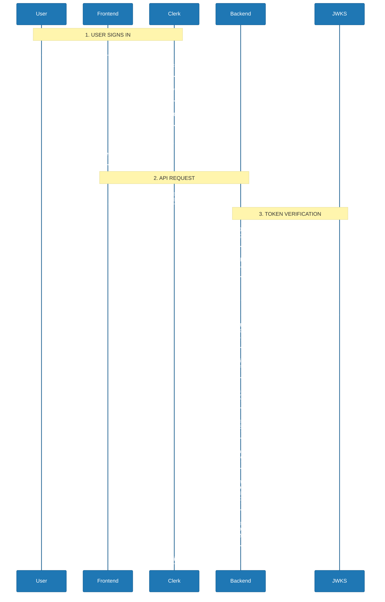

# JWT and JWKS Authentication - 2025

*A comprehensive guide to understanding JSON Web Tokens, JWKS, and cryptographic signatures*

---

## **Table of Contents**

1. [What is JWKS?](#what-is-jwks)
2. [JWT Structure](#jwt-structure)
3. [How Digital Signatures Work](#how-digital-signatures-work)
4. [The Mathematical Verification Process](#the-mathematical-verification-process)
5. [Why Encryption is Necessary](#why-encryption-is-necessary)
6. [JWKS Structure and Contents](#jwks-structure-and-contents)
7. [Complete Verification Flow](#complete-verification-flow)
8. [Security Properties](#security-properties)
9. [Common Misconceptions](#common-misconceptions)

---

## **What is JWKS?**

**JWKS (JSON Web Key Set)** is a standardized way to distribute public cryptographic keys over the internet.

### **Purpose**

The JWKS URL is a public endpoint that contains an authentication provider's (like Clerk's, Auth0's, or Okta's) public keys. It enables:

- **Stateless Authentication**: Your backend can verify JWT tokens independently
- **No Network Calls**: Verification happens locally using cached public keys
- **Horizontal Scaling**: No shared session state needed
- **Security**: Cryptographic proof that tokens are genuine

### **The Problem JWKS Solves**

Without JWKS, your backend would need to:

- Call the authentication service for every request (slow, creates dependency)
- Share secret keys (security risk)
- Maintain session storage (doesn't scale horizontally)

With JWKS, your backend can:

- Fetch public keys once and cache them
- Verify tokens mathematically in milliseconds
- Scale infinitely without coordination
- Trust tokens without contacting the issuer

---

## **JWT Structure**

A JWT consists of three Base64-encoded parts separated by dots:

```
header.payload.signature
```

### **Example JWT (decoded)**

```jsx
// HEADER (Base64-encoded)
{
  "alg": "RS256",           // Signing algorithm
  "typ": "JWT",             // Token type
  "kid": "ins_2abc123xyz"   // Key ID (matches JWKS)
}

// PAYLOAD (Base64-encoded)
{
  "sub": "user_2xyz789",    // Subject (user ID)
  "email": "user@example.com",
  "iat": 1704067200,        // Issued at (timestamp)
  "exp": 1704070800,        // Expiration (timestamp)
  "iss": "https://auth.example.com"  // Issuer
}

// SIGNATURE (Binary, then Base64-encoded)
// This is the cryptographic signature created with private key
```

### **Important Notes**

- **JWTs are NOT encrypted** - just Base64-encoded
- Anyone can decode and read the payload
- Never put sensitive data (passwords, credit cards) in JWTs
- The signature prevents tampering, not reading

---

## **How Digital Signatures Work**

Digital signatures use **asymmetric cryptography** - different keys for signing and verification.

### **Key Pairs**

**Private Key (held by Auth Provider like Clerk)**

- Used to **sign** tokens
- Must be kept secret
- Denoted as `d` in RSA

**Public Key (in JWKS)**

- Used to **verify** signatures
- Can be shared publicly
- Components: `n` (modulus) and `e` (exponent)

### **The Signing Process (by Clerk)**

```jsx
// Step 1: Create the data to sign
const data = base64(header) + "." + base64(payload)

// Step 2: Hash the data
const hash = SHA256(data)
// Result: e.g., "a3f2c1d5..."

// Step 3: Sign the hash with private key
const signature = (hash^d) mod n
// This creates a unique value only Clerk can create

// Step 4: Create complete JWT
const jwt = data + "." + base64(signature)
```

### **The Verification Process (by your backend)**

```python
# Step 1: Split the JWT
header, payload, signature = jwt.split('.')

# Step 2: Get the public key from JWKS (using kid from header)
public_key = jwks.get_key(kid)
n = public_key.n  # Modulus
e = public_key.e  # Exponent (usually 65537)

# Step 3: Decrypt the signature using public key
decrypted_hash = (signature^e) mod n

# Step 4: Compute hash of received data
computed_hash = SHA256(header + "." + payload)

# Step 5: Compare
if decrypted_hash == computed_hash:
    # ✓ Valid! Token is authentic and unmodified
    user_id = payload['sub']
else:
    # ✗ Invalid! Token was tampered or forged
    raise Unauthorized()
```

---

## **The Mathematical Verification Process**

### **RSA Signature Mathematics**

**Signing (Private Key Operation)**

```
signature = (hash^d) mod n

Where:
- hash = SHA256(header.payload)
- d = private exponent (secret, only Clerk knows)
- n = modulus (public, very large number)
```

**Verification (Public Key Operation)**

```
decrypted_hash = (signature^e) mod n

Where:
- signature = the signed value from JWT
- e = public exponent (public, typically 65537)
- n = same modulus (public)
```

**Mathematical Property**

```
(hash^d)^e ≡ hash (mod n)

This ONLY works when d and e are the matching private/public key pair!
```

### **Example with Small Numbers (Conceptual)**

*Note: Real RSA uses numbers with 2048+ bits*

```
Let's say:
n = 3233
e = 17
d = 2753  (private, only auth provider knows)

Message hash = 123

Signing (by auth provider):
signature = (123^2753) mod 3233 = 855

Verification (by your backend):
decrypted = (855^17) mod 3233 = 123 ✓

If attacker changes message:
New hash = 456
But signature is still 855
decrypted = (855^17) mod 3233 = 123 ≠ 456 ✗
```

### **Why Attackers Can't Forge Signatures**

To create a valid signature for modified content:

```jsx
// Attacker modifies payload
const malicious_payload = { sub: 'user_admin' };
const new_hash = SHA256(header + '.' + malicious_payload);

// They need to find signature where:
// (signature^e) mod n = new_hash

// This requires computing:
// signature = new_hash^d mod n

// But 'd' is private! They don't know it.

// Computing 'd' from 'e' and 'n' requires:
// - Factoring n into its prime factors
// - For 2048-bit RSA: computationally infeasible
// - Would take billions of years with current technology
```

---

## **Why Encryption is Necessary**

### **The Critical Question**

> "If anyone can decrypt the signature with the public key, why encrypt it at all? Why not just include the hash directly?"

### **Approach 1: Including Hash Directly (INSECURE) ❌**

```jsx
// JWT structure: header.payload.hash
const data = header + '.' + payload;
const hash = SHA256(data);
const jwt = data + '.' + hash;

// Backend verification:
const received_hash = jwt.split('.')[2];
const computed_hash = SHA256(header + '.' + payload);

if (received_hash === computed_hash) {
  // ✓ Hashes match, accept token
}
```

**The Attack:**

```jsx
// Attacker creates malicious JWT
const malicious = {
  sub: 'user_admin', // Escalate to admin!
  email: 'attacker@evil.com',
};

const header = base64({ alg: 'RS256' });
const payload = base64(malicious);

// Compute hash - ANYONE CAN DO THIS!
const hash = SHA256(header + '.' + payload);

// Create fake JWT
const fake_jwt = header + '.' + payload + '.' + hash;

// Your backend will accept it! ✗
// Because SHA256(header.payload) === hash
```

**Problem**: A hash alone only proves data integrity, **not authenticity**. Anyone can compute a hash for any data.

### **Approach 2: Including Signature (SECURE) ✓**

```jsx
// JWT structure: header.payload.signature
const data = header + "." + payload
const hash = SHA256(data)
const signature = (hash^d) mod n  // Only Clerk can do this!
const jwt = data + "." + base64(signature)

// Backend verification:
const signature = jwt.split('.')[2]
const decrypted_hash = (signature^e) mod n
const computed_hash = SHA256(header + "." + payload)

if (decrypted_hash === computed_hash) {
    // ✓ Valid signature, accept token
}
```

**Why Attackers Fail:**

```jsx
// Attacker creates malicious JWT
const malicious = { sub: 'user_admin' };
const hash = SHA256(header + '.' + malicious_payload);

// Option 1: Include hash directly
const fake_jwt = header + '.' + payload + '.' + hash;
// Backend does: (hash^e) mod n = garbage ≠ computed_hash ✗

// Option 2: Try to create valid signature
// Need: signature where (signature^e) mod n = hash
// Requires: signature = hash^d mod n
// But 'd' is secret! Can't compute it. ✗

// Option 3: Try to find 'd' from 'e' and 'n'
// Requires factoring n into primes
// Computationally infeasible for 2048-bit RSA ✗
```

### **The Key Insight**

The "encryption" with the private key creates a **mathematical proof of origin**:

- **Direct hash**: "This is what the data hashes to" (anyone can verify, anyone can create)
- **Signed hash**: "This hash was sealed by the auth provider's private key" (anyone can verify, **only auth provider can create**)

The security isn't in the decryption step - it's in the fact that **only the auth provider could have created a signature that decrypts correctly**.

### **Analogy**

**Including hash directly:**

- Like checking "this document has 250 words"
- Anyone can count words and verify
- Anyone can also write a NEW 250-word document
- No proof of authorship

**Including signature:**

- Like a royal wax seal on a document
- Everyone knows what the King's seal looks like (public key)
- Anyone can verify the seal is genuine
- But **only the King can create it** (private key)
- If you change the document, the seal breaks

---

## **JWKS Structure and Contents**

### **JWKS Endpoint Response**

```json
{
  "keys": [
    {
      "use": "sig",
      "kty": "RSA",
      "kid": "ins_2abc123xyz",
      "alg": "RS256",
      "n": "xGOr-H7A2PvaFqIxJZN8kQY6R5CvnN2ZFhhK9w3xb4N0pV_QsZLj8KtGH7vY...",
      "e": "AQAB"
    },
    {
      "use": "sig",
      "kty": "RSA",
      "kid": "ins_2def456uvw",
      "alg": "RS256",
      "n": "yH2s-K8B3QwbGrJyKaP9lRZ7S6DwoO3aGiiL0x4yc5O1qW_RtaMe9LuHI8wZ...",
      "e": "AQAB"
    }
  ]
}
```

### **Field Descriptions**

| Field | Description | Example |
| --- | --- | --- |
| `kty` | Key Type | `"RSA"` or `"EC"` (Elliptic Curve) |
| `use` | Public Key Use | `"sig"` (signature) or `"enc"` (encryption) |
| `kid` | Key ID | `"ins_2abc123xyz"` - Unique identifier |
| `alg` | Algorithm | `"RS256"` (RSA with SHA-256) |
| `n` | Modulus | Base64-encoded large number (2048+ bits) |
| `e` | Exponent | `"AQAB"` (Base64 for 65537) |

### **RSA Key Components**

**Modulus (n)**

- Very large number (typically 2048 or 4096 bits)
- Product of two large prime numbers
- Public (included in JWKS)
- Example size: 300-400 characters when Base64-encoded

**Exponent (e)**

- Almost always 65537 (0x010001)
- Represented as `"AQAB"` in Base64
- Public (included in JWKS)
- Standard value chosen for performance

**Private Exponent (d)**

- Secret, never shared
- Only known to the token issuer
- Required to create signatures
- Computing 'd' from 'n' and 'e' requires factoring (infeasible)

### **Multiple Keys (Key Rotation)**

JWKS typically contains multiple keys to support **key rotation**:

```
1. Auth provider generates new key pair
2. Adds new public key to JWKS (with new kid)
3. Starts signing new tokens with new key
4. Old tokens still verify (old key still in JWKS)
5. After grace period, removes old key from JWKS
```

Your backend must:

- Cache JWKS but allow refreshing
- Match JWT's `kid` with correct key from JWKS
- Re-fetch JWKS if `kid` not found (new key added)

---

## **Complete Verification Flow**

### **Step-by-Step Process**



### **Python Implementation Example**

```python
import os
import jwt
from fastapi import FastAPI, Depends, HTTPException
from fastapi.security import HTTPBearer, HTTPAuthorizationCredentials
from jose import jwt, JWTError

app = FastAPI()
security = HTTPBearer()

# JWKS configuration
JWKS_URL = os.getenv("JWKS_URL")
ISSUER = os.getenv("JWT_ISSUER")

def verify_jwt(credentials: HTTPAuthorizationCredentials = Depends(security)):
    """
    Verify JWT token using JWKS.

    Steps:
    1. Extracts JWT from Authorization header
    2. Fetches public keys from JWKS URL (cached)
    3. Verifies signature mathematically
    4. Validates expiration, issuer, audience
    5. Returns decoded payload or raises 401
    """
    try:
        token = credentials.credentials
        # Decode and verify JWT (library handles JWKS fetching)
        payload = jwt.decode(
            token,
            JWKS_URL,
            algorithms=['RS256'],
            issuer=ISSUER
        )
        return payload
    except JWTError:
        raise HTTPException(status_code=401, detail="Invalid token")

@app.get("/api/protected")
def protected_route(payload = Depends(verify_jwt)):
    # If we reach here, token is valid!
    user_id = payload["sub"]
    email = payload.get("email")

    return {
        "message": "Authenticated!",
        "user_id": user_id,
        "email": email
    }
```

---

## **Security Properties**

### **What JWT Signatures Guarantee ✓**

1. **Authenticity**: Token was created by the legitimate issuer
2. **Integrity**: Token content has not been modified
3. **Non-repudiation**: Issuer cannot deny creating the token

### **What JWT Signatures Do NOT Guarantee ✗**

1. **Confidentiality**: Anyone can read the payload
2. **Freshness**: Token could be old (check `exp` claim)
3. **Revocation**: Token is valid until expiration (use short expiry)

### **Additional Validations Required**

**Always validate:**

- `exp` (expiration): Is token still valid?
- `iss` (issuer): Does it match expected issuer?
- `aud` (audience): Is it intended for your application?
- `iat` (issued at): Is token suspiciously old?
- `nbf` (not before): Has token validity started?

**Example:**

```python
import time

def validate_claims(payload):
    current_time = int(time.time())

    # Check expiration
    if payload.get('exp', 0) < current_time:
        raise ValueError("Token expired")

    # Check not before
    if payload.get('nbf', 0) > current_time:
        raise ValueError("Token not yet valid")

    # Check issuer
    expected_issuer = "https://auth.example.com"
    if payload.get('iss') != expected_issuer:
        raise ValueError("Invalid issuer")

    # Check audience
    expected_audience = "my-application"
    if expected_audience not in payload.get('aud', []):
        raise ValueError("Invalid audience")
```

### **Security Best Practices**

**Token Expiration**

- Use short expiration times (minutes to hours)
- Refresh tokens for long-lived sessions
- Balance security vs user experience

**Token Storage**

- Never store in localStorage (vulnerable to XSS)
- Use httpOnly cookies when possible
- Consider sessionStorage for SPAs

**Key Rotation**

- Rotate keys regularly (quarterly/yearly)
- Support multiple keys during rotation
- Monitor for suspicious key usage

**Rate Limiting**

- Limit failed authentication attempts
- Monitor for unusual patterns
- Implement account lockout policies

---

## **Common Misconceptions**

### **Misconception 1: "JWTs are encrypted"**

**Reality**: JWTs are Base64-encoded, not encrypted. Anyone can decode and read the payload.

```jsx
const jwt =
  'eyJhbGciOiJSUzI1NiIsInR5cCI6IkpXVCJ9.eyJzdWIiOiJ1c2VyXzEyMyIsImVtYWlsIjoidXNlckBleGFtcGxlLmNvbSJ9.signature';

// Anyone can do this:
const [header, payload, signature] = jwt.split('.');
const decoded_payload = JSON.parse(atob(payload));
console.log(decoded_payload);
// { sub: "user_123", email: "user@example.com" }
```

**Takeaway**: Never put sensitive data in JWTs (passwords, credit cards, private keys).

### **Misconception 2: "If public keys are public, anyone can create valid tokens"**

**Reality**: Public keys can only **verify** signatures, not **create** them.

```
Creating signature requires private key 'd':
  signature = (hash^d) mod n

Verifying signature uses public key 'e':
  decrypted = (signature^e) mod n

Computing 'd' from 'e' and 'n' requires factoring n (infeasible).
```

### **Misconception 3: "HTTPS makes JWT signatures unnecessary"**

**Reality**: HTTPS protects data **in transit**, JWT signatures protect **data integrity and authenticity**.

```
HTTPS protects:          JWT signatures protect:
├─ Man-in-middle attacks ├─ Token tampering
├─ Eavesdropping         ├─ Forgery
└─ Transit encryption    ├─ Authenticity
                         └─ Integrity

Both are necessary!
```

**Example Attack Without JWT Signatures:**

1. Attacker logs into their account (legitimate over HTTPS)
2. Receives their own JWT
3. Changes `sub` claim to admin user ID
4. Sends modified JWT over HTTPS
5. Without signature verification, backend accepts it ✗

### **Misconception 4: "Longer expiration times are convenient"**

**Reality**: Long expiration times create security risks.

**Risks:**

- Stolen tokens remain valid longer
- Cannot revoke tokens (stateless)
- User permissions changes don't reflect
- Compromise window is larger

**Best Practice:**

- Access tokens: 15 minutes - 1 hour
- Refresh tokens: days to weeks
- Implement token refresh flow

### **Misconception 5: "Signature verification is slow"**

**Reality**: Modern JWT verification is extremely fast.

**Performance:**

- RSA signature verification: ~0.1-1 ms
- JWKS fetch: once, then cached
- No database lookups required
- No network calls to auth provider

**Benchmark Example:**

```
10,000 JWT verifications: ~500ms
= 0.05ms per verification
= 20,000 verifications per second per core
```

---

## **Summary**

### **Key Takeaways**

1. **JWKS provides public keys** for verifying JWT signatures without contacting the issuer
2. **JWT signatures use asymmetric cryptography**:
    - Private key (secret) creates signatures
    - Public key (shared) verifies signatures
    - Only the private key holder can create valid tokens
3. **Signatures must be "encrypted"** (mathematically transformed):
    - Direct hash: anyone can compute → no authenticity
    - Signed hash: only issuer can create → proves origin
4. **Verification is mathematical proof**:
    - `(hash^d)^e ≡ hash (mod n)` only when d/e match
    - Tampering breaks the signature immediately
    - Computing private key from public key is infeasible
5. **JWTs are not encrypted** - don't put sensitive data in them
6. **Always validate claims** - signature alone isn't enough
7. **JWKS enables stateless, scalable authentication** without compromising security

---

## **Additional Resources**

### **Further Reading**

- [RFC 7519: JSON Web Token (JWT)](https://datatracker.ietf.org/doc/html/rfc7519)
- [RFC 7517: JSON Web Key (JWK)](https://datatracker.ietf.org/doc/html/rfc7517)
- [RFC 7518: JSON Web Algorithms (JWA)](https://datatracker.ietf.org/doc/html/rfc7518)
- [jwt.io](https://jwt.io/) - JWT debugger and library list

### **Tools**

- [JWT Debugger](https://jwt.io/) - Decode and verify JWTs
- [Online RSA Key Generator](https://cryptotools.net/rsagen) - Generate RSA key pairs
- [JWKS Inspector](https://jwks-inspector.vercel.app/) - Inspect JWKS endpoints

---

**Created**: 2026-02-06

**Tags**: #authentication #jwt #jwks #security #cryptography #rsa #web-security #api-security #cloud #stateless-auth
