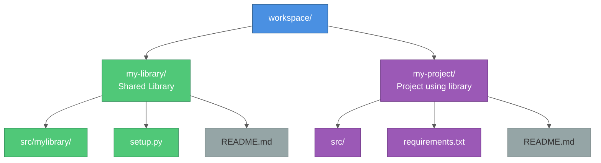

# Pip Install from Git Repositories: A Complete Guide

Learn how to use one Git repository as a dependency in another project using pip, covering local development, production deployment, and common patterns.

## Table of Contents

1. [Why Install from Git?](#why-install-from-git)
2. [Local Development: Editable Installs](#local-development-editable-installs)
3. [Production: Direct Git Installation](#production-direct-git-installation)
4. [Authentication Patterns](#authentication-patterns)
5. [Docker Integration](#docker-integration)
6. [Dependency Management](#dependency-management)
7. [Best Practices](#best-practices)
8. [Troubleshooting](#troubleshooting)

---

## Why Install from Git?

**Use cases for pip installing from Git repositories:**

✅ **Shared internal libraries** - Install company-specific packages not published to PyPI
✅ **Development dependencies** - Use the latest development version
✅ **Private forks** - Install from your own fork of a public package
✅ **Pre-release features** - Test unreleased features from a specific branch
✅ **Monorepo patterns** - Share code between multiple projects in an organization

**Example scenario:**
You have a `data-connectors` library that provides database, cloud storage, and API integrations. Multiple projects in your organization need to use it, but you don't want to publish it to PyPI.

---

## Local Development: Editable Installs

For local development, use **editable installs** (`-e` flag) so changes to the library are immediately reflected without reinstalling.

### Pattern: Sibling Directories

**Project structure:**


### Step 1: Set Up the Library

**File: `my-library/setup.py`**

```python
from setuptools import setup, find_packages

setup(
    name="my-library",
    version="1.0.0",
    packages=find_packages(where="src"),
    package_dir={"": "src"},
    install_requires=[
        "requests>=2.28.0",
        "psycopg2-binary>=2.9.0",
    ],
    extras_require={
        "dev": ["pytest", "black", "mypy"],
        "all": ["boto3", "google-cloud-storage"]
    },
    python_requires=">=3.9",
)
```

**Or use `pyproject.toml` (modern approach):**

```toml
[build-system]
requires = ["setuptools>=61.0", "wheel"]
build-backend = "setuptools.build_meta"

[project]
name = "my-library"
version = "1.0.0"
requires-python = ">=3.9"
dependencies = [
    "requests>=2.28.0",
    "psycopg2-binary>=2.9.0",
]

[project.optional-dependencies]
dev = ["pytest", "black", "mypy"]
all = ["boto3", "google-cloud-storage"]
```

### Step 2: Install in Editable Mode

**File: `my-project/requirements.txt`**

```bash
# Development dependencies
-e ../my-library

# Or with extras
-e ../my-library[all]

# Other dependencies
fastapi>=0.109.0
uvicorn>=0.27.0
```

**Install:**

```bash
cd my-project
pip install -r requirements.txt
```

**What `-e` (editable mode) does:**
- Creates a symbolic link to the library source code
- Changes to `my-library/` are immediately available in `my-project/`
- No need to reinstall after every change
- Perfect for local development

### Step 3: Use the Library

**File: `my-project/src/main.py`**

```python
# Import from the editable-installed library
from mylibrary import DatabaseConnector, S3Client

# Use it
db = DatabaseConnector(host="localhost", port=5432)
results = db.query("SELECT * FROM users")
```

### Verifying Editable Install

```bash
# Check installed packages
pip list | grep my-library
# Output: my-library   1.0.0    /path/to/workspace/my-library

# The path confirms it's an editable install
```

---

## Production: Direct Git Installation

For production (Docker, CI/CD), install directly from the Git repository.

### Public Repository (GitHub, GitLab)

**Syntax:**
```bash
pip install git+https://github.com/username/repo.git
```

**In requirements.txt:**
```bash
# Install from main branch
git+https://github.com/username/my-library.git

# Install from specific branch
git+https://github.com/username/my-library.git@develop

# Install from specific tag
git+https://github.com/username/my-library.git@v1.2.3

# Install from specific commit
git+https://github.com/username/my-library.git@a1b2c3d

# With extras
git+https://github.com/username/my-library.git@main#egg=my-library[all]
```

### Private Repository (Authentication Required)

For private repositories, you need authentication.

#### Option 1: Personal Access Token (PAT)

**1. Generate a PAT:**
- GitHub: Settings → Developer settings → Personal access tokens → Generate new token
- GitLab: User Settings → Access Tokens
- Azure DevOps: User Settings → Personal access tokens

**2. Install with PAT:**

```bash
# Inline PAT (not recommended for security reasons)
pip install git+https://TOKEN@github.com/username/my-library.git

# Better: Use environment variable
export GIT_TOKEN=ghp_your_token_here
pip install git+https://${GIT_TOKEN}@github.com/username/my-library.git
```

**3. In requirements.txt (environment variable):**

```bash
# requirements.txt
# Note: Token must be set in environment before installing
git+https://${GIT_TOKEN}@github.com/username/my-library.git@main#egg=my-library[all]
```

**4. Install with environment variable:**

```bash
export GIT_TOKEN=ghp_your_token_here
pip install -r requirements.txt
```

#### Option 2: SSH Authentication

If you have SSH keys configured:

```bash
# SSH syntax
pip install git+ssh://git@github.com/username/my-library.git

# In requirements.txt
git+ssh://git@github.com/username/my-library.git@main#egg=my-library
```

---

## Authentication Patterns

### Pattern 1: Git Config with PAT (Most Secure)

Configure Git to use PAT for a specific domain, then unset after install.

```bash
#!/bin/bash
# Install script with PAT authentication

GIT_TOKEN="your_token_here"

# Configure git to use PAT
git config --global url."https://${GIT_TOKEN}@github.com/".insteadOf "https://github.com/"

# Install dependencies
pip install git+https://github.com/username/my-library.git@main#egg=my-library[all]

# Unset git config (security)
git config --global --unset url."https://${GIT_TOKEN}@github.com/".insteadOf

# Clear token from environment
unset GIT_TOKEN
```

### Pattern 2: Netrc File (Persistent Authentication)

Create a `.netrc` file for automatic authentication:

**File: `~/.netrc`**

```
machine github.com
login username
password ghp_your_token_here

machine gitlab.com
login username
password glpat-your_token_here
```

**Set permissions (critical for security):**

```bash
chmod 600 ~/.netrc
```

**Install (no token needed in command):**

```bash
pip install git+https://github.com/username/my-library.git
```

### Pattern 3: Environment Variables

**`.env` file:**

```bash
GIT_USER=your_username
GIT_TOKEN=ghp_your_token_here
```

**Python script:**

```python
import os
from dotenv import load_dotenv
import subprocess

load_dotenv()

git_user = os.getenv("GIT_USER")
git_token = os.getenv("GIT_TOKEN")

# Install with authentication
subprocess.run([
    "pip", "install",
    f"git+https://{git_token}@github.com/username/my-library.git@main#egg=my-library[all]"
])
```

---

## Docker Integration

### Pattern 1: Build-Time Installation with PAT

**Dockerfile:**

```dockerfile
FROM python:3.12-slim

WORKDIR /app

# Install git (required for pip install from git)
RUN apt-get update && apt-get install -y git && rm -rf /var/lib/apt/lists/*

# Copy requirements
COPY requirements.txt .

# Accept PAT as build argument
ARG GIT_TOKEN

# Configure git to use PAT, install, then unset
RUN if [ -n "$GIT_TOKEN" ]; then \
        git config --global url."https://${GIT_TOKEN}@github.com/".insteadOf "https://github.com/" && \
        pip install --no-cache-dir -r requirements.txt && \
        git config --global --unset url."https://${GIT_TOKEN}@github.com/".insteadOf; \
    else \
        echo "WARNING: GIT_TOKEN not provided" && \
        pip install --no-cache-dir -r requirements.txt; \
    fi

# Clear token from environment (security)
ENV GIT_TOKEN=""

# Copy application code
COPY src/ ./src/

CMD ["python", "src/main.py"]
```

**requirements.txt:**

```bash
# Will use git config authentication set in Dockerfile
git+https://github.com/username/my-library.git@main#egg=my-library[all]

# Other dependencies
fastapi>=0.109.0
uvicorn>=0.27.0
```

**Build:**

```bash
docker build --build-arg GIT_TOKEN=ghp_your_token_here -t my-app .
```

**docker-compose.yml:**

```yaml
version: '3.8'

services:
  app:
    build:
      context: .
      args:
        GIT_TOKEN: ${GIT_TOKEN}  # Read from .env file
    ports:
      - "8000:8000"
    env_file:
      - .env
```

**Build with docker-compose:**

```bash
# .env file contains GIT_TOKEN=ghp_...
docker-compose build
```

### Pattern 2: Multi-Stage Build (Security Best Practice)

Separate build and runtime to avoid leaking credentials:

```dockerfile
# Stage 1: Build stage with git access
FROM python:3.12-slim AS builder

WORKDIR /build

RUN apt-get update && apt-get install -y git && rm -rf /var/lib/apt/lists/*

COPY requirements.txt .

ARG GIT_TOKEN

RUN git config --global url."https://${GIT_TOKEN}@github.com/".insteadOf "https://github.com/" && \
    pip install --no-cache-dir --target=/build/packages -r requirements.txt && \
    git config --global --unset url."https://${GIT_TOKEN}@github.com/".insteadOf

# Stage 2: Runtime stage (no git, no token)
FROM python:3.12-slim

WORKDIR /app

# Copy installed packages from builder
COPY --from=builder /build/packages /usr/local/lib/python3.12/site-packages

# Copy application code
COPY src/ ./src/

CMD ["python", "src/main.py"]
```

**Why this is better:**
- ✅ Final image doesn't contain git
- ✅ Final image doesn't contain credentials
- ✅ Smaller final image size
- ✅ More secure for production

---

## Dependency Management

### Separate Dev and Production Requirements

**requirements.txt (local dev):**

```bash
# Local editable install
-e ../my-library[all]

# Development tools
pytest>=7.4.0
black>=23.0.0
mypy>=1.5.0
```

**requirements-prod.txt (production):**

```bash
# Production install from Git
git+https://github.com/username/my-library.git@v1.0.0#egg=my-library[all]

# Production dependencies only
fastapi>=0.109.0
uvicorn>=0.27.0
gunicorn>=21.2.0
```

**Using both:**

```bash
# Local development
pip install -r requirements.txt

# Production build
pip install -r requirements-prod.txt
```

### Version Pinning

**Lock to specific versions:**

```bash
# Good: Pin to specific tag
git+https://github.com/username/my-library.git@v1.2.3#egg=my-library

# Good: Pin to specific commit
git+https://github.com/username/my-library.git@a1b2c3d4e5f6#egg=my-library

# Risky: Install from branch (version can change)
git+https://github.com/username/my-library.git@main#egg=my-library
```

### Dependency Resolution

If your library has its own dependencies, pip will resolve them:

**my-library/setup.py:**

```python
setup(
    name="my-library",
    install_requires=[
        "requests>=2.28.0",
        "psycopg2-binary>=2.9.0",
    ]
)
```

**my-project/requirements.txt:**

```bash
# Installing my-library will also install requests and psycopg2-binary
git+https://github.com/username/my-library.git@main#egg=my-library
```

---

## Best Practices

### 1. Use Editable Installs for Development

```bash
# ✅ Good: Editable for development
-e ../my-library

# ❌ Bad: Non-editable for development
../my-library
```

### 2. Pin Versions for Production

```bash
# ✅ Good: Specific version
git+https://github.com/username/my-library.git@v1.2.3#egg=my-library

# ❌ Bad: Tracking branch (unpredictable)
git+https://github.com/username/my-library.git@main#egg=my-library
```

### 3. Never Commit Tokens to Git

```bash
# ❌ NEVER DO THIS
git+https://ghp_secrettoken123@github.com/username/my-library.git

# ✅ Use environment variables
git+https://${GIT_TOKEN}@github.com/username/my-library.git

# ✅ Or use .netrc (not committed)
git+https://github.com/username/my-library.git
```

### 4. Document the Setup Process

**README.md:**

```markdown
## Setup

### Prerequisites
- Python 3.9+
- Git
- Access to private repository (requires PAT)

### Local Development

1. Clone repositories side by side:
   ```bash
   git clone https://github.com/username/my-library.git
   git clone https://github.com/username/my-project.git
   ```

2. Install dependencies:
   ```bash
   cd my-project
   pip install -r requirements.txt
   ```

### Production Deployment

Set `GIT_TOKEN` environment variable before building:

```bash
export GIT_TOKEN=ghp_your_token_here
docker build --build-arg GIT_TOKEN=${GIT_TOKEN} -t my-app .
```
```

### 5. Use Virtual Environments

```bash
# Always use virtual environments
python -m venv venv
source venv/bin/activate  # On Windows: venv\Scripts\activate

# Install dependencies
pip install -r requirements.txt
```

### 6. Clear Credentials After Use

```bash
# In scripts and Dockerfiles
git config --global --unset url."https://${GIT_TOKEN}@github.com/".insteadOf
unset GIT_TOKEN
```

---

## Troubleshooting

### Issue 1: Authentication Failed

**Error:**
```
fatal: Authentication failed for 'https://github.com/username/my-library.git/'
```

**Solutions:**

1. **Check PAT permissions:**
   - GitHub: Needs `repo` scope
   - GitLab: Needs `read_repository` scope

2. **Verify token:**
   ```bash
   echo $GIT_TOKEN  # Should print your token
   ```

3. **Test git access:**
   ```bash
   git clone https://${GIT_TOKEN}@github.com/username/my-library.git
   ```

### Issue 2: SSL Certificate Verification Failed

**Error:**
```
SSL: CERTIFICATE_VERIFY_FAILED
```

**Solutions:**

1. **Update certificates:**
   ```bash
   pip install --upgrade certifi
   ```

2. **Corporate proxy (temporary workaround):**
   ```bash
   # Not recommended for production!
   pip install --trusted-host github.com git+https://github.com/username/my-library.git
   ```

3. **Add corporate CA certificates:**
   ```bash
   export REQUESTS_CA_BUNDLE=/path/to/corporate-ca-bundle.crt
   ```

### Issue 3: Editable Install Not Updating

**Problem:** Changes to the library aren't reflected in the project.

**Solutions:**

1. **Verify editable install:**
   ```bash
   pip list | grep my-library
   # Should show path: my-library   1.0.0    /path/to/my-library
   ```

2. **Reinstall in editable mode:**
   ```bash
   pip uninstall my-library
   pip install -e ../my-library
   ```

3. **Check Python path:**
   ```python
   import mylibrary
   print(mylibrary.__file__)
   # Should point to ../my-library/src/mylibrary
   ```

### Issue 4: Git Not Found in Docker

**Error:**
```
/bin/sh: git: not found
```

**Solution:**

Install git in Dockerfile:

```dockerfile
RUN apt-get update && apt-get install -y git && rm -rf /var/lib/apt/lists/*
```

### Issue 5: Dependency Conflicts

**Error:**
```
ERROR: pip's dependency resolver does not currently take into account all the packages that are installed.
```

**Solutions:**

1. **Check for version conflicts:**
   ```bash
   pip check
   ```

2. **Use constraints file:**
   ```bash
   # constraints.txt
   requests==2.28.0
   psycopg2-binary==2.9.5

   # Install with constraints
   pip install -r requirements.txt -c constraints.txt
   ```

3. **Create clean environment:**
   ```bash
   deactivate
   rm -rf venv
   python -m venv venv
   source venv/bin/activate
   pip install -r requirements.txt
   ```

---

## Real-World Example

### Project Structure

```
company-workspace/
├── data-connectors/              # Shared library
│   ├── src/
│   │   └── data_connectors/
│   │       ├── __init__.py
│   │       ├── postgres.py
│   │       ├── s3.py
│   │       └── sharepoint.py
│   ├── setup.py
│   └── README.md
│
├── project-a/                     # Project using connectors
│   ├── src/
│   ├── requirements.txt           # -e ../data-connectors[all]
│   ├── requirements-prod.txt      # git+https://...
│   └── Dockerfile
│
└── project-b/                     # Another project using connectors
    ├── src/
    ├── requirements.txt
    └── Dockerfile
```

### data-connectors/setup.py

```python
from setuptools import setup, find_packages

setup(
    name="data-connectors",
    version="2.1.0",
    packages=find_packages(where="src"),
    package_dir={"": "src"},
    install_requires=[
        "psycopg2-binary>=2.9.0",
        "sqlalchemy>=2.0.0",
    ],
    extras_require={
        "s3": ["boto3>=1.26.0"],
        "sharepoint": ["office365-rest-python-client>=2.5.0"],
        "all": ["boto3>=1.26.0", "office365-rest-python-client>=2.5.0"]
    },
    python_requires=">=3.9",
)
```

### project-a/requirements.txt (local dev)

```bash
# Shared library (editable)
-e ../data-connectors[all]

# Project-specific dependencies
fastapi>=0.109.0
uvicorn>=0.27.0
```

### project-a/requirements-prod.txt (production)

```bash
# Shared library from Git (pinned version)
git+https://github.com/company/data-connectors.git@v2.1.0#egg=data-connectors[all]

# Project-specific dependencies
fastapi>=0.109.0
uvicorn[standard]>=0.27.0
gunicorn>=21.2.0
```

### project-a/src/main.py

```python
from fastapi import FastAPI
from data_connectors import PostgresClient, S3Client

app = FastAPI()

# Use shared connectors
db = PostgresClient(host="localhost", port=5432)
s3 = S3Client(bucket="my-bucket")

@app.get("/users")
def get_users():
    return db.query("SELECT * FROM users")

@app.get("/files")
def list_files():
    return s3.list_files()
```

### project-a/Dockerfile

```dockerfile
FROM python:3.12-slim AS builder

WORKDIR /build

# Install git
RUN apt-get update && apt-get install -y git && rm -rf /var/lib/apt/lists/*

# Copy production requirements
COPY requirements-prod.txt .

# Install with PAT
ARG GIT_TOKEN
RUN git config --global url."https://${GIT_TOKEN}@github.com/".insteadOf "https://github.com/" && \
    pip install --no-cache-dir --target=/build/packages -r requirements-prod.txt && \
    git config --global --unset url."https://${GIT_TOKEN}@github.com/".insteadOf

# Runtime stage
FROM python:3.12-slim

WORKDIR /app

COPY --from=builder /build/packages /usr/local/lib/python3.12/site-packages
COPY src/ ./src/

CMD ["uvicorn", "src.main:app", "--host", "0.0.0.0", "--port", "8000"]
```

---

## Summary

**Key Takeaways:**

1. **Local Development** - Use editable installs (`-e`) for immediate feedback
2. **Production** - Install directly from Git with version pinning
3. **Authentication** - Use environment variables and git config, never commit tokens
4. **Docker** - Multi-stage builds for security, install git in build stage only
5. **Best Practices** - Pin versions, use separate dev/prod requirements, document setup

## Further Reading

- [Pip Documentation: VCS Support](https://pip.pypa.io/en/stable/topics/vcs-support/)
- [Python Packaging User Guide](https://packaging.python.org/)
- [Setuptools Documentation](https://setuptools.pypa.io/)
- [Docker Multi-Stage Builds](https://docs.docker.com/build/building/multi-stage/)

---

**Created:** 2026-02-06
**Tags:** #python #pip #git #docker #dependencies #devops
